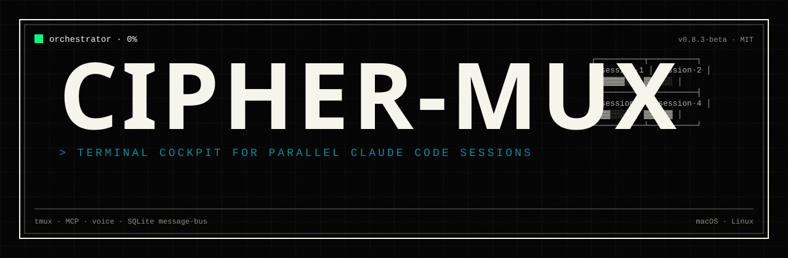
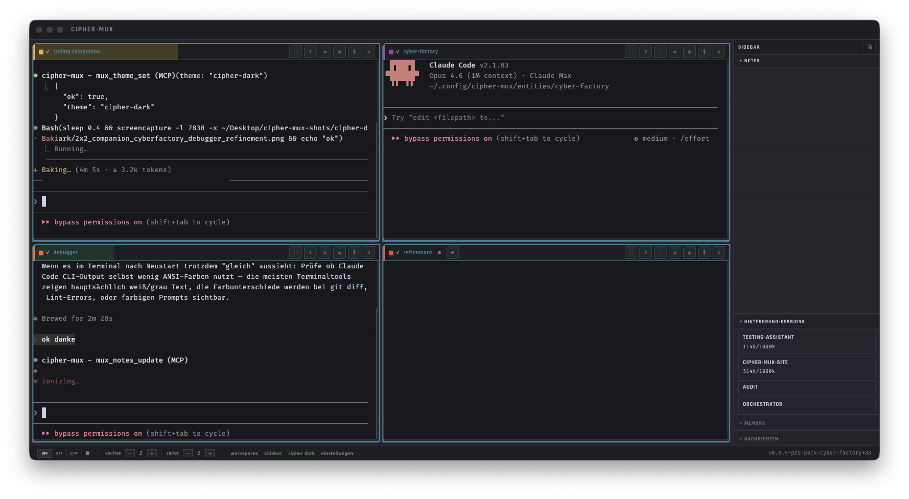

<p align="center">
  
</p>

<p align="center">
  <b>A terminal cockpit for parallel Claude Code sessions.</b><br>
  Voice input · 7 entity types · 37 MCP tools · SQLite message bus · Companion memory.
</p>

<p align="center">
  <a href="https://github.com/cmarkus42/cipher-mux-electron/actions"></a>
  <a href="https://github.com/cmarkus42/cipher-mux-electron/releases"></a>
  <a href="LICENSE"></a>
  <a href="#"></a>
  <a href="CONTRIBUTING.md#maintenance-status"></a>
  <a href="#install"></a>
</p>

---

<p align="center">
  
</p>

<p align="center"><i>2x2 grid — four entity sessions working in parallel, sidebar with background sessions and context usage.</i></p>

---


## Table of Contents

- [Background](#background)
- [Install](#install)
- [Usage](#usage)
- [How It Compares](#how-it-compares)
- [FAQ](#faq)
- [Architecture](#architecture)
- [Contributing](#contributing)
- [Security](#security)
- [License](#license)

## Background

cipher-mux orchestrates multiple Claude Code CLI sessions in embedded tmux panes inside an Electron window. It ships 37 MCP tools across 9 categories, a SQLite-backed message bus for inter-session communication, an entity system with 7 built-in entity types (orchestrator, MPO, launcher, companion, refinement, voice-relay, audit), voice input with scroll commands and grid navigation, a task outbox for structured delegation, persistent companion memory (SQLite FTS5) for learning entities, a markdown notes system with MCP API and handoff notes for session-to-session knowledge transfer, text-to-speech for entities, UI choreography for demos and onboarding, and a unified project launcher UX. Sessions share context through the message bus; an orchestrator session can delegate work across workers via MCP tools.

The primary audience is developers who run multiple parallel Claude Code sessions and want to eliminate the manual coordination overhead. You should be comfortable with tmux and use Claude Code daily. macOS and Linux are supported; Windows is not planned for v1.

cipher-mux is **not** an editor, not an IDE plugin, not a multi-LLM router, and not an autonomous agent platform. It is a cockpit: you see your sessions, you talk to them, you coordinate them. The full feature set is built for Claude Code.

cipher-mux was built with cipher-mux. The 1,207 tests, the audit reports, and the code quality are a direct result of the entity pipeline it ships. [Read how.](docs/BUILT-WITH-ITSELF.md)

## Install

### macOS (DMG)

Download the latest `.dmg` from [Releases](https://github.com/cmarkus42/cipher-mux-electron/releases), mount it, drag `cipher-mux.app` to Applications.

**Requirements:** tmux (`brew install tmux`), Claude Code CLI (`npm install -g @anthropic-ai/claude-code`).

### Linux (AppImage)

Download the latest `.AppImage` from [Releases](https://github.com/cmarkus42/cipher-mux-electron/releases), make it executable:

```bash
chmod +x cipher-mux-*.AppImage
./cipher-mux-*.AppImage
```

**Requirements:** tmux (`sudo apt install tmux`), Claude Code CLI.

**Known limitations:** Global hotkeys may not work on Wayland. Voice input requires PulseAudio or PipeWire. See [docs/linux-notes.md](docs/linux-notes.md) for details.

### Development Setup

```bash
git clone https://github.com/cmarkus42/cipher-mux-electron.git
cd cipher-mux
npm install
npm run dev
```

This starts the TypeScript compiler in watch mode and the Vite dev server concurrently. The Electron window opens with hot-reload for the renderer.

```bash
npm run build     # Full production build
npm run test      # Run test suite
npm run lint      # ESLint
npm run dist      # Package as DMG (macOS) or AppImage (Linux)
```

## Usage

> **Walkthrough:** See [docs/HOWTO.md](docs/HOWTO.md) for a hands-on first-run guide (install → first project → orchestrator → first delegation → voice bug report). The section below is a feature overview; the How-To is the narrative version.

### The Grid

The main window shows a grid of terminal panes - each one is a Claude Code session running inside tmux. Click a cell to focus it. The activity rail on the left shows session status, unread messages, and context usage at a glance. Entities can be launched directly from the LauncherCell in the grid.

### Starting Sessions

Use the **+** button or the project launcher to start new sessions. The launcher scans your configured project directories, shows available projects, and can kick off sessions with pre-configured instructions. The EntityPickerPopup lets you choose from entity presets when starting a new session, applying the right CLAUDE.md, persona, and tools automatically.

### Orchestrator

The orchestrator is one of 7 built-in entity types - a dedicated Claude Code session with access to MCP tools (`mux_create_session`, `mux_send`, `mux_read`, `mux_status`, etc.). It can spawn worker sessions, delegate tasks, and coordinate multi-project work. Start it from the activity rail.

### Entities

cipher-mux ships 7 built-in entity types, each with specialized behaviors, instructions, and tool access:

- **Orchestrator** — coordinates worker sessions, delegates tasks
- **MPO** (Multi-Party Orchestrator) — manages input requests across sessions
- **Launcher** — project kickoff and session bootstrapping
- **Companion** — how-to advisor with persistent memory
- **Refinement** — iterative code review and improvement, with memory
- **Voice-Relay** — voice-driven session control, with memory
- **Audit** — compliance and quality checks

Entities are registered via the entity registry and launched through the EntityPickerPopup or workspace presets.

### Notes

A built-in markdown notes system accessible through MCP tools (`mux_notes_create`, `mux_notes_search`, `mux_notes_read`, etc.). Notes support auto-tagging, full-text search, and handoff notes — a mechanism for transferring knowledge from one session to the next. Entities use notes for bug reports, feature requests, and persistent documentation.

### Companion Memory

Entities with memory (companion, refinement, voice-relay) have access to a persistent SQLite FTS5 memory store. They can write, recall, search, and forget memories across sessions. This enables learning entities that remember user preferences, project context, and past interactions without relying on conversation history.

### Voice Input

Toggle voice input (bottom-left) to dictate prompts into the focused session. Uses local Whisper for speech-to-text with Silero VAD for voice activity detection. Push-to-talk by default, with STT pin mode for hands-free dictation. Voice scroll commands let you scroll session output by voice, and grid navigation commands let you switch between cells verbally. A Bluetooth remote (BT Shutter) is supported for push-to-talk without touching the keyboard. The voice pipeline also powers the bug report interview flow - speak a bug report and the system extracts structured data via a local LLM.

### Task Outbox

Capture tasks via voice interview, chatroom, or hotkey. Tasks are stored in SQLite and can be triaged by the orchestrator on your command ("check for bug reports"). The orchestrator reads the outbox, assigns tasks to sessions, and tracks completion.

### Workspaces & Personas

Define **personas** (named roles with colors and default prompts) and arrange them in **workspaces** (grid layouts with project assignments). Load a workspace to resize the grid, apply vertical cell merges, and spawn sessions in one click. Prompt resolution follows a 3-level priority: per-cell prompt > workspace override > persona default. Workspaces integrate with the entity system - assign entity types to cells for pre-configured behaviors. Manage everything in a dedicated editor window.

### Message Bus

Sessions communicate through a SQLite message bus. The chatroom panel shows inter-session messages. The MCP server exposes this as `mux_send` / `mux_read` tools, enabling the orchestrator to coordinate workers without terminal scraping.

## How It Compares

cipher-mux occupies a specific niche. Here is how it relates to similar tools:

| Tool | Focus | Key difference |
|------|-------|---------------|
| **Claude Squad / CCManager** | Terminal-native session multiplexing | Minimalist, no GUI. If you want terminal-only and no overhead, those are the better choice. cipher-mux adds MCP server, voice input, task outbox, and structured orchestration. |
| **Conductor / Nimbalyst** | Polished Mac apps | Commercial, no tmux dependency. If you want a polished Mac-native experience without tmux, look there. |
| **agtx** | OSS orchestrator with Kanban | Closest in the OSS space. Has an orchestrator agent concept and task board. cipher-mux adds Electron UI, voice, and MCP server; agtx goes further on agent delegation. |

All of these are valid choices. Pick what fits your workflow.

## FAQ

### How many MCP tools are there?

37 tools across 9 categories: Session Management, Context Monitoring, Project Launcher, Bug Reports, Task Queue, MPO, Notes, Companion Memory, and App Control. Every tool is callable by any entity that has MCP access. See [ref/mcp-tools.md](ref/mcp-tools.md) for the full reference.

### What are entities?

Entities are specialized session types with pre-configured instructions, persona settings, and tool access. Think of them as roles: an orchestrator coordinates, a companion teaches, a refinement entity reviews code. Each entity type gets its own `CLAUDE.md`, and some (companion, refinement, voice-relay) have persistent memory across sessions. You pick an entity type when launching a session, or assign them in workspace presets.

### Does cipher-mux work on Linux?

Yes, as AppImage. tmux is required. Known limitations exist for Wayland (global hotkeys) and audio backends (voice input needs PulseAudio or PipeWire). See [docs/linux-notes.md](docs/linux-notes.md).

### Can I write my own adapter?

Yes. See [CONTRIBUTING.md](CONTRIBUTING.md#writing-an-adapter) and the reference stub at `src/main/agent/adapters/_reference-stub.ts`. The [adapter test protocol](docs/contributing/adapter-test-protocol.md) describes the weekend-test workflow for validating a new adapter.

## Architecture

See [ARCHITECTURE.md](ARCHITECTURE.md) for the full architecture overview, module map, and contributor entry points.

**Stack:** Electron 34, Preact, Vite, TypeScript (strict), xterm.js (WebGL + Canvas fallback), better-sqlite3 (WAL mode), MCP SDK, tmux Control Mode.

**Key modules:**

```
src/main/          — Electron main process
  tmux/            — TmuxManager, Control Mode parser, output batcher
  message-bus/     — SQLite CRUD, schema, typed messages
  mcp/             — Streamable HTTP MCP server, tools, auth
  session/         — SessionManager, recovery, orchestrator template
    entity-registry — Entity registration, preset definitions
  workspace/       — Personas, workspaces, prompt resolution, skill sync
  voice/           — Whisper STT, Piper TTS, Silero VAD, interview engine
  task/            — Task state machine, watcher, hooks, MCP tools
  notes/           — NoteManager, tagging, handoff notes
  companion/       — MemoryStore (SQLite FTS5), entity memory
  bluetooth/       — BtShutterManager, BT remote integration
src/renderer/      — Preact UI
  components/      — Grid, TerminalPane, ActivityRail, Chatroom, Cockpit
  hooks/           — useTerminal, useSessions, useMessages, useGrid, ...
src/shared/        — Typed IPC channels, domain types, constants
```

## Accessibility

cipher-mux includes accessibility features for users with different visual and motor needs:

- **CVD Themes** — Three color-vision-deficiency themes: Deuteranopia/Protanopia (red-green, Okabe-Ito palette), Tritanopia (blue-yellow), and Achromatopsia (full grayscale). Selectable in Settings.
- **Focus Mode** — Dims all grid cells except the focused one, reducing visual noise. Toggle via keyboard shortcut or Settings.
- **Font Settings** — Configurable font family, size (10-32px), line-height, and letter-spacing via the A11y settings page. Persisted across sessions.
- **Reduced Motion** — Respects `prefers-reduced-motion` system setting. Can also be overridden to `reduce` or `allow` in A11y settings.
- **ARIA Attributes** — UI components use `aria-label`, `role`, and semantic HTML for screen reader compatibility (65+ ARIA annotations across components).

## Contributing

See [CONTRIBUTING.md](CONTRIBUTING.md) for development setup, test execution, commit conventions, and the PR checklist.

**Maintenance status: active.** This tool is maintained by a single developer as an open-source side project. See CONTRIBUTING.md for the maintenance mode policy.

## Security

Found a vulnerability? Please do not open a public issue. See [SECURITY.md](SECURITY.md) for the private reporting channel and expected timelines.

## License

[MIT](LICENSE) · Copyright (c) 2026 Christian Markus and cipher-mux contributors.

Third-party licenses listed in [NOTICE](NOTICE). Bundled fonts (Rajdhani, Fira Code) use the SIL Open Font License 1.1.
