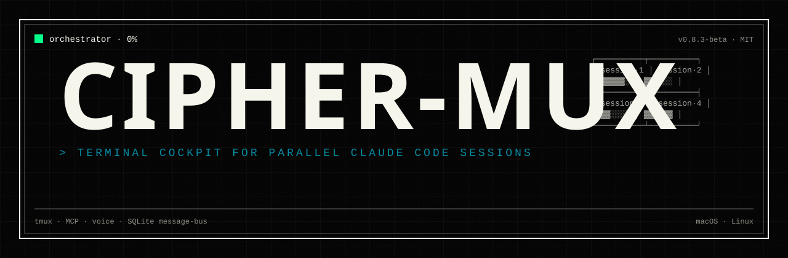
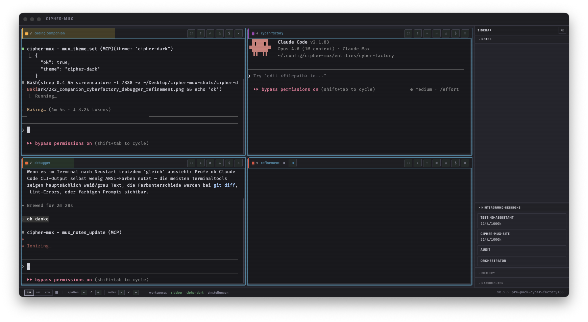

<p align="center">
  
</p>

<p align="center">
  <b>Orchestrates coding CLIs into a real development process</b><br>
  with roles, memory, and voice.<br>
  <sub>Claude Code (Tier 1, the default) · Codex CLI (Tier 2) · opencode (Tier 2)</sub>
</p>

<p align="center">
  <a href="https://cipher-mux.dev"><b>cipher-mux.dev</b></a> · <a href="https://cipher-mux.dev/en/features">Features</a> · <a href="https://cipher-mux.dev/en/docs">Docs</a> · <a href="https://cipher-mux.dev/en/start">Download</a>
</p>

<p align="center">
  <a href="https://github.com/cmarkus42-rgb/cipher-mux-electron/actions"></a>
  <a href="https://github.com/cmarkus42-rgb/cipher-mux-electron/releases"></a>
  <a href="LICENSE"></a>
  <a href="#"></a>
  <a href="CONTRIBUTING.md#maintenance-status"></a>
  <a href="#install"></a>
  <a href="https://cipher-mux.dev"></a>
</p>

> **v0.9.104** — Open beta. Feedback welcome via [Issues](https://github.com/cmarkus42-rgb/cipher-mux-electron/issues).

---

<p align="center">
  
</p>

<p align="center"><i>2x2 grid — four entity sessions working in parallel, sidebar with background sessions and context usage.</i></p>

---

## What it does

cipher-mux is an Electron environment. Its core is a grid with up to 21 cells (7×3) for agent-CLI sessions and Markdown editors. Each cell is its own CLI process — Claude Code, Codex CLI, or opencode, picked per role. In the background, tmux ensures that your sessions are safely preserved — even during a system restart or crash.

Got an idea? Build it. cipher-mux structures the path from idea to code — with specialized agents that build in quality and security you can't get from a single chat session.

### Key features

- **Three Agent CLIs** — Claude Code (Tier 1), Codex CLI (Tier 2), opencode (Tier 2). Pick one per role, or set a global default. See [Agent CLIs](#agent-clis)
- **Grid System** — Adaptable workspace, drag & drop, vertical cell merges, up to 21 cells
- **8 Presets** — Specialized roles: Companion, Ideation, Refinement, Cyber Factory, Testing, Debugger, Workshop, Audit
- **6 Personas** — Control how the model communicates: from bone-dry to socratic to chaos
- **Voice I/O** — Local Whisper.cpp STT (no cloud), Silero VAD, Piper/macOS TTS, BT remote support
- **MCP Server** — 37 tools across 9 categories, Streamable HTTP, bearer auth per entity
- **Tag Management** — Merge tags, exclusive groups, tag cycling. Hierarchical tag tree with tri-state filtering
- **Focus Mode** — Full-screen focus: selected cell fills the grid, others dim. Reduces visual noise for deep work
- **Update Checker** — Automatic release checks on startup (opt-out in Settings)
- **Notes System** — Integrated Markdown editor (CodeMirror 6), auto-tagging via local Ollama, handoff notes, workspace-scoped filtering, file watching for external edits
- **Companion Memory** — Persistent SQLite FTS5 memory, workspace-scoped (isolates learnings per project)
- **Message Bus** — SQLite-backed inter-session communication
- **Workspaces** — One project = one workspace. Assign project folders, grid layout, presets, and personas. Switch projects in one click
- **Prompt Architecture** — Dynamic system prompts: preset (what) × persona (how) × workspace (where). Workspace prompt + context directories auto-injected into all entity sessions
- **Session Recovery** — Close the app, reopen, resume — tmux keeps everything alive
- **Accessibility** — 10 themes incl. WCAG AAA, 3 CVD profiles, configurable fonts, reduced motion, ARIA

### System boundaries

- Not a commercial product — an open-source project born out of personal necessity
- Not a replacement for the agent CLIs — a graphical orchestration layer on top of them
- Not a magic wand for vague ideas — the ability to formulate precise specifications remains essential
- Requires at least one supported agent CLI. Claude Code is the default and needs an Anthropic account (subscription terms may change — current info: anthropic.com). Codex CLI and opencode work too, at Tier 2 — see [Agent CLIs](#agent-clis)

## Table of Contents

- [Install](#install)
- [Usage](#usage)
- [Agent CLIs](#agent-clis)
- [How It Compares](#how-it-compares)
- [FAQ](#faq)
- [Architecture](#architecture)
- [Contributing](#contributing)
- [Security](#security)
- [License](#license)

## Install

**Requirements:** macOS 12+ (Apple Silicon or Intel) · at least one supported agent CLI (Claude Code needs an Anthropic account; Codex CLI and opencode are alternatives at Tier 2) · ~1 GB free space

### macOS (DMG)

1. Download the latest `.dmg` from [Releases](https://github.com/cmarkus42-rgb/cipher-mux-electron/releases)
2. Open DMG, drag `cipher-mux.app` to Applications
3. Remove quarantine (one-time): `xattr -cr /Applications/cipher-mux.app`
4. Launch — the **Setup Wizard** handles the rest

The Setup Wizard detects what's missing and installs it for you:

| Component | Status | Size |
|-----------|--------|------|
| **Homebrew** | Required | ~200 MB |
| **tmux** | Required | ~2 MB |
| **Node.js** | Recommended | ~30 MB |
| **Claude Code CLI** | Recommended | ~50 MB |
| **Whisper Model** (local STT) | Optional | ~500 MB |
| **Piper TTS** (local speech) | Optional | ~30 MB |

After the wizard, log in to Claude Code (one-time):

```bash
claude login
```

**Codex CLI and opencode are deliberately absent from that table.** The setup wizard neither
installs nor checks them (`src/main/setup/`, `src/main/util/dependency-check.ts` know only the
Claude Code CLI). If you point a role at Codex or opencode, install and authenticate the CLI
yourself.

### Linux & Windows

Not yet available. Linux support is planned. Windows is on the roadmap but has no timeline.

### Manual Install (without Setup Wizard)

If you prefer to install dependencies yourself or the wizard isn't available:

```bash
# Required
/bin/bash -c "$(curl -fsSL https://raw.githubusercontent.com/Homebrew/install/HEAD/install.sh)"
brew install tmux

# Recommended
brew install node
npm install -g @anthropic-ai/claude-code
claude login

# Optional: Voice models
curl -L -o ~/.cache/cipher-mux/ggml-base.bin \
  https://huggingface.co/ggerganov/whisper.cpp/resolve/main/ggml-base.bin
curl -L -o ~/.cache/cipher-mux/de_thorsten-medium.onnx \
  https://huggingface.co/rhasspy/piper-voices/resolve/main/de/de_DE/thorsten/medium/de_DE-thorsten-medium.onnx
```

### Development Setup

```bash
git clone https://github.com/cmarkus42-rgb/cipher-mux-electron.git
cd cipher-mux-electron
npm install
npm run dev
```

This starts the TypeScript compiler in watch mode and the Vite dev server concurrently. The Electron window opens with hot-reload for the renderer.

```bash
npm run build     # Full production build
npm run test      # Run test suite
npm run lint      # ESLint
npm run dist      # Package as DMG (macOS)
```

## Usage

> **Walkthrough:** See [docs/HOWTO.md](docs/HOWTO.md) for a hands-on first-run guide (install → first project → orchestrator → first delegation → voice bug report). The section below is a feature overview; the How-To is the narrative version.

### The Grid

The main window shows a grid of terminal panes — each one an agent-CLI session running inside tmux. Click a cell to focus it. The activity rail on the left shows session status, unread messages, and context usage at a glance.

### Presets

Eight specialized roles structure the development process:

| Preset | Purpose |
|--------|---------|
| **Coding Companion** | Your constant guide. Knows your profile, answers system questions, helps you get started. |
| **Ideation Partner** | Research and idea synthesis. Structures brainstorming into tangible concepts. |
| **Refinement** | Requirements analysis. Transforms vague ideas into precise specifications. |
| **Cyber Factory** | Subsystem decomposition, coordinates multiple worker sessions in parallel. |
| **Testing Assistant** | Critically evaluates generated code. Writes and executes tests. |
| **Debugger** | Error analysis. Systematic root-cause search instead of trial-and-error. |
| **Workshop** | Oversees the overall process. Distributes tasks, monitors context, rotates workers. |
| **Audit** | Final code reviews. Checks for quality, security, and consistency. |

### Personas

Personas control how the model communicates with you. Six built-in profiles — from bone-dry (Cipher) to discursive (Socratic Tutor) to chaos (The Glitch). Create your own as needed.

### Prompt Architecture

The system prompt for a session is generated dynamically: preset (function) × persona (tone) × workspace (project context). Resolution follows a 3-level priority: per-cell prompt > workspace override > persona default.

### Voice Input

Local Whisper.cpp STT with Silero VAD for voice activity detection. No cloud dependencies. Push-to-talk by default, with pin mode for hands-free dictation. Grid navigation and scroll commands by voice. Bluetooth remote (BT Shutter) supported.

### Notes & Companion Memory

Integrated Markdown editor (CodeMirror 6) with auto-tagging via local Ollama (gemma3:4b). Handoff notes transfer knowledge between sessions. Companion, Refinement, and Voice-Relay entities have persistent SQLite FTS5 memory across sessions.

### Message Bus

Sessions communicate through a SQLite message bus. The chatroom panel shows inter-session messages. MCP tools (`mux_send` / `mux_read`) enable structured coordination without terminal scraping.

## Agent CLIs

A role is not tied to one CLI. Three adapters ship in the registry
(`src/main/agent/registry.ts`):

| CLI | Adapter id | Tier | Project instructions | Measured against | What is missing |
|-----|-----------|------|---------------------|------------------|-----------------|
| **Claude Code** | `claude-code` | Tier 1 | `CLAUDE.md`, `.claude` | v2.1.284 | — |
| **Codex CLI** | `codex` | Tier 2 | `AGENTS.md`, `.codex` | codex-cli 0.155.1 | sub-agents |
| **opencode** | `opencode` | Tier 2 | `AGENTS.md`, `opencode.json`, `.opencode` | opencode 1.18.34 | context display (`status-line`), sub-agents, role boundaries |

**Tier 2 means: not every Mux capability has been measured there.** The "What is missing" column
is not a guess — it is the set of `false` entries in the adapter's own `getCapabilities()`. A
`false` there says *unproven*, not *impossible*; for your session the effect is the same, so the
UI names it either way. Grid, presets, personas, workspaces, notes, voice, the MCP server, and
the message bus work under all three.

One difference deserves naming outright: **opencode has no role boundaries and no smoke test
against the real CLI.** opencode exposes plugin events (`tool.execute.before` and friends)
instead of hook files, and whether those can actually deny a tool call has not been measured — so
the adapter writes no boundary. A boundary that looks like one and does not fire is worse than
none. The opencode adapter is backed by unit tests, not by a run against the CLI.

### Choosing a CLI

- **Per role:** field **CLI** in the preset editor. `Default` follows the global setting; anything
  else overrides it. Takes effect at that role's next session start — a running session does not
  switch CLI. Under the field, the editor names what is missing under the CLI you picked.
- **Globally:** **Default CLI** in Settings → General. Takes effect immediately, for sessions
  started afterwards.

Resolution order, in the code at `src/main/session/entity-runtime.ts`:

```
app.entityAdapters[<role>]      (your per-role choice)
  > role default                (EntityConfig.adapterId, if the role carries one)
  > agent.defaultAdapter        (the global setting; ships as 'claude-code')
```

### Where the config lives

```
~/Library/Application Support/cipher-mux-electron/cipher-mux-config.json
```

That is `app.getPath('userData')`. `agent.defaultAdapter` and `app.entityAdapters` live there.

**There is also `~/.config/cipher-mux/config.json`, and cipher-mux does not read it.** Editing
that file changes nothing. `~/.config/cipher-mux/` holds *content* — role directories
(`entities/`), run directories (`runs/<workspaceId>/<entityId>/`), voice models — but no app
settings. You should not need to touch either file: everything above is settable in the UI.

## Built with Itself

cipher-mux was built with cipher-mux. Not a single test was written by hand — every one was produced by Claude Code. From Wave 5, the Testing Entity was wired into the process: it writes tests, hands findings to the Debugger, and the cycle runs without manual trigger.

| Wave | Tests | Milestone |
|------|-------|-----------|
| 0 | 400 | Baseline |
| 1–2 | 520 | Hub, MCP, Grid |
| 3–4 | 700 | Debugger, Factory |
| 5 | 841 | Entity pipeline active |
| 6 | 1,050 | Handoff, Voice |
| 7 | 1,207 | Audit, Pre-Release |

0 high-severity findings in the final audit. The developer's job was to design the process — and stay out of its way.

## How It Compares

| Tool | Focus | Key difference |
|------|-------|---------------|
| **Claude Squad / CCManager** | Terminal-native session multiplexing | Minimalist, no GUI. If you want terminal-only and no overhead, those are the better choice. cipher-mux adds MCP server, voice input, task outbox, and structured orchestration. |
| **Conductor / Nimbalyst** | Polished Mac apps | Commercial, no tmux dependency. If you want a polished Mac-native experience without tmux, look there. |
| **agtx** | OSS orchestrator with Kanban | Closest in the OSS space. Has an orchestrator agent concept and task board. cipher-mux adds Electron UI, voice, and MCP server; agtx goes further on agent delegation. |

All of these are valid choices. Pick what fits your workflow.

## FAQ

### How many MCP tools are there?

37 tools across 9 categories: Session Management, Messaging, Task Management, Notes, Companion Memory, Grid & UI Control, Demo & Presentation, Voice/TTS, and Other. Every tool is callable by any entity that has MCP access. See [docs/mcp-tools.md](docs/mcp-tools.md) for the full reference.

### Which agent CLIs are supported?

Three: Claude Code (Tier 1, the default), Codex CLI (Tier 2), and opencode (Tier 2). See
[Agent CLIs](#agent-clis) for the capability table, how to pick one per role, and what Tier 2
costs you.

### I edited `~/.config/cipher-mux/config.json` and nothing changed

That file is not the one cipher-mux reads. The settings live in
`~/Library/Application Support/cipher-mux-electron/cipher-mux-config.json`. See
[Where the config lives](#where-the-config-lives).

### What are entities?

Entities are specialized session types with pre-configured instructions, persona settings, and tool access. Think of them as roles: a Workshop coordinates, a Companion teaches, a Refinement entity reviews code. Each entity type gets its own `CLAUDE.md`, and some (Companion, Refinement, Voice-Relay) have persistent memory across sessions.

### Does cipher-mux work on Linux?

Not yet. Linux support is planned.

### Can I write my own adapter?

Yes — three exist, and the third was built against the same contract as the first. See [CONTRIBUTING.md](CONTRIBUTING.md#writing-an-adapter) and the reference stub at `src/main/agent/adapters/_reference-stub.ts`. The [adapter test protocol](docs/contributing/adapter-test-protocol.md) describes the weekend-test workflow for validating a new adapter. Read `adapters/codex.ts` and `adapters/opencode.ts` before you start: both file headers list the CLI properties that were measured and the ones that were not.

## Architecture

See [ARCHITECTURE.md](ARCHITECTURE.md) for the full architecture overview, module map, and contributor entry points.

**Stack:** Electron 34, Preact, Vite, TypeScript (strict), xterm.js (WebGL + Canvas fallback), better-sqlite3 (WAL mode), MCP SDK, tmux Control Mode.

**Key modules:**

```
src/main/          — Electron main process
  agent/           — AgentAdapter contract, registry, three adapters (claude-code, codex, opencode)
  tmux/            — TmuxManager, Control Mode parser, output batcher
  message-bus/     — SQLite CRUD, schema, typed messages
  mcp/             — Streamable HTTP MCP server, tools, auth
  session/         — SessionManager, recovery, orchestrator template
    entity-registry — Entity registration, preset definitions
  workspace/       — Personas, workspaces, prompt resolution, skill sync
  voice/           — Whisper STT, Piper TTS, Silero VAD, interview engine
  task/            — Task state machine, watcher, hooks, MCP tools
  notes/           — NoteManager, tagging, handoff notes
  companion/       — MemoryStore (SQLite FTS5), entity memory
  bluetooth/       — BtShutterManager, BT remote integration
src/renderer/      — Preact UI
  components/      — Grid, TerminalPane, ActivityRail, Chatroom, Cockpit
  hooks/           — useTerminal, useSessions, useMessages, useGrid, ...
src/shared/        — Typed IPC channels, domain types, constants
```

## Accessibility

- **CVD Themes** — Three color-vision-deficiency themes: Deuteranopia/Protanopia (Okabe-Ito palette), Tritanopia, and Achromatopsia (full grayscale).
- **High Contrast** — WCAG AAA black/white/yellow theme for low vision.
- **Focus Mode** — Dims all grid cells except the focused one, reducing visual noise.
- **Font Settings** — Configurable font family, size (10–32px), line-height, and letter-spacing.
- **Reduced Motion** — Respects `prefers-reduced-motion`. Override in A11y settings.
- **ARIA** — 65+ ARIA annotations across components for screen reader compatibility.

## Contributing

See [CONTRIBUTING.md](CONTRIBUTING.md) for development setup, test execution, commit conventions, and the PR checklist.

**Maintenance status: active.** This tool is maintained by a single developer as an open-source side project. See CONTRIBUTING.md for the maintenance mode policy.

## Security

Found a vulnerability? Please do not open a public issue. See [SECURITY.md](SECURITY.md) for the private reporting channel and expected timelines.

## License

[MIT](LICENSE) · Copyright (c) 2026 Christian Markus and cipher-mux contributors.

Third-party licenses listed in [NOTICE](NOTICE). Bundled fonts (Rajdhani, Fira Code) use the SIL Open Font License 1.1.
