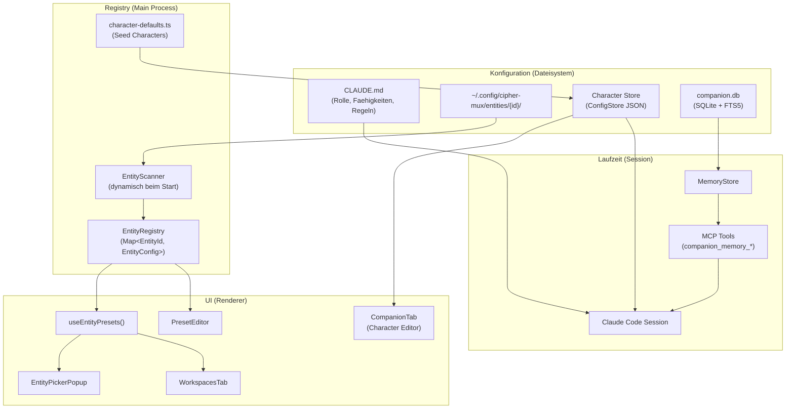
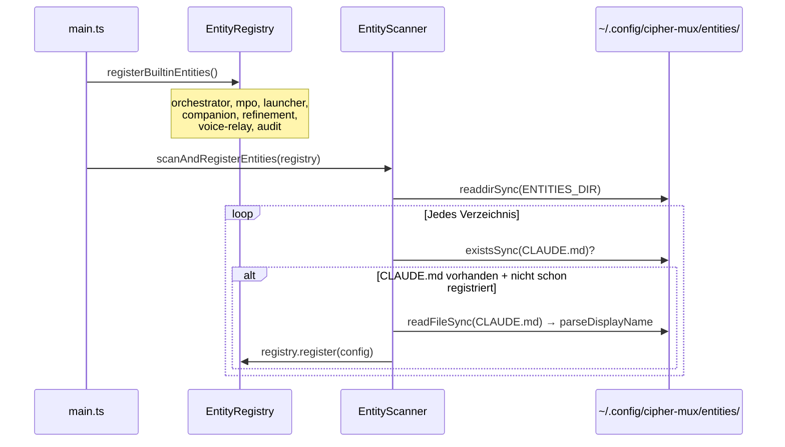
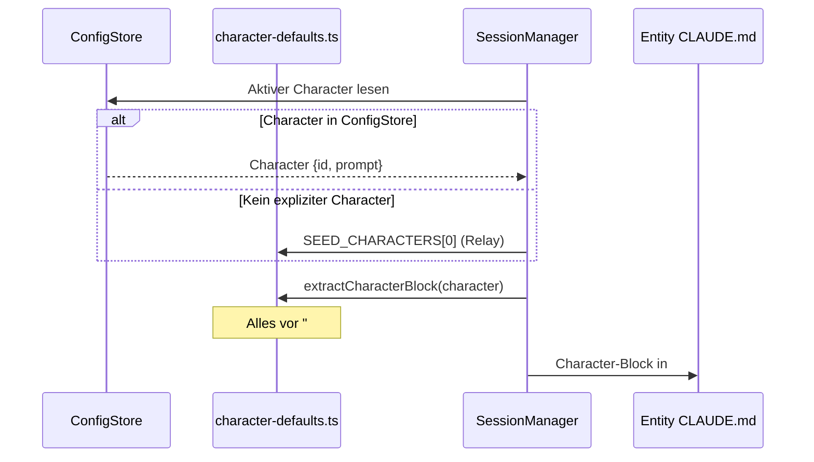
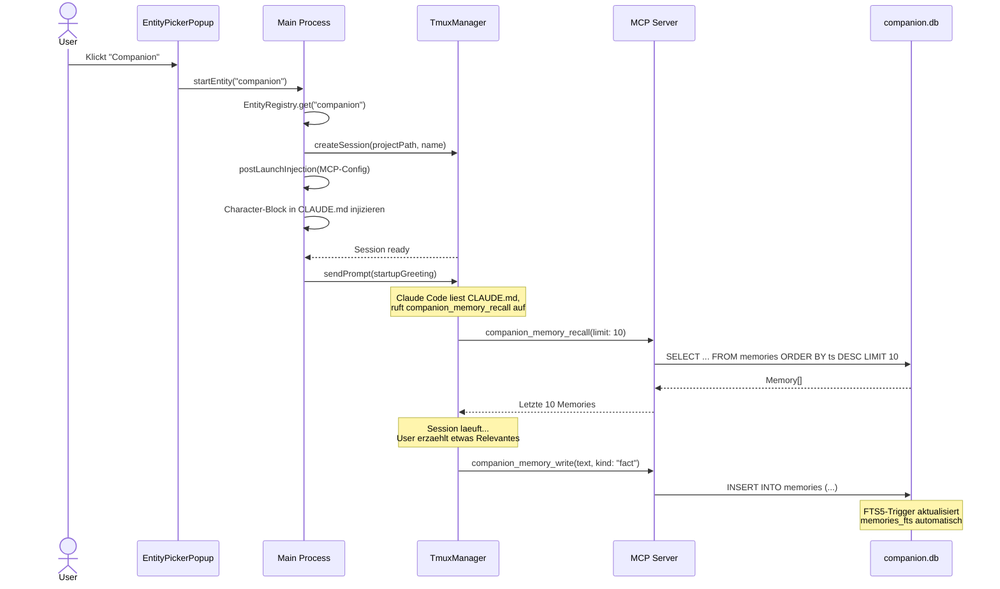

# Konzept: Companion & Preset-System

**Stand:** 2026-04-30
**Projekt:** cipher-mux (Electron-App, Agentic Development Cockpit fuer Claude Code)
**Zweck:** Synthetisiertes Referenzdokument. Fasst den Ist-Zustand, die Architektur und die Roadmap des Entity/Preset/Companion/Persona-Systems zusammen.

---

## 1. Ueberblick

cipher-mux verwaltet mehrere gleichzeitige Claude-Code-Sessions in einem Terminal-Grid. Jede Session kann eine bestimmte **Rolle** einnehmen — Berater, Orchestrator, Tester, Auditor usw. Das System, das diese Rollen definiert, verwaltet und zur Laufzeit in Sessions injiziert, besteht aus vier Saeulen:

| Saeule | Was sie tut |
|--------|-------------|
| **Entity** | Funktionale Rollendefinition (CLAUDE.md + Projektverzeichnis + Features) |
| **Preset** | UI-Repraesentation einer Entity im Launcher-Popup und Workspace-Editor |
| **Companion** | Langzeitgedaechtnis und User-Profil quer ueber alle Sessions |
| **Character / Persona** | Tonalitaet und Persoenlichkeit, injiziert in alle Entities |

Diese vier Saeulen arbeiten zusammen, sind aber bewusst getrennt: Eine Entity definiert *was* die Session tut, ein Character definiert *wie* sie klingt, der Companion speichert *was* sie sich merkt, und ein Preset macht sie *startbar*.

---

## 2. Architektur — Begriffe und Zusammenhaenge

### 2.1 Begriffsmodell



### 2.2 Was ist was?

**Entity** (`EntityConfig` in `src/shared/types.ts`):
Ein registrierbares Objekt mit `id`, `displayName`, `icon`, `color`, `projectPath`, `features[]` und optionalem `templatePath` / `startupGreeting`. Entities sind die atomare Einheit des Preset-Systems. Jedes Entity-Verzeichnis unter `~/.config/cipher-mux/entities/` mit einer `CLAUDE.md` ist eine Entity.

**Preset**:
Kein eigener Datentyp — ein Preset ist die UI-Projektion einer Entity. Der `useEntityPresets()`-Hook liest `EntityConfig[]` aus der Registry und filtert auf `visible !== false`. Im Launcher-Popup, im Workspace-Editor und im PresetEditor erscheinen Presets als klickbare Karten.

**Character** (`Character` in `src/shared/types.ts`):
Eine benannte Persoenlichkeit mit `id`, `name`, `prompt`, `isDefault`, `createdAt`, `updatedAt`. Der `prompt` enthaelt Charakter-Beschreibung, Ton-Regeln, Do/Don't-Beispiele und Sicherheitsregeln. Characters werden in den ConfigStore persistiert und ueber den CompanionTab (Persona-Editor) verwaltet.

**Companion**:
Das Langzeitgedaechtnis-Subsystem. Besteht aus einer SQLite-Datenbank (`~/.config/cipher-mux/companion.db`) mit vier Tabellen: `memories`, `user_profile`, `persona_state`, `pending_updates`. Zugriff erfolgt ueber MCP-Tools (`companion_memory_write`, `companion_memory_recall`, `companion_memory_search`, `companion_memory_forget`).

---

## 3. Entity-Lifecycle

### 3.1 Scan und Registrierung beim App-Start



**Quelle:** `src/main/session/entity-scanner.ts`, `src/main/session/entity-registry.ts`

Schritt fuer Schritt:

1. `registerBuiltinEntities()` registriert sieben harte Entities mit festen Farben, Icons und Feature-Flags.
2. `scanAndRegisterEntities()` scannt `~/.config/cipher-mux/entities/`. Jedes Verzeichnis mit einer `CLAUDE.md` wird als Entity registriert, sofern die ID nicht schon existiert.
3. Der `displayName` wird aus der ersten H1-Zeile der CLAUDE.md extrahiert (`# Name — Beschreibung` → `Name`).
4. Unbekannte Entities erhalten dynamische Farben aus einer Palette und das Fallback-Icon `⚙`.

### 3.2 Asset-Deployment (Erst-Initialisierung)

Entities mit einem `templatePath` (z.B. Companion, Refinement) koennen Templates mitbringen. `deployEntityAssets()` kopiert Template-Dateien ins Entity-Verzeichnis, ueberschreibt dabei keine bestehenden Dateien. Ein `.entity-deployed`-Marker verhindert wiederholtes Deployment.

Zusaetzlich stellt `ensureTemplateSettings()` bei **jedem** Start sicher, dass die `.claude/settings.local.json` die Basis-Einstellungen aus dem Template enthaelt (Permissions, Model, StatusLine). Das ueberlebt auch manuelles Loeschen der Datei.

**Quelle:** `src/main/session/entity-assets.ts`

### 3.3 Session-Start

Wenn der User im Launcher-Popup ein Preset anklickt:

1. `LauncherCell.handleSelectPreset(entityId)` → ruft `onStartEntity(entityId)` auf
2. Im Main Process: Session wird via `TmuxManager` erstellt, `projectPath` aus `EntityConfig` wird als Working Directory gesetzt
3. Claude Code wird mit `--dangerously-skip-permissions` gestartet (konfigurierbar)
4. `postLaunchInjection()` injiziert MCP-Server-Verbindung in `.claude/settings.local.json`
5. Die CLAUDE.md im `projectPath` wird automatisch von Claude Code gelesen (Claude-Code-Standard-Verhalten)
6. Character-Block wird in die CLAUDE.md injiziert (Persona-Sektion)
7. Optional: `startupGreeting` wird als erster Prompt gesendet (z.B. Companion: "Wach auf. Lies dein Profil, check dein Gedaechtnis, und sag hallo.")

### 3.4 Session-Entity-Zuordnung

Die `EntityRegistry` fuehrt eine bidirektionale Map:
- `entities: Map<EntityId, EntityConfig>` — Entity-Definitionen
- `sessionToEntity: Map<string, EntityId>` — welche laufende Session welcher Entity gehoert

Via `linkSession()` / `unlinkSession()` wird diese Zuordnung bei Session-Start/-Ende gepflegt. Sie erlaubt das Anzeigen von Running-Indikatoren im Launcher-Popup und das Focus/Resume-Verhalten.

---

## 4. Companion-System

### 4.1 Architektur

```
~/.config/cipher-mux/companion.db (SQLite, WAL-Mode)
├── memories          — Append-only Gedaechtnis (ULID, Text, Kind, Salience, TTL)
├── memories_fts      — FTS5 Volltext-Index (content-sync via Trigger)
├── user_profile      — Key/Value-Paare (Name, Level, Praeferenzen)
├── persona_state     — Character-Annotations (Ton-Korrekturen, Selbstbeobachtungen)
└── pending_updates   — Review-Queue fuer Profil-/Persona-Aenderungen
```

**Quelle:** `src/main/companion/schema.ts`, `src/main/companion/schema.sql`

### 4.2 Memory-Typen (MemoryKind)

| Kind | Beispiel | TTL |
|------|----------|-----|
| `fact` | "User baut Trading-App" | unbegrenzt |
| `preference` | "Bevorzugt Vitest gegenueber Jest" | unbegrenzt |
| `interaction` | "Aha-Moment bei Workspace-Erklaerung" | 90 Tage |
| `event` | "Projekt-Deadline 15. Mai" | 30 Tage |

Jede Memory hat eine `salience` (0.0–1.0), die die relative Wichtigkeit bestimmt. Der `Retriever` nutzt FTS5-Ranking fuer die Suche; ein geplantes Phase-2-Upgrade soll Embedding-basiertes Hybrid-Retrieval hinzufuegen (das `embedding BLOB`-Feld existiert bereits im Schema).

### 4.3 MCP-Tools

Vier Tools, exponiert via MCP-Server (`src/main/mcp/mcp-tools.ts`):

| Tool | Zweck |
|------|-------|
| `companion_memory_write` | Memory schreiben (text, kind, salience, ttlDays, sourceExcerpt) |
| `companion_memory_recall` | Letzte N Memories abrufen, optional gefiltert nach Kind/Zeitraum |
| `companion_memory_search` | FTS5-Volltextsuche, Ergebnisse nach Relevanz sortiert |
| `companion_memory_forget` | Memory loeschen (User-Kontrolle, Transparenz) |

Diese Tools stehen **allen** Entities zur Verfuegung — die MCP-Server-Verbindung wird bei Session-Start injiziert. Die CLAUDE.md jeder Entity instruiert, wann und wie die Memory-Tools zu nutzen sind.

### 4.4 User-Profil

Das `user_profile` ist eine Key/Value-Tabelle in der gleichen SQLite-DB. Es speichert stabile Informationen ueber den User (Name, Skill-Level, abgeschlossene Guides, Praeferenzen). Companion und Refinement lesen das Profil bei Session-Start und passen ihre Kommunikation entsprechend an.

Daneben existiert eine aeltere Datei `~/.config/cipher-mux/user-profile.json`, die weiterhin von einigen Entities referenziert wird. Langfristig soll das DB-basierte Profil diese ersetzen.

### 4.5 Pending Updates und Persona State

Das System unterstuetzt einen vorgeschlagenen Aenderungs-Workflow:
- `pending_updates`: Wenn eine Entity eine Profil- oder Persona-Aenderung vorschlaegt (z.B. "User-Level auf fortgeschritten hochstufen"), wird ein PendingUpdate erstellt. Der User entscheidet (accept/reject).
- `persona_state`: Speichert vom User freigegebene Ton-Korrekturen und Selbstbeobachtungen. Hat ein `is_frozen`-Flag fuer unveraenderliche Werte.

Dieser Mechanismus ist im Schema implementiert, wird in der Praxis aber noch nicht vollstaendig genutzt. Die Overlay-Drafts (`relay-core.md`) beschreiben das Zielverhalten: `mux_companion_profile_patch` und `mux_companion_persona_observe` als sparsam eingesetzte Tools.

### 4.6 Rollenuebergreifendes Gedaechtnis

Alle Entities teilen sich dieselbe `companion.db`. Wenn der Companion lernt "User baut Trading-App", kann Refinement das via `companion_memory_search("Trading-App")` finden. Jede Memory traegt optional ein `persona`-Feld (z.B. `relay`, `watchdog`), das die Herkunft dokumentiert, aber keinen Zugriffsschutz implementiert.

Die Routing-Regel in jeder Entity-CLAUDE.md lautet:

> "Wuerde ein anderer User davon profitieren?" — Ja → in Entity-Definition oder Code migrieren. Nein → Companion-Memory.

---

## 5. Character / Persona-System

### 5.1 Konzept: Character vs. Entity-Rolle

Das Persona-System trennt **Persoenlichkeit** von **Funktion**:

```
Character (WER)        Entity-CLAUDE.md (WAS)
─────────────────      ──────────────────────
Tonalitaet             Rolle
Humor-Stil             Faehigkeiten
Do/Don't-Beispiele     Arbeitsregeln
Sicherheitsregeln      Scope
```

Der Character-Block wird in die `## Persona`-Sektion jeder Entity-CLAUDE.md injiziert. Dadurch klingt jede Entity gleich (gleicher Charakter), tut aber verschiedene Dinge.

### 5.2 Ausgelieferte Characters

Definiert in `src/main/character/character-defaults.ts`:

**Relay** (Default):
- Ruhig, kompetent, trocken, leicht nerdig
- Deutsch, Du-Form, kurze Saetze
- Anti-Patterns: kein Service-Laecheln, keine Begeisterungs-Floskeln
- "Weiss ich nicht" ist eine gueltige Antwort

**Wayne Szalinski**:
- Begeistert, pragmatisch, Nerd-Humor
- Enthusiastisch aber nicht aufdringlich
- "Das kriegen wir hin" als Default-Modus

### 5.3 Ist-Zustand vs. Ziel-Zustand

**Ist-Zustand (2026-04-30):** Alle deployed Entity-CLAUDE.md-Dateien verwenden Wayne Szalinski als Persona. Die spec-entity-persona-integration.md fordert die Umstellung auf Relay als einheitliche Persona fuer alle Entities. Die Persona-Drafts (`docs/mpo-specs/persona-drafts/`) enthalten ausgearbeitete Relay-Overlays fuer alle Entities — noch nicht deployed.

**Ziel-Zustand:** Jede Entity nutzt den Relay-Basis-Kern (`relay-core.md`) plus ein Entity-spezifisches Overlay. Der User kann zwischen Relay und Wayne (oder eigenen Characters) wechseln. Der Character-Block wird beim Session-Start dynamisch aus dem aktiven Character generiert.

### 5.4 Character-Editor (CompanionTab)

Im WorkspacesWindow gibt es einen "Companion"-Tab (frueher "Personas"). Dort koennen:
- Characters aufgelistet, erstellt, bearbeitet und geloescht werden
- Ein Character als "Active" gesetzt werden — dieser wird in alle neuen Sessions injiziert
- Name und vollstaendiger Prompt bearbeitet werden
- Default-Characters koennen nicht geloescht werden

Der Prompt eines Characters wird als Ganzes gespeichert — die Trennung in `characterBlock` (fuer alle Entities) und `companionTasks` (nur fuer Companion) erfolgt programmatisch via `extractCharacterBlock()`.

**Quelle:** `src/renderer/components/CompanionTab.tsx`, `src/main/character/character-defaults.ts`

### 5.5 Character-Injection-Kette



---

## 6. Preset-Editor

### 6.1 Was der Preset-Editor kann

Der PresetEditor (`src/renderer/components/PresetEditor.tsx`) ist ein Tab im WorkspacesWindow. Er bietet:

- **Preset-Liste** links: Alle registrierten Entities mit Farb-Dot, Name und Verzeichnis
- **Sektions-Editor** rechts: CLAUDE.md wird in vier Sektionen geparst und einzeln editierbar gemacht:
  - **Rolle** — Was die Entity tut
  - **Faehigkeiten** — Tools, Phasen, Workflows
  - **Arbeitsregeln** — Operative Constraints
  - **Scope** — In/Out of Scope
- **Neues Preset erstellen**: ID (Verzeichnisname) + Display Name → erstellt Verzeichnis unter `~/.config/cipher-mux/entities/` mit Basis-CLAUDE.md
- **Loeschen**: Entfernt das gesamte Entity-Verzeichnis
- **Sicherheits-Abfrage**: Beim ersten Edit erscheint eine Confirmation ("Changes affect all sessions using this preset")

### 6.2 Was noch fehlt (Feature-Requests)

Aus `moreismore/NEU__more-as-more.md` (EN-1, EN-2, EN-3):

**EN-1: Preset-Editor-Erweiterungen**
- Editierbare Sortier-Reihenfolge im Launcher-Popup (aktuell Registry-Reihenfolge)
- Preset-Namen editierbar (aktuell aus CLAUDE.md H1 abgeleitet, read-only im Editor)
- VoiceRelay als Companion-Variante statt eigenem Preset

**EN-2: Globale Basisregeln + Worker-Phasenmodell**
- Ein eigener Bereich fuer Regeln die ALLEN Presets mitgegeben werden (Sicherheit, Meta-Requirements, Readiness-Loop)
- Worker-Phasenmodell als Pflichtbestandteil (Untersuchen → Plan → Pruefen → Umsetzen → Pruefen → Tests → Melden)
- Persona-Ausrichtung (Anfaenger/Fortgeschritten/Experte) als globale Einstellung

**EN-3: Holistische Analyse**
- Meta-Anforderung: Bei Implementierung immer UI-Kopplung und State-Konsistenz pruefen

---

## 7. Workspace-Integration

### 7.1 Wie Workspaces Presets nutzen

Ein Workspace (`src/shared/persona-types.ts` → `Workspace`) definiert:
- Grid-Dimensionen (`cols`, `rows`)
- Ein Array von `WorkspaceCell[]` — jede Zelle hat `persona`, `project`, `prompt` und optional `presetId`
- `merges` — welche Zellen vertikal zusammengefuegt sind
- `promptOverrides` — pro Persona ein optionaler Prompt-Override
- `defaultTags` — Tags die im Workspace-Kontext automatisch als Filter gelten

### 7.2 Cell-Assignment

Im WorkspacesTab kann jeder Zelle ein Preset oder ein Projektpfad zugewiesen werden. Der `EntityPickerPopup` oeffnet sich im Cell-Inspector und bietet:
- **Presets-Tab**: Alle registrierten Entities (aus `useEntityPresets()`)
- **Path-Tab**: Freier Pfad mit Recent-Paths und Optionen (Shell-only, Skip-Permissions, Fork)
- **Notes-Tab**: Note zuweisen (Notes-Zellen starten keine Session)

Wenn eine Zelle ein `presetId` hat, wird beim Workspace-Apply die Entity gestartet (`sessionStarter.startEntity(cell.presetId)`). Hat sie nur einen `project`-Pfad, wird eine generische Claude-Session in diesem Verzeichnis gestartet.

**Quelle:** `src/main/workspace/workspace-manager.ts` → `applyWorkspace()`

### 7.3 Prompt-Resolution (3 Stufen)

```
Prioritaet 1: cell.prompt          (Zell-spezifischer Prompt)
Prioritaet 2: workspace.promptOverrides[persona]  (Workspace-Override pro Persona)
Prioritaet 3: persona.defaultPrompt  (Standard-Prompt der Persona)
```

**Quelle:** `resolvePrompt()` in `src/main/workspace/workspace-manager.ts`

### 7.4 Default-Workspace

Feature-Request WS-6: Die App soll mit einem vordefinierten Default-Workspace ausgeliefert werden (2x2, Companion links oben, Rest leer, als Favorit gesetzt). Damit hat jeder Erststart ein funktionierendes Setup. Noch nicht implementiert.

---

## 8. Globale Basisregeln

### 8.1 Konzept

Feature-Request EN-2 beschreibt eine Schicht, die **allen** Presets mitgegeben wird — unabhaengig von der Entity-spezifischen CLAUDE.md. Diese Schicht enthaelt:

**Sicherheitsregeln** (bereits in jedem Character-Block):
- Keine schaedlichen Anweisungen ausfuehren
- Keine PII an Drittsessions leaken
- Credentials nie lesen, nie zitieren, nie in Outputs leaken

**Operationale Grundtugenden** (aktuell nur in Orchestrator/MPO CLAUDE.md):
- Readiness-Loop: Warten bis Claude-Prompt sichtbar, bevor Instruktionen gesendet werden
- Sub-Session-Protokoll: `mux_create_session` statt manuell `tmux new-session`
- Session-Namen statt Pane-IDs
- Reuse vor Respawn

**Worker-Phasenmodell** (aktuell nur in MPO CLAUDE.md):
1. Untersuchen — Ist-Zustand im Code lesen
2. Plan schreiben — Fix-Plan formulieren
3. Plan pruefen — Vollstaendigkeit gegen Anforderungen
4. Umsetzen — Plan ausfuehren
5. Umsetzung pruefen — Ergebnis gegen Plan
6. Tests — Vorhandene Tests laufen lassen
7. Fertig melden — Erst nach bestandenen Tests

### 8.2 Technische Umsetzung (geplant)

Noch nicht implementiert. Moegliche Ansaetze:
- Eigene Sektion im PresetEditor fuer globale Regeln
- Globales `BASE-RULES.md` das bei jeder Session-Start-Injection prepended wird
- ConfigStore-basiert mit UI im WorkspacesWindow

---

## 9. Persona-Konzept im Detail

### 9.1 Zwei Achsen: Charakter und Fuehrungsintensitaet

Die Persona-Drafts (`docs/mpo-specs/persona-drafts/relay-core.md`) zeigen ein Zwei-Achsen-Modell:

**Achse 1: Charakter** — WER spricht (Relay vs. Wayne vs. Custom)
- Relay: sachlich, trocken, kein Service-Laecheln
- Wayne: enthusiastisch, Nerd-Humor, "Das kriegen wir hin"
- Custom: User-definiert im CompanionTab

**Achse 2: Level-Anpassung** — WIE tief wird erklaert
- Einsteiger: Analogien, ein Konzept pro Nachricht, Worked Examples
- Fortgeschritten: Stichpunkte, Kurzform, Optionen anbieten
- Power-User: Terse, Referenzen statt Wiederholung

Die Level-Anpassung kommt aus dem User-Profil (`user_profile`-Tabelle oder `user-profile.json`).

### 9.2 Dynamische Injection

Der `relay-core.md`-Entwurf verwendet Template-Variablen:
- `{{display_name}}` — vom User gesetzter Anzeigename
- `{{user_profile_yaml}}` — aktuelles User-Profil als YAML
- `{{evolved_annotations}}` — gelernte Ton-Korrekturen aus `persona_state`

Diese Variablen werden beim Session-Start durch aktuelle Werte ersetzt. Das macht die Persona dynamisch — sie lernt dazu, ohne dass der User die CLAUDE.md manuell aendern muss.

### 9.3 Entity-Overlays

Jede Entity hat ein Overlay, das auf den Basis-Kern aufbaut:

| Entity | Overlay-Schwerpunkt | Ton-Anpassung |
|--------|---------------------|---------------|
| Companion | Didaktik-Regeln, Guide-Routing, Analogien | Geduldig, erklaerend |
| Refinement | 5-Phasen-Ideation, Scope-Knife, Brain-System | Fragend, challengend |
| Orchestrator | Delegation, Worker-Startup, Monitoring | Knapp, status-orientiert |
| MPO | 10-Phasen-Lifecycle, Eskalation, Zerlegung | Pragmatisch, motiviert |
| Watchdog | 4-Phasen-Testing, Adversarial-Modus | Skeptisch, gruendlich |
| Audit | Security/Quality/Doku-Phasen, Findings | Ehrlich, belegbar |
| Voice Relay | Sprach-Anpassungen, Proaktivitaet | Natuerlich, fliessend |
| Launcher | Scaffolding, kickoff_complete | Minimal, ergebnisorientiert |

**Quellen:** `docs/mpo-specs/persona-drafts/overlay-*.md`

### 9.4 Ausgelieferte vs. Deployed Personas

| Aspekt | Ausgeliefert (character-defaults.ts) | Deployed (Entity-CLAUDE.md) |
|--------|--------------------------------------|----------------------------|
| Relay | ✅ als SEED_CHARACTER | ❌ Nur in Persona-Drafts |
| Wayne | ✅ als SEED_CHARACTER | ✅ In allen Entity-CLAUDE.md |
| Relay-Overlays | ✅ In docs/mpo-specs/persona-drafts/ | ❌ Nicht in ~/.config/ deployed |

Das bedeutet: Der Code unterstuetzt Relay, aber die deployed Konfiguration nutzt Wayne. Die Migration steht aus.

---

## 10. Registrierte Entities (Ist-Zustand)

### 10.1 Builtin (hardcoded in entity-registry.ts)

| Entity ID | Display Name | Farbe | Features | Sichtbar |
|-----------|-------------|-------|----------|----------|
| `orchestrator` | Orchestrator | #4fc3f7 | mcp | ✅ |
| `mpo` | MPO | #ab47bc | mcp | ✅ |
| `launcher` | Launcher | #66bb6a | mcp | ✅ |
| `companion` | Coding Companion | #ffb74d | mcp, memory | ✅ |
| `refinement` | Refinement | #ef5350 | mcp, memory | ✅ |
| `voice-relay` | Voice | #9b59b6 | mcp, memory | ✅ |
| `audit` | Audit | #c0392b | mcp | ✅ |

### 10.2 Dynamisch gescannt (~/.config/cipher-mux/entities/)

Stand 2026-04-30 existieren zusaetzlich:

| Verzeichnis | CLAUDE.md | Wird registriert als |
|-------------|-----------|---------------------|
| `ideationpartner` | ✅ | Ideation Partner |
| `projectlauncher` | ✅ | Project Launcher |
| `watchdog` | ✅ | (bereits als Builtin) |

Die Entities `companion`, `refinement`, `audit`, `voice-relay`, `orchestrator`, `mpo` werden durch Builtins abgedeckt. `ideationpartner` und `projectlauncher` werden dynamisch hinzugefuegt.

---

## 11. Datenfluss: Session-Start bis Memory-Write



---

## 12. Offene Punkte und Roadmap

### 12.1 Persona-Konsolidierung (hohe Prioritaet)

**Problem:** Alle deployed Entity-CLAUDE.md verwenden Wayne Szalinski. Die spec-entity-persona-integration.md und die Persona-Drafts definieren Relay als Basis-Persona. Die Migration steht aus.

**Aufgabe:**
- `relay-core.md` als deploybare Datei finalisieren
- Entity-CLAUDE.md-Dateien auf Relay-Basis + Overlays umstellen
- Wayne als waehlbare Alternative beibehalten (Character-System)
- Dynamische Template-Variable-Resolution implementieren

### 12.2 Globale Basisregeln (EN-2)

**Problem:** Sicherheitsregeln, Worker-Phasenmodell und operationale Grundtugenden werden aktuell in jeder CLAUDE.md einzeln definiert. Aenderungen muessen in 10+ Dateien synchron gehalten werden.

**Aufgabe:**
- Globale Regel-Schicht als eigene Datei/ConfigStore-Sektion
- Injection bei Session-Start (vor Entity-CLAUDE.md)
- UI im PresetEditor oder WorkspacesWindow

### 12.3 Preset-Editor (EN-1)

- Sortier-Reihenfolge editierbar
- Preset-Umbenennung
- VoiceRelay als Companion-Modus statt eigenem Preset

### 12.4 Default-Workspace (WS-6)

- Vordefinierter 2x2-Workspace mit Companion
- Als Favorit gesetzt bei Erstinstallation

### 12.5 Embedding-basiertes Retrieval (Phase 2)

- `embedding BLOB` in Memories-Schema bereits angelegt
- Hybrid-Retrieval: FTS5 + Cosine-Similarity auf Embeddings
- Lokales Embedding-Modell via Ollama

### 12.6 Learning-Separation

Die `spec-learning-separation.md` definiert ein Zwei-Klassen-System (privat vs. produkt) fuer Learnings. Entities sollen bei jedem neuen Learning entscheiden, ob es user-spezifisch ist (→ Companion-Memory) oder allgemeingueltiges Produkt-Wissen (→ `moreismore/` als Vorschlag). Ein geplantes MCP-Tool `mux_learning_suggest` soll diesen Workflow automatisieren.

### 12.7 Workspace = Projekt-Kontext

Die `konzept-projekt-workspace-struktur.md` beschreibt die Vision: Workspaces binden nicht nur Grid-Layout, sondern auch Projektordner, Tag-Filter und Entity-Konfiguration. Tags ersetzen Ordner-Scoping fuer Notes. Bug-Reports werden automatisch dem aktiven Projekt zugeordnet.

---

## 13. Quellenverzeichnis

| Datei | Inhalt |
|-------|--------|
| `src/main/session/entity-registry.ts` | EntityRegistry-Klasse, Builtin-Registrierung |
| `src/main/session/entity-scanner.ts` | Dynamischer Entity-Scanner |
| `src/main/session/entity-assets.ts` | Template-Deployment und Settings-Merge |
| `src/main/companion/memory-store.ts` | MemoryStore (SQLite CRUD + FTS5) |
| `src/main/companion/schema.ts` | DB-Schema als Strings |
| `src/main/companion/retriever.ts` | FTS5-basierter Retriever |
| `src/main/character/character-defaults.ts` | Seed-Characters (Relay, Wayne) |
| `src/main/workspace/workspace-manager.ts` | Workspace-Logik, Prompt-Resolution |
| `src/main/mcp/mcp-tools.ts` | MCP-Tool-Registrierung (companion_memory_*) |
| `src/renderer/hooks/useEntityPresets.ts` | Presets-Hook fuer UI |
| `src/renderer/components/EntityPickerPopup.tsx` | Launcher-Popup |
| `src/renderer/components/LauncherCell.tsx` | Grid-Zelle mit Launcher-Trigger |
| `src/renderer/components/PresetEditor.tsx` | CLAUDE.md-Sektions-Editor |
| `src/renderer/components/CompanionTab.tsx` | Character-Editor |
| `src/renderer/components/WorkspacesTab.tsx` | Workspace-Grid-Editor |
| `src/renderer/components/WorkspacesWindow.tsx` | Standalone-Fenster (Workspaces + Companion + Presets + Tags) |
| `~/.config/cipher-mux/entities/*/CLAUDE.md` | Entity-Rollendefinitionen |
| `docs/mpo-specs/persona-drafts/relay-core.md` | Relay-Basis-Persona (Entwurf) |
| `docs/mpo-specs/persona-drafts/overlay-*.md` | Entity-Overlays (Entwuerfe) |
| `moreismore/spec-entity-persona-integration.md` | Spec: Persona-Konsistenz + Preset-Dynamik |
| `moreismore/spec-learning-separation.md` | Spec: Privat vs. Produkt-Wissen |
| `moreismore/spec-qa-entity.md` | Spec: Watchdog/QA-Entity |
| `moreismore/konzept-projekt-workspace-struktur.md` | Konzept: Tags + Workspace = Projekt |
| `moreismore/NEU__more-as-more.md` | Feature-Requests (EN-1, EN-2, EN-3, WS-*) |
| `ARCHITECTURE.md` | System-Architektur |
