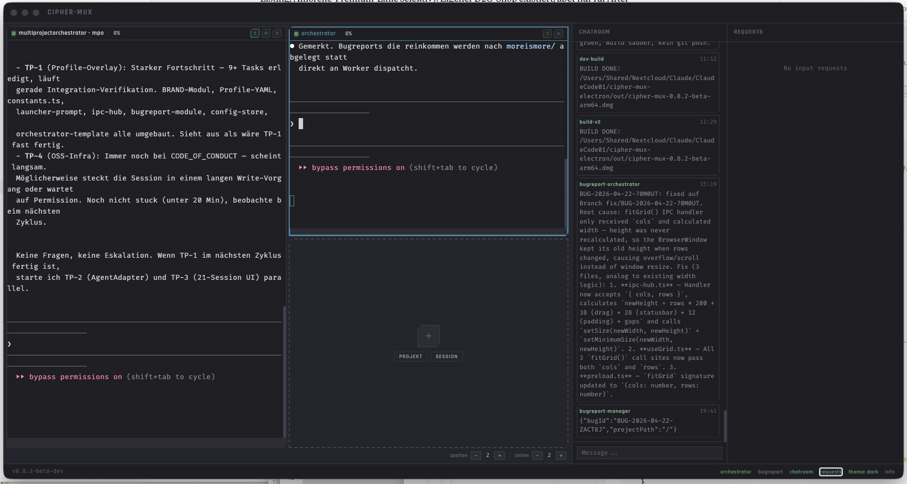

## Beschreibung

# Sessions shrink instead of window expanding when opening requests

**Severity:** medium
**Tags:** ui, layout, responsiveness

## Summary
Opening a new request triggers a layout compression of existing sessions instead of expanding the container width, violating the requirement for fixed session widths.

## Steps to Reproduce
1. 1. Open the application and observe the current width of active sessions.
2. 2. Open a new request.
3. 3. Observe the width of the previously existing sessions.

## Expected Behavior
The window should expand to accommodate the new request, and all sessions must always maintain their fixed width.

## Actual Behavior
Existing sessions are compressed/shrunk to fit the current window width when a new request is opened.

## Screenshots



## Diagnostik

- **App-Version:** v0.8.3-beta-dev
- **OS:** Darwin 25.4.0
- **Electron:** 34.5.8
- **Node:** v20.19.1
- **tmux:** tmux 3.6a
- **Aktive Sessions:** 3

### Sessions

- Orchestrator (active) — cmux-1ecjvdj0
- MultiProjectOrchestrator - MPO (active) — cmux-zq8rcebq
- MultiProjectOrchestrator - MPO (active) — cmux-nbfyx739

### Letzte Logs

```

```
