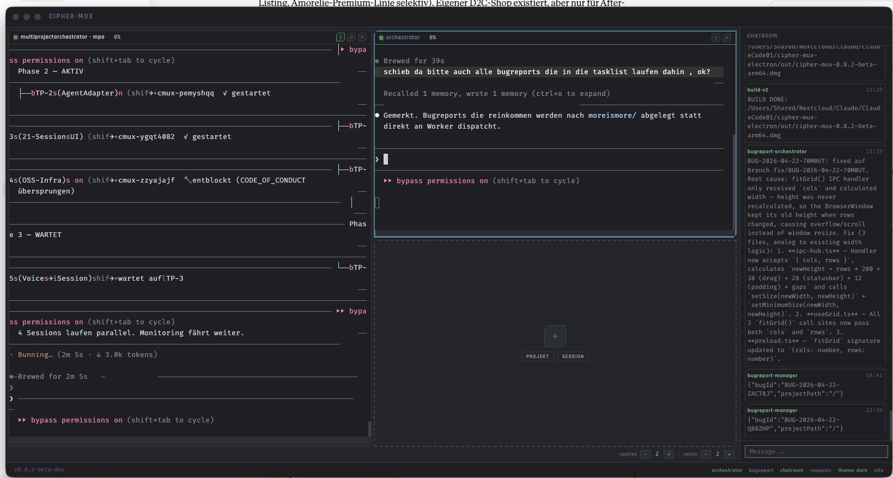

## Beschreibung

schau mal die zeilen in der mpo session - die zerfaleln - ganz stabil ist das nicht...

## Screenshots



## Diagnostik

- **App-Version:** v0.8.3-beta-dev
- **OS:** Darwin 25.4.0
- **Electron:** 34.5.8
- **Node:** v20.19.1
- **tmux:** tmux 3.6a
- **Aktive Sessions:** 3

### Sessions

- Orchestrator (active) — cmux-1ecjvdj0
- MultiProjectOrchestrator - MPO (active) — cmux-zq8rcebq
- MultiProjectOrchestrator - MPO (active) — cmux-nbfyx739

### Letzte Logs

```

```
