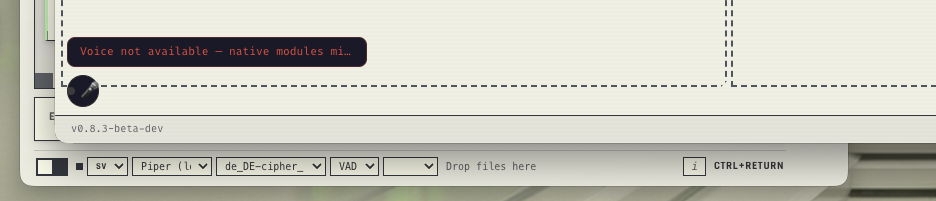

## Beschreibung

man sieht es schon i bild - voice läuft nicht - und unten links sieht man den voice toggle vom cipher electron desktop - so sollte er auch im mux aussehen - ein toggle - kein mikrofon-emoji button --- tief ins die designrichtlinien: css art ja, emoticons and such - no way

## Screenshots



## Diagnostik

- **App-Version:** v0.8.3-beta-dev
- **OS:** Darwin 25.4.0
- **Electron:** 34.5.8
- **Node:** v20.19.1
- **tmux:** tmux 3.6a
- **Aktive Sessions:** 1

### Sessions

- Orchestrator (active) — cmux-d01k855b

### Letzte Logs

```

```
