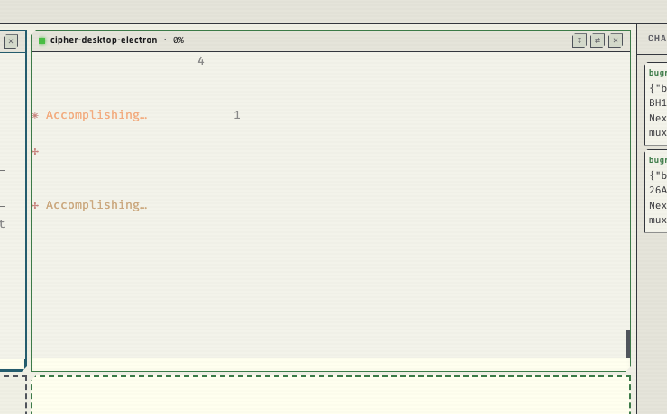

## Beschreibung

so sieht es aus wenn eien session voll loslegt -- außerdem - ich wiederhole mich - die hellen schriften - weiß natürlich vorneweg, die geehn nicht im cipher mux - kann weiß nicht ein dunkleres grün sein , hervorhebungen in hellbalu dann helleres grün, aber imme rnoch dunkler als jetzt das hellblau - das wäre gut - und viel mehr cipehr CI


## Screenshots



## Diagnostik

- **App-Version:** v0.8.3-beta-dev
- **OS:** Darwin 25.4.0
- **Electron:** 34.5.8
- **Node:** v20.19.1
- **tmux:** tmux 3.6a
- **Aktive Sessions:** 2

### Sessions

- Orchestrator (active) — cmux-d01k855b
- cipher-desktop-electron (active) — cmux-qhtyy1qz

### Letzte Logs

```

```
