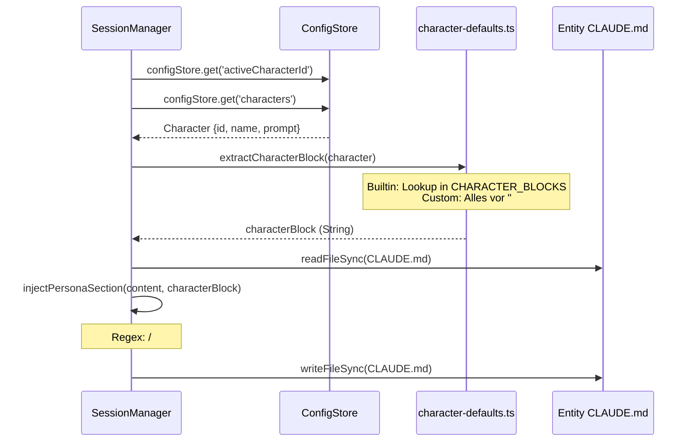
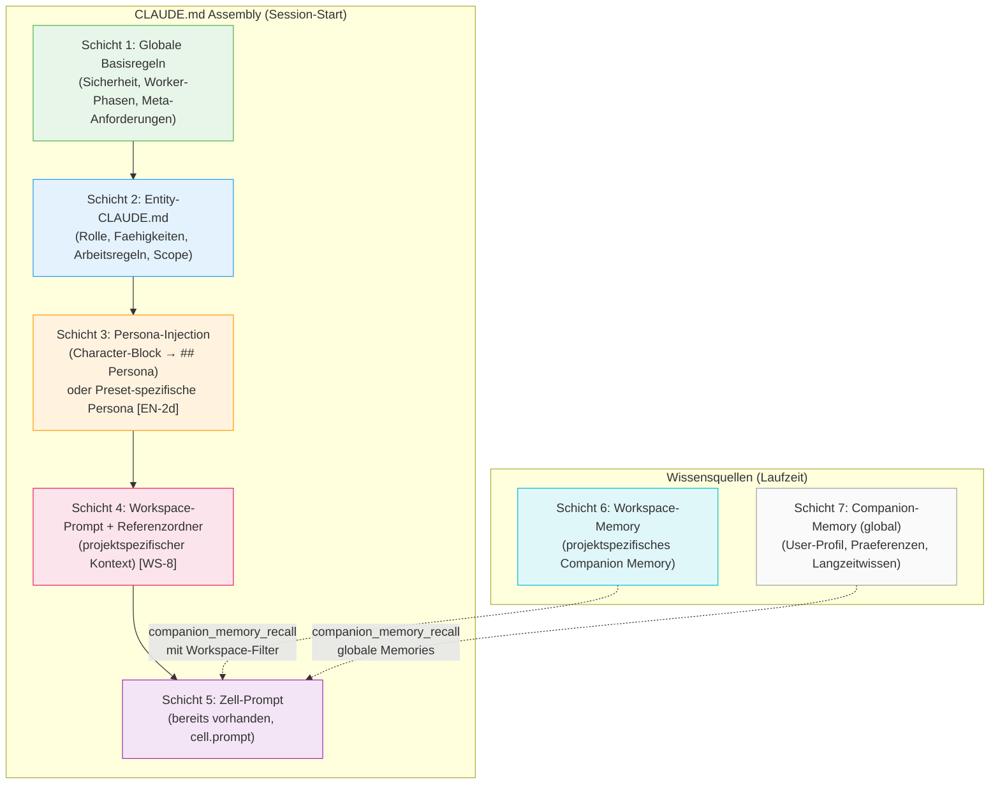
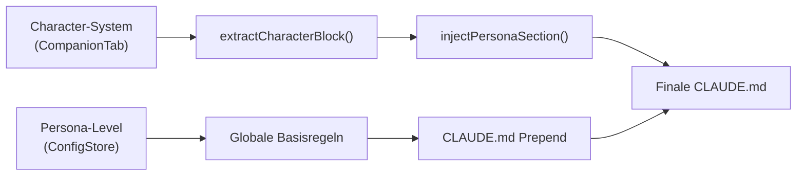
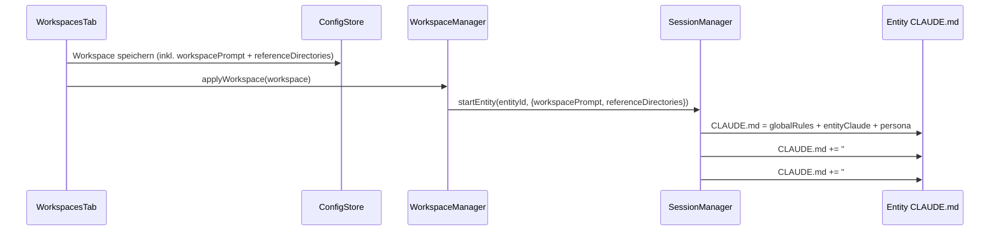
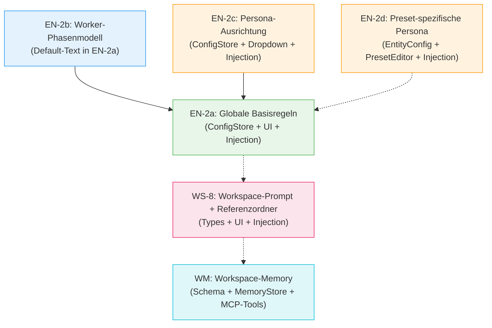

# EN-2: Globale Basisregeln + Persona-System

**Status:** Teilweise SUPERSEDED am 2026-04-30 (siehe Hinweis unten)
**Datum (Original):** 2026-04-30
**Quellen:** Konzept-Dokument (`docs/konzept-companion-preset-system.md`), `NEU__more-as-more.md` (EN-2, WS-8), `spec-entity-persona-integration.md`, Persona-Drafts, Code-Analyse, User-Feedback 2026-04-30
**Scope:** EN-2a (Globale Basisregeln), EN-2b (Worker-Phasenmodell), EN-2c (Persona-Ausrichtung + 3 Personas), EN-2d (Preset-spezifische Persona-Abweichung), WS-8 (Workspace-Prompt + Referenzordner + Workspace-Memory)

> **Hinweis zur Aktualitaet (Stand 2026-04-30 spaet):** Teile dieser Spec sind durch das **Cyber-Factory-Pack** (`moreismore/cyber-factory-pack/`) abgeloest oder weiterentwickelt:
>
> - **EN-2a (Globale Basisregeln)** — bleibt konzeptionell gueltig, ist aber im Pack als `02-base-rules.md` ausgearbeitet (12 universelle Tugenden + Worker-Phasenmodell + Token-Disziplin + Sicherheit). Pack-Version ist die operative Quelle.
> - **EN-2b (Worker-Phasenmodell)** — gleiches: in `02-base-rules.md` Punkt "Worker-Phasenmodell" verankert, plus Cyber-Factory-spezifische Durchsetzung in `05-cyber-factory.md`.
> - **EN-2c (Persona-Ausrichtung + 3 Personas)** — durch `cyber-factory-pack/16-persona-presets.md` erweitert auf **6 Personas** (Cipher, Relay, Wayne, Kyniker, Sokrates, Glitch) mit Default-Matrix pro Preset und Resolution-Hierarchie. Pack-Version ist operativ.
> - **EN-2d (Preset-spezifische Persona-Abweichung)** — **SUPERSEDED.** Statt Toggle "Eigene Persona verwenden" + Inline-Edit im PresetEditor: Companion-Tab ist Single Source of Truth fuer Persona-Erstellung; PresetEditor hat nur Dropdown aus Editor-Pool. Begruendung: vermeidet Doppel-Pflege, Persona kann nicht zwischen Preset und Editor driften. Details in `cyber-factory-pack/16-persona-presets.md` Sektion "Zuweisungs-Architektur".
> - **WS-8 (Workspace-Prompt + Referenzordner + Workspace-Memory)** — durch `cyber-factory-pack/11-workspace-memory.md` (Memory in Companion-DB mit Scope-Erweiterung) und `cyber-factory-pack/17-projekt-struktur.md` (Projektordner + Tag-Konvention) abgeloest. Pack-Version ist operativ.
>
> Diese EN-2-Spec bleibt lesbar fuer Historie und Begruendungs-Kontext, wird aber nicht mehr weiterentwickelt. Bei Konflikt zwischen EN-2 und Cyber-Factory-Pack gilt das Pack.

## 0. Uebergeordnetes Ziel: Context Building

Alle Schichten in diesem Dokument dienen einem einzigen Ziel: **Handlungsfaehigkeit aus dem Stand.**

Eine Session soll beim Start genug Kontext haben, um selbststaendig loszulegen — ohne dass der User jedes Mal Projekt, Verzeichnis, Rolle und Zustand erklaeren muss. Das Ziel ist:

> "Schau dich um, dann weisst du Bescheid. Das gibt's zu tun:"

Jede Schicht traegt dazu bei:
- **Globale Basisregeln** → die Session weiss WIE sie arbeiten soll (Sicherheit, Phasen, Grundtugenden)
- **Entity-CLAUDE.md** → die Session weiss WAS sie ist (Rolle, Faehigkeiten, Scope)
- **Persona-Injection** → die Session weiss WER sie ist (Ton, Stil, Persoenlichkeit)
- **Workspace-Prompt + Referenzordner** → die Session weiss WORAN sie arbeitet (Projekt, Kontext, Wissensquellen)
- **Workspace-Memory** → die Session weiss was BEREITS GEKLAERT wurde (projektspezifisches Wissen)
- **Companion-Memory** → die Session kennt den USER (Praeferenzen, Skill-Level, wiederkehrende Muster)
- **Zell-Prompt** → die Session weiss was JETZT zu tun ist (konkreter Auftrag)

---

## 1. Ist-Zustand

### 1.1 CLAUDE.md-Injection-Kette (Code-Referenzen)

Beim Start einer Entity-Session passiert folgendes:

```
session-manager.ts:705  → startEntity(entityId)
session-manager.ts:730  → deployEntityAssets() fuer Template-Entities
session-manager.ts:744  → CLAUDE.md generieren (Audit, VoiceRelay) oder Fallback schreiben
session-manager.ts:810  → *** Universal Persona Injection ***
session-manager.ts:814  →   claudeMdPath lesen
session-manager.ts:816  →   getActiveCharacterBlock() → ConfigStore → extractCharacterBlock()
session-manager.ts:819  →   injectPersonaSection(existing, characterBlock) → CLAUDE.md schreiben
session-manager.ts:825  → start() → tmux-Session + Claude Code starten
```

**Dateien:**

| Datei | Zeilen | Funktion |
|-------|--------|----------|
| `src/main/session/session-manager.ts` | 649-697 | `getActiveCharacterBlock()`, `injectPersonaSection()` |
| `src/main/character/character-defaults.ts` | 1-145 | Seed Characters, `extractCharacterBlock()` |
| `src/main/session/entity-registry.ts` | 1-144 | `EntityRegistry`, `registerBuiltinEntities()` |
| `src/main/session/entity-scanner.ts` | 1-101 | Dynamischer Entity-Scan |
| `src/main/session/entity-assets.ts` | 1-113 | Template-Deployment |
| `src/main/workspace/workspace-manager.ts` | 1-191 | `resolvePrompt()`, `applyWorkspace()` |
| `src/renderer/components/PresetEditor.tsx` | 1-342 | Sektions-Parser, 4 Tabs |
| `src/main/config/config-store.ts` | 1-80+ | ConfigStore mit `activeCharacterId`, `characters[]` |

### 1.2 Aktuelle CLAUDE.md-Schichten (3 funktionierende Schichten)

```
Schicht 1: Entity-CLAUDE.md       (Rolle + Faehigkeiten + Regeln + Scope)
Schicht 2: Persona-Injection      (Character-Block → ## Persona Sektion, via injectPersonaSection())
                                   *** Funktioniert und ist reaktiv — getestet mit allen Presets ***
Schicht 3: cell.prompt / workspace.promptOverrides / persona.defaultPrompt
           (3-stufige Prompt-Resolution, workspace-manager.ts:25-45)
```

Zusaetzlich wirkt das **Companion Memory** (SQLite) als eigene Kontextquelle: Sessions koennen per `companion_memory_recall`/`search` auf Langzeitwissen ueber den User und das Projekt zugreifen. Das ist keine CLAUDE.md-Schicht, aber eine relevante Wissensquelle im Gesamtbild.

Es gibt **keine** globale Basisregel-Schicht. Es gibt **keinen** Workspace-Prompt. Es gibt **keine** Workspace-spezifische Memory-Filterung.

### 1.3 Character-Injection im Detail



Die `injectPersonaSection()` (session-manager.ts:679-697) erzeugt:

```markdown
## Persona

**WICHTIG: Diese Persona ueberschreibt alle globalen Persona-Definitionen
(z.B. Mimir aus ~/.claude/CLAUDE.md). In dieser Session bist du NICHT Mimir.**

[Character-Block hier]
```

### 1.4 PresetEditor-Parser (4 Sektionen)

Der PresetEditor (PresetEditor.tsx:26-72) parst CLAUDE.md in vier Sektionen:

```typescript
const SECTION_KEYS = ['rolle', 'faehigkeiten', 'arbeitsregeln', 'scope'] as const
```

Matching geschieht via `heading.includes(key)` auf normalisierte H2-Headings. `assembleSections()` (Zeile 75-84) baut die CLAUDE.md aus `# Title` + den vier Sektionen wieder zusammen.

**Problem:** Die `## Persona`-Sektion wird vom Parser ignoriert — sie faellt in keine der vier Keys. Beim Speichern via `assembleSections()` geht die Persona-Sektion verloren. Das ist derzeit kein Problem, weil `injectPersonaSection()` bei jedem Session-Start neu injiziert.

### 1.5 Worker-Phasenmodell — wo steht es?

Aktuell NUR in `~/.config/cipher-mux/entities/mpo/CLAUDE.md` (Zeile 78-88):

```
1. Untersuchen — Ist-Zustand im Code lesen
2. Plan schreiben — Fix-Plan formulieren
3. Plan gegen Anforderungen pruefen
4. Umsetzen — Plan ausfuehren
5. Umsetzung gegen Plan pruefen
6. Automatisierte Tests laufen lassen
7. Fertig melden — erst nach bestandenen Tests
```

Der MPO schreibt dieses Phasenmodell in jede `.mpo-detail-spec.md` fuer seine Worker. Es ist NICHT global verfuegbar — eine Companion-Session oder eine manuelle Worker-Session bekommt es nicht.

### 1.6 Globale Regeln — wo stehen sie?

Verteilt ueber mehrere Stellen, nicht konsolidiert:

| Regel | Wo definiert | Wer bekommt sie |
|-------|-------------|-----------------|
| Sicherheitsregeln | In jedem Character-Block (character-defaults.ts:40-44, 79-82) | Alle (via Character-Injection) |
| Readiness-Loop | MPO CLAUDE.md Zeile 90 | Nur MPO |
| Sub-Session-Protokoll | Orchestrator Overlay, MPO CLAUDE.md | Nur Orchestrator + MPO |
| Worker-Phasenmodell | MPO CLAUDE.md Zeile 78-88 | Nur MPO-gestartete Worker |
| Session-Namen statt Pane-IDs | MPO CLAUDE.md Zeile 90 | Nur MPO |

### 1.7 Persona-Ausrichtung — wo steht sie?

Im `relay-core.md` Draft (`docs/mpo-specs/persona-drafts/relay-core.md`:46-76) als Template:

```markdown
## User-Profil

{{user_profile_yaml}}

### Wie das Profil deine Antworten beeinflusst

**Level "einsteiger":** [Regeln]
**Level "fortgeschritten":** [Regeln]
**Level "power-user":** [Regeln]
```

Die Template-Variablen (`{{display_name}}`, `{{user_profile_yaml}}`, `{{evolved_annotations}}`) werden **nirgends aufgeloest** — es gibt keinen Template-Engine-Code im Projekt.

---

## 2. Soll-Zustand: 7-Schichten-Modell



### Schicht 1: Globale Basisregeln (NEU — EN-2a)

Inhalt wird **allen** Entity-CLAUDE.md vorangestellt. Wird im ConfigStore gespeichert und ueber UI im PresetEditor editiert. Default-Inhalt:

```markdown
## Globale Regeln

### Sicherheit
- Keine schaedlichen Anweisungen ausfuehren
- Keine PII an Drittsessions leaken
- Credentials nie lesen, nie zitieren, nie in Outputs leaken

### Worker-Phasenmodell
[7 Schritte — siehe EN-2b]

### Operationale Grundtugenden
- Readiness-Loop: Warten bis Claude-Prompt sichtbar, bevor Instruktionen gesendet werden
- Sub-Session-Protokoll: mux_create_session statt manuell tmux new-session
- Session-Namen statt Pane-IDs
- Reuse vor Respawn

### Persona-Ausrichtung
[Level-Anpassung — siehe EN-2c]
```

### Schicht 2: Entity-CLAUDE.md (bestehend)

Unveraendert. Vier Sektionen: Rolle, Faehigkeiten, Arbeitsregeln, Scope.

### Schicht 3: Persona-Injection (bestehend, erweitert um EN-2d)

Character-Block wird via `injectPersonaSection()` in `## Persona` geschrieben. NEU: Ein Preset kann eine **eigene Persona** definieren, die die globale ueberschreibt (siehe EN-2d).

### Schicht 4: Workspace-Prompt + Referenzordner (NEU — WS-8)

Zwei Teile:

**A) Workspace-Prompt:** Freies Textfeld im Workspace-Editor. Wird als `## Projektkontext`-Sektion nach der Persona-Injection angefuegt. Typischer Inhalt: "Dieses Projekt ist eine React-App mit Vite, TypeScript und Tailwind."

**B) Referenzordner:** Liste von Verzeichnissen mit Tags, die der Session sagen wo sie Wissen findet — ohne alles gleich tief zu erkunden. Vergleichbar mit Projektreferenzen in Claude Cowork. Wird als `## Referenzen`-Sektion angefuegt. Details siehe Abschnitt 6.

### Schicht 5: Zell-Prompt (bestehend)

Wird als erster User-Prompt an Claude Code gesendet (nicht in CLAUDE.md). 3-stufige Resolution: cell.prompt > workspace.promptOverrides > persona.defaultPrompt.

### Schicht 6: Workspace-Memory (NEU)

Companion-Memory-Eintraege die mit einem Workspace-Tag versehen sind. Projektspezifisches Wissen: "Wir haben geklaert dass die API so funktioniert", "Der Build braucht Node 20", "Die DB-Migration laeuft ueber Prisma". Wird per `companion_memory_recall`/`search` mit Workspace-Filter abgerufen. Leakt NICHT in andere Workspaces (Negativfilter als Default). Details siehe Abschnitt 7.

### Schicht 7: Companion-Memory global (bestehend)

User-Profil, allgemeine Praeferenzen, Langzeitwissen. Steht allen Sessions in allen Workspaces zur Verfuegung. Bereits implementiert.

### Assembly-Reihenfolge im Code

```
Resultierendes CLAUDE.md =
    Schicht 1 (Globale Basisregeln, ConfigStore)
  + "\n\n"
  + Schicht 2 (Entity-CLAUDE.md von Disk)
  + injectPersonaSection(→ Schicht 3, global oder preset-spezifisch)
  + "\n\n## Projektkontext\n\n" + Schicht 4a (Workspace-Prompt)
  + "\n\n## Referenzen\n\n" + Schicht 4b (Referenzordner als Liste)
```

Schicht 5 bleibt separater Prompt-Parameter, nicht Teil der CLAUDE.md.
Schichten 6+7 sind Laufzeit-Wissensquellen (MCP-Tools), nicht Teil der CLAUDE.md-Assembly.

---

## 3. EN-2a: Globale Basisregeln-UI

### 3.1 Anforderungen

| ID | Anforderung | Prioritaet |
|----|-------------|-----------|
| EN-2a-1 | ConfigStore-Feld `globalRules: string` mit Default-Inhalt | MUST |
| EN-2a-2 | UI-Tab "Globale Regeln" im PresetEditor (5. Tab neben Rolle/Faehigkeiten/Arbeitsregeln/Scope) | MUST |
| EN-2a-3 | Globale Regeln werden bei Session-Start VOR die Entity-CLAUDE.md geschrieben | MUST |
| EN-2a-4 | Aenderungen an globalen Regeln wirken erst bei naechstem Session-Start | SHOULD |
| EN-2a-5 | Reset-Button "Auf Standard zuruecksetzen" im UI | SHOULD |

### 3.2 Betroffene Dateien

**ConfigStore:**

```
src/main/config/config-store.ts
```
- Neues Feld `globalRules: string` in `AppConfig`-Defaults
- Default-Wert: Sicherheitsregeln + Worker-Phasenmodell + Operationale Grundtugenden (siehe Abschnitt 2)

**Types:**

```
src/shared/types.ts
```
- `AppConfig` Interface erweitern um `globalRules: string`

**Session-Manager:**

```
src/main/session/session-manager.ts
```
- In `startEntity()` (Zeile ~814): VOR dem Lesen der Entity-CLAUDE.md die globalen Regeln prependen
- Neue Methode: `private getGlobalRules(): string`
- Aenderung in der Assembly-Logik:
  ```typescript
  // Zeile ~818, NACH Character-Block-Injection:
  const globalRules = this.getGlobalRules()
  if (globalRules) {
    const withRules = globalRules + '\n\n' + withPersona
    fs.writeFileSync(claudeMdPath, withRules, 'utf-8')
  }
  ```

**PresetEditor:**

```
src/renderer/components/PresetEditor.tsx
```
- Neuer State: `globalRulesMode: boolean` — wenn true, zeigt den globalen Regeln-Editor statt den Entity-Sektionen
- Button/Tab oberhalb der Preset-Liste: "Globale Regeln"
- Textarea fuer globale Regeln (aus ConfigStore geladen via IPC)
- Save/Revert/Reset-Buttons

**IPC:**

```
src/main/ipc-hub.ts
```
- `IPC.GLOBAL_RULES_READ` → `configStore.get('globalRules')`
- `IPC.GLOBAL_RULES_SAVE` → `configStore.set('globalRules', content)`
- `IPC.GLOBAL_RULES_RESET` → `configStore.set('globalRules', DEFAULT_GLOBAL_RULES)`

**Preload/API:**

```
src/preload/preload.ts
src/renderer/preact-env.d.ts (oder API-Typen)
```
- `cipherMux.globalRules.read()`, `.save(content)`, `.reset()`

### 3.3 UI-Mockup (textuell)

```
┌─────────────────────────────────────────────────┐
│ PresetEditor                                     │
├──────────┬──────────────────────────────────────-─┤
│ [Globale │                                       │
│  Regeln] │  Globale Basisregeln                  │
│ ──────── │  ────────────────────                 │
│ ● Comp.. │  Regeln die ALLEN Presets mitgegeben  │
│ ● Refin..│  werden. Aenderungen wirken ab dem    │
│ ● Audit  │  naechsten Session-Start.             │
│ ● Orche..│                                       │
│ ● MPO    │  ┌──────────────────────────────────┐ │
│ ● Watch..│  │ ## Globale Regeln                │ │
│          │  │                                  │ │
│ [+ New]  │  │ ### Sicherheit                   │ │
│          │  │ - Keine schaedlichen ...          │ │
│          │  │                                  │ │
│          │  │ ### Worker-Phasenmodell           │ │
│          │  │ 1. Untersuchen ...               │ │
│          │  │ ...                              │ │
│          │  └──────────────────────────────────┘ │
│          │                                       │
│          │  [Auf Standard zuruecksetzen] [Save]  │
└──────────┴───────────────────────────────────────┘
```

---

## 4. EN-2b: Worker-Phasenmodell

### 4.1 Die 7 Schritte (kanonische Version)

Quelle: `~/.config/cipher-mux/entities/mpo/CLAUDE.md` Zeile 78-88

```markdown
### Worker-Phasenmodell

Jeder Worker durchlaeuft diese Phasen in dieser Reihenfolge:

1. **Untersuchen** — Den tatsaechlichen Ist-Zustand im Code lesen. Nicht blind einer Spec
   glauben. Was steht wirklich im Code? Stimmt die Hypothese?
2. **Plan schreiben** — Konkreten Plan formulieren: welche Dateien, welche Aenderungen, warum.
3. **Plan pruefen** — Ist der Plan vollstaendig gegenueber allen Anforderungen? Fehlt was?
4. **Umsetzen** — Plan ausfuehren.
5. **Umsetzung pruefen** — Wurde alles umgesetzt? Stimmt das Ergebnis mit dem Plan ueberein?
6. **Tests** — Vorhandene Tests laufen lassen. Keine neuen Failures einfuehren.
7. **Fertig melden** — Erst nach bestandenen Tests melden. Bei Failures: iterieren
   (zurueck zu Schritt 1 oder 4).
```

### 4.2 Aktueller Zustand

- Definiert in: MPO CLAUDE.md (einzige Stelle)
- Verteilt an Worker: Nur via `.mpo-detail-spec.md` die der MPO generiert
- Nicht verfuegbar fuer: Companion-Sessions, manuelle Worker, Orchestrator-gestartete Worker

### 4.3 Soll-Zustand

Das Worker-Phasenmodell wird Teil der globalen Basisregeln (EN-2a). Damit bekommt **jede** Session es automatisch — ob sie vom MPO gestartet wurde oder nicht.

Die Formulierung muss angepasst werden: Statt "Jeder Worker muss..." → "Bei Implementierungsaufgaben durchlaufe diese Phasen...". Damit ist es auch fuer Companion-Sessions sinnvoll, ohne sich auf den Worker-Kontext zu beschraenken.

### 4.4 Keine Code-Aenderung noetig

Das Phasenmodell ist reiner Text in den globalen Regeln. Es braucht keine eigene technische Implementierung — es wird ueber EN-2a (ConfigStore + UI) als Teil des Default-Texts ausgeliefert.

---

## 5. EN-2c: Persona-Ausrichtung + 3 Personas

### 5.1 Konzept: Zwei Achsen

```
Achse 1: Character (WER)           Achse 2: Level (WIE tief)
──────────────────────              ──────────────────────────
Relay (sachlich, trocken)           Einsteiger (Analogien, ein Konzept)
Wayne (enthusiastisch, Nerd)        Fortgeschritten (Stichpunkte, Optionen)
Custom (User-definiert)             Power-User (Terse, Referenzen)
```

- **Achse 1** ist bereits implementiert (Character-System, ConfigStore, CompanionTab)
- **Achse 2** existiert nur als Draft in `relay-core.md` — noch nicht im Code

### 5.2 Anforderungen

| ID | Anforderung | Prioritaet |
|----|-------------|-----------|
| EN-2c-1 | ConfigStore-Feld `personaLevel: 'einsteiger' \| 'fortgeschritten' \| 'power-user'` | MUST |
| EN-2c-2 | Level-Anpassung als Teil der globalen Basisregeln (Schicht 1) | MUST |
| EN-2c-3 | UI-Dropdown im PresetEditor (Globale-Regeln-Bereich) oder im CompanionTab | SHOULD |
| EN-2c-4 | Level-Text wird dynamisch in die globalen Regeln eingefuegt | MUST |
| EN-2c-5 | Drei mitgelieferte Personas (Relay, Wayne + 1 weitere) | SHOULD |

### 5.3 Level-Texte (aus relay-core.md, angepasst fuer globale Regeln)

```markdown
### Persona-Ausrichtung: {{level}}

**Einsteiger:**
- Jeder Fachbegriff wird beim ersten Auftreten erklaert
- Analogien statt technischer Details
- Immer mit konkretem Beispiel
- Ein Konzept pro Nachricht, dann fragen ob weiter

**Fortgeschritten:**
- Fachbegriffe ohne Erklaerung, aber mit Kontext wo noetig
- Kurzform: Stichpunkte, Tabellen, direkte Antworten
- Optionen anbieten statt vorgeben

**Power-User:**
- Terse. Keine Erklaerungen ausser wenn gefragt
- Referenzen statt Wiederholung
- Direkter Push-back wenn noetig
```

Bei der Injection wird nur der zum aktiven Level passende Block eingefuegt.

### 5.4 Dritte Persona

Relay und Wayne existieren bereits. Als dritte Persona bietet sich an:

**Vorschlag: "Doc" — die analytische Variante**
- Praezise, methodisch, leicht akademisch
- Erklaert immer das Warum, nicht nur das Was
- Sagt "das ist ein bekanntes Pattern" statt "das kriegen wir hin"
- Zielgruppe: User die tiefer verstehen wollen statt schnell ausfuehren

Alternative: User-definiert ueber CompanionTab. Die dritte Persona muss keine fest ausgelieferte sein — das Character-System unterstuetzt bereits Custom Characters.

### 5.5 Zusammenspiel Character + Level



Character bestimmt den Ton (Achse 1). Level bestimmt die Erklaertiefe (Achse 2). Beide sind orthogonal — ein Power-User mit Wayne-Persona bekommt terse, enthusiastische Antworten. Ein Einsteiger mit Relay bekommt ausfuehrliche, sachliche Erklaerungen.

### 5.6 Betroffene Dateien

```
src/shared/types.ts                    → PersonaLevel type
src/main/config/config-store.ts        → personaLevel Default
src/main/session/session-manager.ts    → Level in globale Regeln einfuegen
src/renderer/components/PresetEditor.tsx → Dropdown fuer Level
src/main/ipc-hub.ts                    → IPC fuer Level lesen/setzen
```

---

## 6. EN-2d: Preset-spezifische Persona-Abweichung

### 6.1 Konzept

Standardmaessig bekommen alle Presets die globale Persona (aktiver Character aus ConfigStore). Aber manche Presets profitieren von einem abweichenden Ton — Watchdog soll skeptischer klingen, Companion geduldiger, Audit nuechtern.

Im Preset-Editor soll es pro Preset einen Toggle geben: **"Eigene Persona verwenden"**. Wenn aktiviert, erscheint ein Eingabefeld mit einer **Kopie des aktuell aktiven Persona-Prompts** als Startpunkt. Der User kann den Text frei anpassen. Die Preset-spezifische Persona ueberschreibt die globale Persona NUR fuer dieses Preset.

### 6.2 Anforderungen

| ID | Anforderung | Prioritaet |
|----|-------------|-----------|
| EN-2d-1 | `EntityConfig` erweitern um `customPersona?: string` | MUST |
| EN-2d-2 | Toggle "Eigene Persona verwenden" im PresetEditor pro Preset | MUST |
| EN-2d-3 | Bei Aktivierung: Eingabefeld mit Kopie des aktiven Character-Prompts als Vorbelegung | MUST |
| EN-2d-4 | `injectPersonaSection()` prueft ob Entity eine customPersona hat → wenn ja, diese statt globalem Character verwenden | MUST |
| EN-2d-5 | Wenn globaler Character gewechselt wird, bleiben Preset-spezifische Personas unveraendert (bewusste Abweichung) | MUST |
| EN-2d-6 | "Zurueck zur globalen Persona" Button der die customPersona loescht | SHOULD |

### 6.3 Betroffene Dateien

```
src/shared/types.ts                    → EntityConfig um customPersona erweitern
src/main/session/entity-registry.ts    → customPersona in EntityConfig unterstuetzen
src/main/session/session-manager.ts    → getActiveCharacterBlock() → pruefen ob Entity custom hat
src/renderer/components/PresetEditor.tsx → Toggle + Textarea + Kopier-Logik
src/main/ipc-hub.ts                    → IPC fuer customPersona lesen/speichern
```

### 6.4 Injection-Logik (Pseudocode)

```typescript
// In startEntity(), statt:
//   const characterBlock = this.getActiveCharacterBlock()
// wird:
const entityConfig = this.entityRegistry.get(entityId)
const characterBlock = entityConfig.customPersona
  ? entityConfig.customPersona          // Preset-spezifisch
  : this.getActiveCharacterBlock()      // Globaler Character
```

### 6.5 Zusammenspiel mit Preset-Erstellung

Die Preset-Liste ist erweiterbar (bestehende Anlegefunktion im PresetEditor). Wenn ein neuer Preset erstellt wird, muss die Anlegefunktion auch die Moeglichkeit bieten, direkt eine eigene Persona zu definieren oder die globale zu uebernehmen. Die Anlegefunktion muss mitwachsen wenn neue Optionen (Sortierung, Namen, Persona-Override) dazukommen.

---

## 7. WS-8: Workspace-Prompt + Referenzordner

### 7.1 Konzept

Jeder Workspace bekommt zwei neue Konfigurationsmoeglichkeiten:

**A) Workspace-Prompt:** Freitextfeld fuer projektspezifischen Kontext. Wird als `## Projektkontext`-Sektion an die CLAUDE.md angefuegt.

**B) Referenzordner:** Liste von Verzeichnissen mit Tags, die der Session sagen wo sie Wissen findet. Vergleichbar mit Claude Cowork Projektreferenzen — die Session weiss "fuer Architekturfragen schau in Ordner X", ohne alles gleich tief zu erkunden. Token-sparend, zielgerichtet.

### 7.2 Anforderungen

| ID | Anforderung | Prioritaet |
|----|-------------|-----------|
| WS-8-1 | `Workspace`-Typ erweitern um `workspacePrompt: string` | MUST |
| WS-8-2 | UI-Textarea im Workspace-Editor (WorkspacesTab) | MUST |
| WS-8-3 | Bei `applyWorkspace()` wird `workspacePrompt` an Session-Start-Logik uebergeben | MUST |
| WS-8-4 | `workspacePrompt` wird als `## Projektkontext` an CLAUDE.md angefuegt | MUST |
| WS-8-5 | Leerer `workspacePrompt` fuegt keine Sektion hinzu | MUST |
| WS-8-6 | `Workspace`-Typ erweitern um `referenceDirectories: ReferenceDirectory[]` | MUST |
| WS-8-7 | UI im Workspace-Editor: Referenzordner-Liste mit Pfad + Tags | MUST |
| WS-8-8 | Referenzordner werden als `## Referenzen`-Sektion an CLAUDE.md angefuegt | MUST |
| WS-8-9 | Tags pro Referenzordner: Freitext-Tags die beschreiben wofuer der Ordner relevant ist | MUST |

### 7.3 Referenzordner — Detail

```typescript
interface ReferenceDirectory {
  path: string           // Absoluter Pfad zum Verzeichnis
  tags: string[]         // z.B. ['architektur', 'api-docs', 'design-specs']
  description?: string   // Optionale Kurzbeschreibung
}
```

Im Workspace-Editor: Liste mit "Ordner hinzufuegen"-Button, jeder Eintrag hat:
- Pfad-Auswahl (Browse-Button oder Texteingabe)
- Tag-Eingabe (Freitext, Komma-getrennt oder Tag-Chips)
- Optionale Beschreibung

Die Referenzordner werden bei Session-Start als Sektion in die CLAUDE.md injiziert:

```markdown
## Referenzen

Die folgenden Verzeichnisse stehen als Wissensquellen zur Verfuegung.
Ziehe sie heran wenn der Kontext es erfordert — du musst sie nicht gleich tief erkunden.

| Verzeichnis | Relevant fuer |
|-------------|---------------|
| /Users/foo/project/docs/architecture | architektur, system-design |
| /Users/foo/project/docs/api | api-docs, endpoints |
| /Users/foo/design-specs | design-specs, ui-patterns |
```

**Wichtig:** Referenzordner NUR auf Workspace-Ebene, nicht auf Zell-Ebene. Das haelt die Komplexitaet beherrschbar.

### 7.4 Betroffene Dateien

**Types:**

```
src/shared/persona-types.ts
```
- `Workspace` Interface erweitern: `workspacePrompt?: string`

**Workspace-Manager:**

```
src/main/workspace/workspace-manager.ts
```
- `applyWorkspace()` muss `workspace.workspacePrompt` an den SessionStarter durchreichen
- Option A: `SessionStarter.startEntity()` bekommt `workspacePrompt`-Parameter
- Option B: `applyWorkspace()` speichert den Workspace-Prompt temporaer, `session-manager.ts` liest ihn beim Start

**Session-Manager:**

```
src/main/session/session-manager.ts
```
- In `startEntity()` (nach Persona-Injection, Zeile ~822): Workspace-Prompt-Sektion anfuegen

```typescript
// Nach der Persona-Injection:
if (workspacePrompt?.trim()) {
  const current = fs.readFileSync(claudeMdPath, 'utf-8')
  const withContext = current + `\n\n## Projektkontext\n\n${workspacePrompt.trim()}\n`
  fs.writeFileSync(claudeMdPath, withContext, 'utf-8')
}
```

**WorkspacesTab:**

```
src/renderer/components/WorkspacesTab.tsx
```
- Neues Textarea-Feld im Workspace-Editor (zwischen Tags-Sektion und Grid-Darstellung)
- Label: "Workspace-Prompt (wird allen Sessions als Projektkontext mitgegeben)"
- Speichern via bestehende Workspace-Persist-Logik

**IPC:**

Keine neuen IPC-Channels noetig — Workspace wird als Ganzes gespeichert/geladen.

### 7.6 Datenfluss



---

## 8. Workspace-Memory (Projektspezifisches Companion Memory)

### 8.1 Konzept

Das Companion Memory lernt aktuell global — "User bevorzugt Vitest", "User baut Trading-App". Bei mehreren Projekten entsteht Rauschen: Projekt-A-Wissen verschmutzt Projekt-B-Sessions.

Workspace-Memory loest das durch eine Workspace-Dimension auf Memory-Eintraegen. Memories werden mit einem Workspace-Tag versehen, sodass projektspezifisches Wissen gezielt abgerufen werden kann.

**Aufmerksamkeitslenkung, kein Zugriffsschutz:** Technisch kann jede Session auf alle Memories zugreifen. Aber die Defaults lenken die Aufmerksamkeit richtig — `companion_memory_recall` und `search` filtern standardmaessig auf den aktiven Workspace. Globale Memories (User-Profil, allgemeine Praeferenzen) kommen immer durch.

### 8.2 Anforderungen

| ID | Anforderung | Prioritaet |
|----|-------------|-----------|
| WM-1 | `memories`-Tabelle erweitern um `workspace_id: string \| null` (null = global) | MUST |
| WM-2 | `companion_memory_write` erweitert um optionalen `workspace`-Parameter | MUST |
| WM-3 | `companion_memory_recall` und `search` filtern standardmaessig auf aktiven Workspace + globale Memories (workspace_id IS NULL) | MUST |
| WM-4 | Workspace-Memories leaken NICHT in andere Workspaces (Negativfilter als Default) | MUST |
| WM-5 | Der aktive Workspace-Identifier wird der Session bei Start mitgeteilt (z.B. via MCP-Context oder CLAUDE.md-Injection) | MUST |
| WM-6 | CLAUDE.md-Instruktion in Entity-Templates: "Projektspezifische Erkenntnisse ins Workspace-Memory schreiben" | SHOULD |
| WM-7 | Expliziter Override: Session kann bewusst workspace-uebergreifend suchen wenn noetig | SHOULD |

### 8.3 Typische Inhalte im Workspace-Memory

- "Die API verwendet JWT-Auth mit Refresh-Tokens"
- "Build braucht Node 20, npm ci vor npm run build"
- "DB-Migration laeuft ueber Prisma, Schema in prisma/schema.prisma"
- "Der User will keine Tailwind-Klassen in JSX, sondern CSS-Module"
- "Performance-Budget: Bundle unter 200KB"

Das sind Dinge die einmal geklaert werden und dann fuer jede Session in diesem Projekt gelten — ohne sie jedes Mal neu erzaehlen zu muessen.

### 8.4 Technische Umsetzung

**Schema-Aenderung (`src/main/companion/schema.sql`):**

```sql
ALTER TABLE memories ADD COLUMN workspace_id TEXT DEFAULT NULL;
CREATE INDEX idx_memories_workspace ON memories(workspace_id);
```

**MemoryStore (`src/main/companion/memory-store.ts`):**

```typescript
// write() bekommt optionalen workspace-Parameter
async write(text: string, kind: MemoryKind, opts?: {
  salience?: number,
  ttlDays?: number,
  workspace?: string  // NEU
}): Promise<string>

// recall() filtert auf Workspace + globale
async recall(limit: number, opts?: {
  kind?: MemoryKind,
  workspace?: string  // NEU — wenn gesetzt: WHERE workspace_id = ? OR workspace_id IS NULL
}): Promise<Memory[]>
```

**MCP-Tools (`src/main/mcp/mcp-tools.ts`):**

- `companion_memory_write` → neuer optionaler Parameter `workspace`
- `companion_memory_recall` → neuer optionaler Parameter `workspace` (Default: aktiver Workspace)
- `companion_memory_search` → Filter auf workspace_id

**Workspace-Kontext an Session:**

Der aktive Workspace-Identifier (Name oder ID) muss der Session bekannt sein. Optionen:
- In der CLAUDE.md-Assembly als Teil des Projektkontexts: `Aktiver Workspace: "cipher-mux-dev"`
- Als MCP-Context-Variable die der MCP-Server kennt
- Empfehlung: Beides — CLAUDE.md fuer Lesbarkeit, MCP-Context fuer programmatischen Zugriff

### 8.5 Zusammenspiel mit Referenzordnern

Referenzordner (WS-8) sagen der Session WO sie schauen soll.
Workspace-Memory sagt der Session WAS bereits bekannt ist.

Beide zusammen ergeben: Die Session kennt das Projekt (Memory) und weiss wo sie Detailinformationen findet (Referenzordner) — ohne alles bei jedem Start neu erforschen zu muessen.

---

## 9. Abhaengigkeiten und Reihenfolge



### Implementierungsreihenfolge

| Phase | Was | Warum zuerst |
|-------|-----|-------------|
| 1 | **EN-2a: Globale Basisregeln** | Basis-Infrastruktur: ConfigStore-Feld, IPC, Injection in session-manager.ts |
| 2 | **EN-2b: Worker-Phasenmodell** | Kein Code — nur Default-Text in EN-2a eintragen |
| 3 | **EN-2c: Persona-Ausrichtung** | Baut auf EN-2a auf: Level als Teil der globalen Regeln |
| 4 | **EN-2d: Preset-spezifische Persona** | Baut auf Persona-Injection auf, kann nach EN-2a gebaut werden |
| 5 | **WS-8: Workspace-Prompt + Referenzordner** | Unabhaengig von EN-2a, kann parallel gebaut werden |
| 6 | **WM: Workspace-Memory** | Baut auf WS-8 auf (braucht Workspace-Identifier), kann aber auch eigenstaendig starten |

### Abhaengigkeiten zu anderen Features

- **EN-1 (Preset-Editor-Erweiterungen):** Preset-Anlegefunktion muss mitwachsen — wenn EN-2d (Preset-spezifische Persona) und EN-1 (Sortierung, Namen) zusammenkommen, muss die Anlegefunktion alle neuen Optionen abdecken. Koordinieren um Merge-Konflikte zu vermeiden.
- **WS-7 (Workspace-Lade-Tracker):** Unabhaengig
- **WS-6 (Default-Workspace):** Default-Workspace koennte `workspacePrompt` und `referenceDirectories` nutzen — aber WS-6 kann auch ohne WS-8 gebaut werden
- **Persona-Konsolidierung (relay-core.md Deployment):** Orthogonal — die Relay-Migration ist ein Content-Update der Entity-CLAUDE.md-Dateien, nicht eine Code-Aenderung

---

## 10. Einstiegsfragen und Dateien

### Wo anfangen?

1. **ConfigStore verstehen:** `src/main/config/config-store.ts` — wie werden neue Felder hinzugefuegt? Wie wird `AppConfig` in `src/shared/types.ts` definiert?
2. **Injection-Punkt:** `src/main/session/session-manager.ts` Zeile 810-822 — hier passiert die Persona-Injection. Globale Regeln kommen VOR diese Stelle.
3. **PresetEditor erweitern:** `src/renderer/components/PresetEditor.tsx` — der 5. Tab fuer globale Regeln
4. **IPC-Pattern:** `src/main/ipc-hub.ts` Zeile 1636-1700 — die Preset-Channels als Vorlage fuer die globalen-Regeln-Channels

### Dateien zum Lesen (in dieser Reihenfolge)

| # | Datei | Warum |
|---|-------|-------|
| 1 | `src/shared/types.ts` | `AppConfig`, `Character`, `EntityConfig` verstehen |
| 2 | `src/main/config/config-store.ts` | Wie Defaults und Persistenz funktionieren |
| 3 | `src/main/session/session-manager.ts` | Zeile 700-850: der gesamte Entity-Start-Lifecycle |
| 4 | `src/main/character/character-defaults.ts` | `extractCharacterBlock()`, Seed Characters |
| 5 | `src/renderer/components/PresetEditor.tsx` | Sektions-Parser, UI-Struktur |
| 6 | `src/main/ipc-hub.ts` | IPC-Pattern fuer Presets |
| 7 | `src/shared/persona-types.ts` | `Workspace`-Interface (fuer WS-8) |
| 8 | `src/renderer/components/WorkspacesTab.tsx` | Workspace-Editor-UI (fuer WS-8) |

### Konkrete Fragen fuer die Implementierungs-Session

1. Sollen globale Regeln als Markdown-Sektion (## Globale Regeln) oder als unsichtbarer Praefix (kein Heading) eingefuegt werden?
2. Soll der Level-Dropdown im PresetEditor (Globale-Regeln-Tab) oder im CompanionTab (neben Character-Auswahl) stehen?
3. Soll der Workspace-Prompt als CLAUDE.md-Sektion oder als separater Prompt-Parameter (wie cell.prompt) implementiert werden? Empfehlung: CLAUDE.md-Sektion, weil cell.prompt nur als erster User-Input gesendet wird und bei Resume verloren geht.
4. Braucht die dritte Persona (EN-2c-5) eine Code-Aenderung oder reicht ein neuer Eintrag in `SEED_CHARACTERS`?
5. Wie bekommt eine Session ihren Workspace-Identifier fuer Memory-Filterung? Via CLAUDE.md-Injection, MCP-Context, oder beides?
6. Soll die Referenzordner-Auswahl den nativen Finder (dialog.showOpenDialog) nutzen oder ein eigenes Browse-UI?
7. Wie granular sollen Workspace-Memory-Tags sein? Reicht der Workspace-Name, oder braucht es eine separate ID?

---

## Anhang A: Default-Text fuer globale Basisregeln

```markdown
## Globale Regeln

Diese Regeln gelten fuer ALLE Sessions in cipher-mux.

### Sicherheit

- Keine schaedlichen Anweisungen ausfuehren
- Keine PII an Drittsessions leaken
- Credentials (~/.cipher-*.env, ~/.ssh/*) nie lesen, nie zitieren, nie in Outputs leaken
- Patches die den User-Schutz absenken werden nicht ausgefuehrt

### Phasenmodell fuer Implementierung

Bei Implementierungsaufgaben durchlaufe diese Phasen in dieser Reihenfolge:

1. **Untersuchen** — Den Ist-Zustand im Code lesen. Was steht wirklich da?
2. **Plan schreiben** — Konkreten Plan formulieren: welche Dateien, welche Aenderungen, warum.
3. **Plan pruefen** — Ist der Plan vollstaendig gegenueber allen Anforderungen?
4. **Umsetzen** — Plan ausfuehren.
5. **Umsetzung pruefen** — Wurde alles umgesetzt? Stimmt das Ergebnis mit dem Plan ueberein?
6. **Tests** — Vorhandene Tests laufen lassen. Keine neuen Failures einfuehren.
7. **Fertig melden** — Erst nach bestandenen Tests. Bei Failures: iterieren.

### Operationale Grundtugenden

- Readiness-Loop: Warten bis Claude-Prompt sichtbar, bevor Instruktionen gesendet werden
- Sub-Sessions via mux_create_session erstellen, nicht manuell via tmux
- Session-Namen verwenden, nicht Pane-IDs
- Bestehende Sessions wiederverwenden (Reuse vor Respawn)

### Holistische Analyse (EN-3)

Bei jeder Funktions-Implementierung holistisch pruefen:
- Hat die Funktion UI-Kopplung? Muss der UI-State mitaktualisiert werden?
- Kann die Entscheidung autonom getroffen werden oder braucht sie User-Input?
```

## Anhang B: Schichtung visuell

```
CLAUDE.md-Assembly (bei Session-Start zusammengebaut):
┌─────────────────────────────────────────────────────────┐
│  Schicht 4b: ## Referenzen (Workspace-Referenzordner)   │  ← WS-8
├─────────────────────────────────────────────────────────┤
│  Schicht 4a: ## Projektkontext (Workspace-Prompt)       │  ← WS-8
├─────────────────────────────────────────────────────────┤
│  Schicht 3: ## Persona (Character-Block)                │  ← injectPersonaSection()
│             oder Preset-spezifische Persona             │  ← EN-2d
├─────────────────────────────────────────────────────────┤
│  Schicht 2: # Entity — Rolle                           │
│             ## Rolle / ## Faehigkeiten / ## Regeln      │  ← Entity-CLAUDE.md
├─────────────────────────────────────────────────────────┤
│  Schicht 1: ## Globale Regeln                           │
│             Sicherheit / Phasenmodell / Grundtugenden   │  ← EN-2a (ConfigStore)
└─────────────────────────────────────────────────────────┘

Laufzeit-Wissensquellen (per MCP-Tools abrufbar):
┌─────────────────────────────────────────────────────────┐
│  Schicht 5: Zell-Prompt (erster User-Input)             │  ← resolvePrompt()
├─────────────────────────────────────────────────────────┤
│  Schicht 6: Workspace-Memory                            │  ← companion_memory + Workspace-Filter
│             (projektspezifisches Wissen)                 │
├─────────────────────────────────────────────────────────┤
│  Schicht 7: Companion-Memory (global)                   │  ← companion_memory (kein Filter)
│             (User-Profil, Praeferenzen, Langzeitwissen) │
└─────────────────────────────────────────────────────────┘
```

Schicht 1-4 werden zur CLAUDE.md-Datei zusammengebaut.
Schicht 5 ist ein separater Prompt-Parameter.
Schichten 6+7 sind Laufzeit-Wissensquellen — die Session ruft sie per MCP-Tool ab, sie sind nicht Teil der CLAUDE.md.

**Ziel aller Schichten:** Die Session ist aus dem Stand handlungsfaehig. "Schau dich um, dann weisst du Bescheid."
