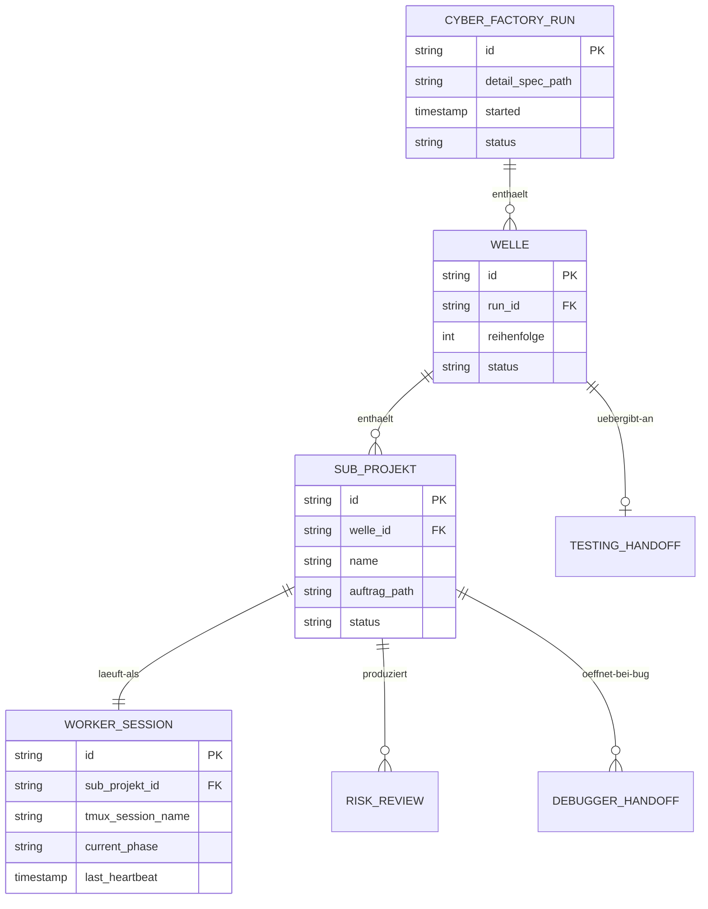

# 05 — Cyber Factory

## Abhaengigkeiten

- *Eingang:* Detail-Spec mit REQ-IDs aus dem Refinement (`08-refinement-extended.md`). Ohne diese Abhaengigkeit hat die Cyber Factory keinen sinnvollen Eingang — Refinement-Profil ist Voraussetzung fuer Cyber-Factory-Runs (Pflichtfelder, REQ-ID-Format, Verwendungszweck-Tag).
- *Persona-System:* `16-persona-presets.md` (Cipher als Default fuer L1-Cyber-Factory-Hauptsession, Kyniker als Default fuer L2-Worker)
- *Memory + Notes:* `11-workspace-memory.md` (Memory-Scope-Erbung) und `17-projekt-struktur.md` (Projektordner-Konventionen)
- *Bug-Report-Skill:* `18-bugreport-skill.md` (Cyber-Factory-Sessions koennen `/bugreport` aufrufen, z.B. wenn ein Worker auf eine Inkonsistenz stoesst)

## Operative Vorlage (verbindlich)

Die Cyber Factory **instrumentiert** das bereits ausgearbeitete Multi-Session-Konzept des Repositories. Das operative Konzept liegt in:

- `/moreismore/multisession_concept/multi_session_architecture.md` — Konventionen fuer L0/L1/L2/RV-Sessions, Spec mit REQ-IDs, Uebergabeprompt-Template, sub-CLAUDE.md je Subsystem, Reviewer-Checkliste, Token-Disziplin, Worktree-Mechanik, Iterations-Loop, "Wann ueberdimensioniert"-Heuristik
- `/moreismore/multisession_concept/multi_session_architecture.svg` — Visualisierung der Architektur

**Diese Pack-Datei (`05-cyber-factory.md`) ersetzt das nicht — sie liefert die cipher-mux-spezifischen Aspekte:**

| Im Architektur-Doc (operativ) | In dieser Pack-Datei (cipher-mux-spezifisch) |
|--------------------------------|-----------------------------------------------|
| Uebergabeprompt-Template `docs/handoffs/S<N>-<name>.md` | Code-Module unter `src/main/cyber-factory/` |
| sub-CLAUDE.md je Subsystem | ConfigStore-Sektion `cyber_factory` |
| REQ-IDs als Anti-Vergessens-Anker | MCP-Tool-Erweiterungen |
| Reviewer-Checkliste (Plan/Code/Spec-Conformance) | IPC-Channels |
| Worktree-Mechanik (`feature/<subsystem>`) | Datenmodell fuer Persistenz (SQLite-Tabellen) |
| Token-Disziplin pro Ebene | 11-Phasen-Lifecycle inkl. Architekt-Phase (Code-Sequenz) |
| Iterations-Loop | Stuck-Heuristik, Diagnose-Tool, Eskalations-Routing |
| Cross-Cutting-Realitaet (L0 als dauerhafter Koordinator) | Token-Budget-Mechanik, Model-Routing-Tabelle |
| "Wann ueberdimensioniert" | Schnittstellen zu anderen Presets (Refinement, Testing, Debugger) |

Wenn dieses Doc und das Architektur-Doc auseinanderlaufen: **das Architektur-Doc gewinnt** fuer operative Fragen. Diese Pack-Datei gewinnt fuer Code- und UI-Fragen.

## Was das Pack dem Multi-Session-Konzept hinzufuegt

Das Multi-Session-Konzept (Stand vor diesem Pack) kannte folgende Pack-Erweiterungen noch **nicht**. Sie sind zusaetzliche Konzept-Schichten, die das operative L0/L1/L2/RV-Geruest umrahmen:

1. **Phasen-Trennung im Software-Lebenszyklus** — Ideation Partner → Refinement → Cyber Factory → Testing Assistant → Debugger → Audit (`04-presets-funktional.md`). Multi-Session-Konzept hat L0/L1/L2/RV als generische Schichten, keine Lebenszyklus-Phasen.
2. **Persona-System** — Cipher, Relay, Wayne, Kyniker, Sokrates, Glitch mit Default-Matrix und Resolution-Hierarchie (`16-persona-presets.md`). Multi-Session-Konzept ist persona-frei.
3. **Globale Basisregeln** — Whitepaper-Tugenden als universelle Schicht ueber allen Sessions (`02-base-rules.md`). Multi-Session-Konzept hat nur eine Token-Disziplin-Sektion, keine vollstaendige Tugend-Verankerung.
4. **Preset-Akzente** — rolle-spezifische Tugenden pro Phase (`03-preset-akzente.md`). Multi-Session-Konzept differenziert Verhalten primaer ueber Modell und Off-Limits, nicht ueber Tugend-Akzente.
5. **Workspace-Memory** — drei-Schichten-Memory (Companion / Workspace / Session) mit MCP-Tools, Salience, Tag-Policy (`11-workspace-memory.md`). Multi-Session-Konzept hat nur Spec als Single Source of Truth, kein dynamisches Run-Memory.
6. **Companion als Wissensdatenbank + Steuerung** — Tutor/Berater/Helfer-Modi, Konzept-Erklaerer, Live-Steuerung via MCP (`04-presets-funktional.md`).
7. **Voice Companion** — Sprach-Adapter ueber jedem Preset.
8. **Token-Budget pro Worker-Auftrag** — Eskalation vor Ueberschreitung, nicht nur "Token-Disziplin"-Hinweise.
9. **Model-Routing-Tabelle pro Sub-Projekt-Typ** — formalisiert das L0/L1/L2-Modell-Default um eine feinere Sub-Projekt-Stufe.
10. **Pre-Mortem-Erkenntnisse** — Anwendungs-Beleg pro Welle, Cutover-Frist 14 Tage, Welle-1-Splittung (`15-pre-mortem.md`).
11. **Konzept-Aenderung gegenueber EN-2** — PresetEditor-Persona-Dropdown statt Inline-Edit (`14-offene-punkte.md`).
12. **External-Review-Funde** — strukturelle Patches aus frischer Session (`external-review-integration-2026-04-30.md`).

Diese Erweiterungen sind **additiv**. Sie aendern die operativen Konventionen aus dem Multi-Session-Konzept nicht, sondern setzen Schichten obendrauf.

Empfehlung fuer Welle 1a: das Multi-Session-Architektur-Doc bekommt im Frontmatter einen Hinweis "Erweitert durch cipher-mux/moreismore/cyber-factory-pack/ ab 2026-04-30" — aber bleibt inhaltlich unveraendert. Das Pack ist die jeweils aktuelle Praezisierung.

## Worker-Auftrags-Format (Übergabeprompt)

Jeder Worker-Auftrag, den die Cyber Factory verteilt, folgt dem Uebergabeprompt-Template aus dem Multi-Session-Konzept (`multi_session_architecture.md` → "Uebergabeprompt-Template (L0 → L1)") **plus** Pack-Erweiterungen:

```markdown
# Uebergabe: Sub-Projekt <id> — <Name>

## Auftrag
<Ein bis zwei Saetze, was das Sub-Projekt leisten muss.>

## REQ-IDs (verbindlich, aus Refinement-Detail-Spec)
- REQ-S<N>-001: <Kurzbeschreibung>
- REQ-S<N>-002: <Kurzbeschreibung>
...
Volltext: docs/specs/<subsystem>.md

## Architektur-Kontext
- Welche anderen Subsysteme angrenzen
- Welche APIs stabil sind (rufen, nicht aendern)
- Welche APIs dieses Subsystem definiert

## Off-Limits (kombiniert: globale Basisregeln + Workspace-Memory + Detail-Spec)
- <Pfad 1>
- <Pfad 2>

## Definition of Done
- Alle REQ-IDs umgesetzt + durch Tests abgedeckt
- Reviewer-Session (Testing Assistant) hat Spec-Conformance bestaetigt
- sub-CLAUDE.md im Worktree aktuell

## Modell und Tooling (Pack-Erweiterung)
- Modell: <haiku|sonnet|opus> (gemaess Routing-Tabelle)
- Token-Budget: <N> Tokens, Eskalations-Threshold 80%, Auto-Pause 95%
- Worktree: feature/<subsystem>
- Plan-Modus zwingend vor erstem Schreibvorgang

## Persona (Pack-Erweiterung)
- <persona-id> (z.B. 'kyniker' fuer Worker)
- Resolution erfolgt bei Session-Start

## MCP-Tools (Pack-Erweiterung)
- mux_workspace_memory_recall — Off-Limits-Liste, Konventionen, frühere Findings
- mux_workspace_memory_write — eigene Risk-Reviews, Walkthrough-Notizen
- mux_companion_recall — User-Praeferenzen
- mux_input_request_create — Eskalation an User (Level 5)
- mux_context_usage — Token-Verbrauch tracken
```

## sub-CLAUDE.md je Worker-Worktree

Beim Worker-Spawn legt die Cyber Factory eine `sub-CLAUDE.md` im Worktree-Root an. Format-Skelett aus `multi_session_architecture.md` plus Pack-Erweiterungen:

```markdown
# Sub-Projekt <id> — <Name>

## Auftrag
<aus Uebergabeprompt kopiert>

## Persona (Pack-Erweiterung)
<resolved Persona-Block aus 16-persona-presets.md>

## Basisregeln (Pack-Erweiterung)
<aus 02-base-rules.md zusammengefasst, nicht eingebettet — Verweis>

## Stack
<Sprache, Framework, Test-Tool, Build-Befehl>

## Konventionen
<aus Workspace-Memory Kind=convention>

## Off-Limits
<aus globalen Basisregeln + Workspace-Memory + Detail-Spec>

## Tests
- Run: `<command>`
- Coverage muss gruen sein vor Commit

## Bekannte Schnittstellen zu anderen Subsystemen
- S<X>: <kurze Beschreibung der Vertragsschnittstelle>

## Workspace-Memory (Pack-Erweiterung)
- workspace-id: <id>
- Recall pro Tool-Call moeglich, Write fuer Findings/Walkthroughs
```

## Worktree-Konvention

Worker-Sub-Sessions arbeiten in eigenem Worktree (uebernommen aus Multi-Session-Konzept):

```bash
git worktree add ../<projekt>-<subsystem> feature/<subsystem>
```

Cyber-Factory-Worker-Launcher (`worker-launcher.ts`) erzeugt den Worktree automatisch beim Spawn, fuegt sub-CLAUDE.md ein, startet Claude-Code mit dem Worktree-Pfad als Working Directory. Worktree-Cleanup nach Welle-Abschluss (Merge in main oder Verwurf) ist Aufgabe der Cyber-Factory-Hauptsession.

Subagents eines Workers (Sub-Sub-Level, falls in Welle 2 nicht erlaubt aber spaeter optional) bleiben im **selben** Worktree wie der Eltern-Worker.

## Zweck

Die Cyber Factory ist der Multi-Session-Orchestrator fuer die eigentliche Entwicklungsarbeit. Sie ersetzt die Funktion des heutigen MPO, separiert aber konsequent das **Bauen** vom **Bugfixing** (Debugger) und vom **Pruefen** (Testing Assistant). Sie nimmt eine Detail-Spec vom Refinement entgegen, zerlegt sie in Wellen, startet parallele Worker-Sessions, ueberwacht sie, und uebergibt fertige Wellen an den Testing Assistant.

In Begriffen der Multi-Session-Architektur: Cyber-Factory-Hauptsession = **L1**, Cyber-Factory-Worker = **L2**. Refinement = **L0** (Spec-Hoheit). Testing Assistant + Audit = **RV** (Reviewer in frischem Kontext).

## Abgrenzung

| Was Cyber Factory tut | Was sie nicht tut |
|------------------------|-------------------|
| Architekt-Phase: Subsystem-Zerlegung entlang Kommunikation/Schnittstellen | Anforderungen klaeren (Refinement) |
| Architekt-Phase: ADRs anlegen | Detail-Spec mit REQ-IDs schreiben (Refinement) |
| Architekt-Phase: Scaffolding (Projekt-Geruest) | Verwendungszweck-Pruefung (Refinement) |
| Multi-Session-Orchestrierung | Selbst Code schreiben |
| Worker-Sessions starten und ueberwachen | Tests laufen lassen (Worker tut das, Testing Assistant audit) |
| Eskalations-Hierarchie (5 Level) | Bug-Fixes (das macht der Debugger) |
| Risk-Reviews vor Welle-Cutover | Adversarial Testing (Testing Assistant) |
| Welle-Plan auf Basis der Subsystem-Zerlegung | (kein Welle-Plan ohne Architekt-Phase) |

**Faustregel:** Refinement weiss *was* gebaut werden soll und *für wen*. Cyber Factory weiss *wie* es zerlegt und gebaut wird — und tut es dann auch.

## Architektur — Code-Module

```
src/main/cyber-factory/
├── cyber-factory-manager.ts       — Lifecycle, ConfigStore, Phase-Sequenz
├── architect.ts                    — Architekt-Phase: Subsystem-Zerlegung, Schnittstellen-Design
├── adr-builder.ts                  — ADR-Generator (Architektur-Entscheidungen aus Phase 2)
├── scaffolding.ts                  — Projekt-Geruest aufsetzen (uebernommen aus altem Launcher-Code)
├── welle-planner.ts                — Subsystem-Zerlegung → Wellen mit Reihenfolge + Abhaengigkeiten
├── worker-launcher.ts              — Sub-Session Spawn + Auftrag
├── worker-monitor.ts               — Status-Loop, Stuck-Erkennung
├── escalation-classifier.ts        — Level-1..5 Heuristik
├── risk-reviewer.ts                — Risk-Review-Generator pro Worker
├── handoff-testing.ts              — Uebergabe an Testing Assistant
├── handoff-debugger.ts             — Routing bei Bug-Findings
├── diagnose.ts                     — Health-Report fuer aktive Runs (Pre-Mortem-Vorkehrung)
├── cyber-factory-template.ts       — Persona+Akzent+Funktional in Entity-CLAUDE.md
└── types.ts                        — TypeScript-Schnittstellen
```

**Architekt-Phase (Phase 2, neu — uebernommen aus dem zuvor in Refinement angesiedelten Stueck):** `architect.ts` enthaelt die Systems-Engineering-Logik. Auf Basis der vom Refinement gelieferten Detail-Spec mit REQ-IDs:

- *Subsystem-Identifikation entlang Kommunikation und Schnittstellen.* Sinnige Schnitte sind die, an denen Kommunikation zwischen Komponenten stabilisiert werden kann (Vertraege, APIs).
- *Schnittstellen-Verträge dokumentieren.* Besonderes Augenmerk: was geht rein, was kommt raus, welche Garantien (Idempotenz, Reihenfolge, Fehler-Semantik). Das ist der Hebel fuer Testbarkeit und Wartbarkeit.
- *Testbarkeit als Designziel.* Subsysteme so schneiden, dass sie isoliert testbar sind — Mocking-Last gering, Verhalten an Schnittstellen pruefbar.
- *ADRs anlegen.* Jede substantielle Architektur-Entscheidung wird in `<projektpfad>/docs/decisions/ADR-NNN.md` dokumentiert.
- *Scaffolding.* Projekt-Geruest aufsetzen (`.claude/`, `docs/SPEC.md`, `docs/decisions/`, `.gitignore`, Test-Setup, ggf. Build-Konfiguration, `CLAUDE.md`). Bestehende Dateien werden nicht ueberschrieben.

**Diagnose-Tool (Pre-Mortem Grund 3):** `diagnose.ts` produziert auf Anfrage einen Health-Report eines aktiven Cyber-Factory-Runs:
- Worker-Status (running, stuck, eskaliert, fertig)
- tmux-Session-Status pro Worker
- Context-Usage pro Worker (in % vom Limit)
- Letzte 30 Zeilen Output pro Worker
- Eskalations-Backlog
- Welle-Status

CLI-Befehl: `mux cyber-factory diagnose <run-id>`. Auch ueber MCP-Tool `mux_cyber_factory_diagnose` verfuegbar.

**Diagnose-Tool (Pre-Mortem Grund 3):** `diagnose.ts` produziert auf Anfrage einen Health-Report eines aktiven Cyber-Factory-Runs:
- Worker-Status (running, stuck, eskaliert, fertig)
- tmux-Session-Status pro Worker
- Context-Usage pro Worker (in % vom Limit)
- Letzte 30 Zeilen Output pro Worker
- Eskalations-Backlog
- Welle-Status

CLI-Befehl: `mux cyber-factory diagnose <run-id>`. Auch ueber MCP-Tool `mux_cyber_factory_diagnose` verfuegbar.

## Architektur — Datenmodell



Persistiert wird in der bestehenden SQLite-DB `~/.config/cipher-mux/cipher-mux.db` als neue Tabellen `cyber_factory_runs`, `wellen`, `sub_projekte`. Mehrgenerige Schema-Migration (siehe `12-migration-rebuild.md`).

## Lifecycle (11 Phasen)

```
Phase 1: Detail-Spec vom Refinement lesen + Pflichtfeld-Check
    ↓
Phase 2: Architekt-Phase — Subsystem-Zerlegung, Schnittstellen-Design,
         ADRs, Scaffolding (Systems-Engineering-Methoden)
    ↓
Phase 3: Welle-Plan auf Basis der Subsystem-Zerlegung + User-Bestaetigung
    ↓
Phase 4: Welle 1 starten (parallele Worker)
    ↓
Phase 5: Monitoring-Loop (5-7 min)
    ↓
Phase 6: Eskalation falls noetig (Level 1-5, plus Budget-Eskalation)
    ↓
Phase 7: Risk-Review pro Worker
    ↓
Phase 8: Welle abschliessen + Cutover-Check
    ↓
Phase 9: Naechste Welle starten ODER Uebergabe an Testing Assistant
    ↓
Phase 10: Bei Bug-Finding vom Testing → Routing an Debugger
    ↓
Phase 11: Abschluss-Note + User-Report (inkl. Token-/Cost-Bilanz)
```

**Phase 2 — Architekt-Phase (neu, vom Refinement abgegrenzt):**

Die Architekt-Phase ist die kreative Pflichtarbeit der Cyber Factory. Hier sitzt der Architekt, nicht der Requirements-Engineer. Der Architekt arbeitet auf Basis der Detail-Spec mit REQ-IDs, die vom Refinement geliefert wurde.

- *Subsystem-Identifikation entlang Kommunikation und Schnittstellen.* Welche Komponenten sprechen mit welchen? Wo verlaufen die natuerlichen Schnitte zwischen Verantwortlichkeiten?
- *Schnittstellen-Verträge dokumentieren.* Pro Subsystem-Schnittstelle: was geht rein, was kommt raus, welche Garantien, welche Fehlerfälle. Schnittstellen sind das Tragwerk der Wartbarkeit — hier wird gespart, wenn man später leiden will.
- *Testbarkeit als Designziel.* Subsysteme so schneiden, dass sie isoliert testbar sind. Wenn ein Subsystem nur durch Mocking von 5 anderen testbar ist, ist der Schnitt falsch.
- *ADRs anlegen.* Substantielle Architektur-Entscheidungen werden in `<projektpfad>/docs/decisions/ADR-NNN.md` dokumentiert. Format aus Basisregeln.
- *Scaffolding.* Projekt-Geruest aufsetzen — `.claude/`, `docs/SPEC.md`, `docs/decisions/`, `.gitignore`, Test-Setup, ggf. Build-Konfiguration, `CLAUDE.md` mit Projekt-Konventionen + Off-Limits + Test-Befehlen.

Diese Phase laeuft auf **Opus** (siehe Modell-Routing-Tabelle: `architecture: 'opus'`). Sie ist der wichtigste Hebel der ganzen Welle — hier sparen waere Pfennigfuchserei.

**Welle-Plan (Phase 3, neu nummeriert)** entsteht **aus** der Subsystem-Zerlegung von Phase 2. Sub-Projekte sind die Subsysteme; Wellen sind Bündel von Sub-Projekten ohne wechselseitige Blocker.

**Phase 4-11** sind die bisherige Multi-Session-Mechanik — Mechanik wie zuvor mit MPO uebernommen, aber:

- Phase 9 hat einen expliziten Uebergabe-Schritt (`handoff-testing.ts`), der ein Testing-Assistant-Anforderungspaket erzeugt.
- Phase 10 ist neu — Routing an Debugger bei Findings. Im alten MPO gab es das nicht, weil der MPO selbst Bugfixing implizierte.

## Eskalations-Hierarchie (5 Level)

Direkt aus MPO uebernommen (overlay-mpo.md), unveraendert. Die Hierarchie funktioniert robust und braucht keine konzeptionelle Aenderung.

| Level | Quelle | Autonomie | Beispiel |
|---|---|---|---|
| 1 | Detail-Spec | Autonom | "REST-first" steht drin → REST |
| 2 | Meta-Requirements | Autonom + Begruendung | Aus Stack/Constraints ableitbar |
| 3 | Cross-Session | Autonom + Logging | Andere Session hat kompatibel entschieden |
| 4 | Web-Recherche | Autonom | API-Docs, npm-Pakete, Patterns |
| 5 | User-Input | Eskalation via `mux_input_request_create` | Geschmack, Strategie, Scope, Irreversibles |

## Schnittstellen-Praezisierungen (Review-Integration 2026-04-30)

Diese Sektion praezisiert Schnittstellen, die nach External Review als zu vage gemeldet wurden.

### Refinement → Cyber Factory Handoff (Review-Fund 2)

Refinement endet, Cyber Factory beginnt — der Handoff laeuft so:

1. Refinement schliesst Phase 6 ab und ruft `mux_refinement_handoff_cyber_factory({wellePlanPath, projectPath, offLimits})` auf.
2. Tool legt einen `cyber_factory_run`-Eintrag mit Status `pending_user_confirmation` im ConfigStore an, und erzeugt einen Note-Eintrag mit Welle-Plan-Vorschlag.
3. Companion oder Sidebar zeigt dem User eine Bubble: "Refinement fertig. Cyber-Factory-Run starten?". User bestaetigt.
4. Cyber Factory uebernimmt — Phase 1 startet automatisch.

Auto-Start ist **nicht** Default; User-Bestaetigung ist Pflicht. Begruendung: User-Kontrolle ueber irreversible Wellen-Plan-Aktivierung.

### Welle-Plan-Format (Review-Fund 18)

Welle-Plan ist Markdown mit YAML-Frontmatter:

```markdown
---
run_id: cf-2026-05-01-auth-refactor
welle_count: 3
parallel_max: 3
---

## Welle 1
- sub-projekt: db-schema (worker, autonom)
- sub-projekt: auth-module (worker, autonom)
abhaengigkeit: keine

## Welle 2
- sub-projekt: api-routes (worker, plan-review)
abhaengigkeit: blocks-by Welle 1

## Welle 3
...
```

Plan wird als Note mit Kind `welle-plan` im Workspace-Memory gespeichert und ueber `mux_input_request_create` dem User zur Bestaetigung vorgelegt.

### Off-Limits-Liste — Quelle (Review-Fund 20)

Die Off-Limits-Liste, die Cyber Factory an Sub-Sessions verteilt, setzt sich zusammen aus:

1. *Globale Basisregeln* (`02-base-rules.md` → 5. Off-Limits respektieren) — gelten immer
2. *Workspace-Memory* (Kind `off_limit`) — projekt-spezifisch, von Refinement geschrieben
3. *Detail-Spec* (sub-projekt-spezifisch, falls in Detail-Spec markiert)

Die kombinierte Liste wird in der Worker-Auftrags-Nachricht mitgegeben, der Worker bestaetigt sie beim Start.

### Stuck-Heuristik (Review-Fund 13)

Worker wird als stuck klassifiziert, wenn:

- Kein heartbeat seit > 7 Minuten **ODER**
- Output flacht ab (< 100 Zeichen seit > 3 Minuten, dabei kein "warten auf Input"-Status)

Bei stuck:
1. `diagnose.ts` wird automatisch aufgerufen
2. Diagnose-Bericht als Note (Kind `diagnose`) angelegt
3. User-Eskalation Level 5 via `mux_input_request_create`

User entscheidet: weitermachen, abbrechen, oder Auftrag aendern.

### Risk-Review-Format (Review-Fund 14)

Risk-Review pro Worker-Session ist strukturierter Markdown:

```markdown
---
run_id: cf-2026-05-01-auth-refactor
worker_id: cmux-w-auth-1
date: 2026-05-01T14:23
---

## Geaenderte Dateien
- src/auth/login.ts (47 Zeilen geaendert)
- src/auth/jwt.ts (neu, 89 Zeilen)

## Geloeschte Dateien
- (keine)

## Neue Abhaengigkeiten
- jose@5.2.0 (gepruefte Registry-Existenz)

## Potentiell Gebrochenes
- session-Handling-Test in tests/auth/session.test.ts hat geaenderte Erwartung — pruefen

## Off-Limits-Status
- (keine Beruehrung)

## Tests
- alle gruen
```

Persistiert als Note mit Kind `risk-review` im Workspace-Memory. Sidebar-Tab "Risk-Reviews" zeigt eine Liste.

### Testing → Debugger Routing (Review-Fund 21)

Testing Assistant ruft `mux_cyber_factory_handoff_debugger({findings_report_path, severity_summary})`. Routing-Regel:

| Severity-Mix | Aktion |
|---|---|
| ≥1 Hoch | Auto-Routing an Debugger, Bubble an User ("Debugger gestartet") |
| 0 Hoch + ≤5 Mittel | User-Dialog "Debugger starten?" mit Empfehlung |
| 0 Hoch + 0 Mittel | Direktes Routing an Audit |

User kann Auto-Routing in ConfigStore (`testing_assistant.autoHandoffOnSeverityHigh`) abschalten.

### Model-Routing pro Sub-Projekt-Typ

Der wirkungsvollste Token- und Latenz-Hebel ist nicht die Antwort-Laenge, sondern die Modell-Wahl. Opus, Sonnet und Haiku unterscheiden sich um Faktor ~10 in Kosten und ~3 in Latenz. Bei parallelen Workern multipliziert sich das. Die Cyber Factory routet pro Sub-Projekt-Typ auf das passende Modell.

Konzeptioneller Anker: Whitepaper Kap. 7.2 (Risiko-Domaenen mit Autonomie-Tabelle) und 6.12 (Autonomy Slider). Hohe Autonomie + standardisierter Code → kleineres Modell genuegt. Niedrige Autonomie + sicherheitskritisch → groesseres Modell gerechtfertigt.

**Architektur-Anker:** Das Pack baut auf der bestehenden Multi-Session-Architektur des Repositories auf. Referenz-Dokument: `/moreismore/multisession_concept/multi_session_architecture.md` und das zugehoerige SVG. Diese Architektur definiert vier Ebenen — L0 (Stakeholder/Spec), L1 (Subsystem-Koordinator), L2 (Worker), RV (Reviewer in frischem Kontext) — mit klaren Modell-Defaults pro Ebene. Mein Pack mappt darauf wie folgt:

| L0/L1/L2/RV | Cyber-Factory-Pack-Aequivalent | Modell-Default |
|-------------|----------------------------------|----------------|
| **L0** Stakeholder + Spec | Refinement (Phase 3-4: Detail-Spec + ADRs) plus Cyber-Factory-Welle-Plan-Phase | opusplan (Opus fuer Plan, Sonnet fuer Schreiben) |
| **L1** Subsystem-Koordinator | Cyber-Factory-Hauptsession (eine Welle = ein Subsystem) | Sonnet |
| **L2** Worker | Cyber-Factory-Worker-Sub-Sessions | Sonnet (Default) oder Haiku (mechanische Aufgaben) |
| **RV** Reviewer | Testing Assistant + Audit + Code-Review-Subagents | Sonnet, **frischer Kontext, keine Subagents der schreibenden Session** |

Diese Tabelle ist die uebergeordnete Default-Verteilung. Die feinere Sub-Projekt-Typ-Tabelle unten praezisiert L2 weiter.

**Default-Routing-Tabelle:**

| Sub-Projekt-Typ | Default-Modell | Begruendung |
|------------------|----------------|-------------|
| Trivialitaet, Tippfehler-Fix | Haiku | minimal Kontext, klare Aufgabe |
| Boilerplate, Scaffolding | Haiku | repetitiv, gut typisiert, hoher Reinforcement-Korridor |
| Tests, Doku-Generierung | Haiku oder Sonnet | abhaengig von Test-Komplexitaet |
| Refactor, Renaming, Mechanical Edits | Sonnet | Konsistenz wichtig, aber kein Architektur-Risiko |
| Geschaeftslogik, Integrationen | Sonnet | Standard-Coding-Partner laut Whitepaper 7.4 |
| Worker im Bug-Fixing nach Plan | Sonnet | Reproduktion + minimal Diff |
| Architektur-Implementierung mit ADR | Opus | mehrschichtige Konsequenzen, Trade-offs abwaegen |
| Auth, Payments, Krypto, Migrations | Opus | hoch-Risiko-Domaene, Whitepaper 7.2 |
| Audit-Vollscan (Sicherheit + ADR-Konsistenz) | Opus | umfassende Diff-Analyse, OWASP-Heuristik |
| Adversarial Probing (Testing Assistant) | Sonnet oder Opus | kreativitaets-abhaengig |
| Plan-Reviewer (Cyber-Factory-Welle-Plan) | Sonnet oder Opus | Plan ist Hebel — Geld an der Stelle gut investiert |

**Wichtige Heuristik:** Der **Welle-Planner** selbst (Cyber-Factory-Hauptsession, in L0/L1/L2/RV-Sprache: L1) laeuft auf Sonnet, mit **opusplan** in der Plan-Phase — das ist die Konvention der bestehenden Multi-Session-Architektur. Refinement (L0) laeuft generell auf opusplan. Worker (L2), die nur ausfuehren, koennen auf Sonnet oder Haiku. Der Reviewer (RV — Testing Assistant, Audit) laeuft auf Sonnet in **frischem Kontext** (keine Subagents der schreibenden Session, kein Cache-Bias). Plan-Qualitaet ist der wichtigste Hebel der ganzen Welle, dort sparen ist Pfennigfuchserei.

**Aufgabenabhaengige Flexibilitaet:**

- *Welle-Planner kann pro Sub-Projekt das Modell ueberschreiben.* Beispiel: ein "Boilerplate"-Sub-Projekt, das aber unbekannte Library nutzt → eskaliert auf Sonnet.
- *User kann im Welle-Plan-Bestaetigungs-Dialog Modelle anpassen* (analog zu Token-Budgets).
- *ConfigStore-Override fuer Default-Modell*: `cyber_factory.modelRouting.boilerplate = 'sonnet'` (z.B. wenn der User generell Sonnet bevorzugt).

**Ausgeliefertes Modell-Set (Stand Pack v0.2):**

```typescript
type ClaudeModel =
  | 'claude-haiku-4-5-20251001'
  | 'claude-sonnet-4-6'
  | 'claude-opus-4-6';
```

Modell-Strings sind versions-gebunden. ConfigStore haelt sie symbolisch (`'haiku' | 'sonnet' | 'opus'`); ein zentraler Resolver in `src/main/cyber-factory/model-resolver.ts` mappt auf den aktuellen Versions-String. Bei Modell-Updates aendert sich nur der Resolver, nicht die ConfigStore-Eintraege.

**Worker-Spawn-Mechanik:** `mux_create_session` bekommt einen optionalen `model`-Parameter. Wird dieser gesetzt, wird das Claude-Code-CLI mit `--model <string>` (oder per `.claude/settings.local.json` Eintrag) gestartet. Heute erlaubt cipher-mux das ueber globale Settings — die Cyber Factory schreibt fuer Worker-Sessions eine eigene `settings.local.json` mit Worker-spezifischem Modell.

**Cost-Awareness als Welle-Bilanz:** In Phase 10 (Abschluss-Note) wird neben Token-Verbrauch auch das ungefaehre Cost-Profil pro Worker gemeldet (Tokens × Modell-Preis). Lerneffekt fuer kuenftige Welle-Plaene — Sub-Projekt-Typ, der oft auf Sonnet eskaliert, sollte dort als Default landen.

**Fallback bei nicht verfuegbarem Modell:** Wenn der User-Account das Default-Modell nicht hat (z.B. kein Opus-Zugang), eskaliert der Welle-Planner an User mit Vorschlag "Opus nicht verfuegbar — Sonnet stattdessen?". Kein Auto-Fallback ohne User-Entscheidung, weil das Plan-Qualitaet betreffen kann.

### Token-Budget pro Worker-Auftrag

Jeder Worker-Auftrag enthaelt ein `tokenBudget`-Feld. Das Feld ist nicht hart erzwingbar (Claude-Code-CLI hat keine Token-Cap-Schnittstelle), aber als Auftrags-Bestandteil weist der Worker es der eigenen Disziplin zu.

**Default-Profile (vom Welle-Planner pro Sub-Projekt gesetzt):**

| Sub-Projekt-Typ | Default-Budget | Verhalten bei Annaeherung |
|------------------|----------------|----------------------------|
| Boilerplate, Scaffolding | 20.000 Tokens | bei 80%: Worker meldet "fast am Limit, soll ich weitermachen?" |
| Geschaeftslogik, Integrationen | 50.000 Tokens | bei 80%: Worker meldet, bei 95%: Auto-Pause |
| Architektur-Implementierung mit ADR | 80.000 Tokens | bei 80%: Worker meldet, bei 95%: Auto-Pause |
| Refactor / Migration | 60.000 Tokens | bei 80%: Worker meldet |
| Tests/Doku-Welle | 30.000 Tokens | bei 80%: Worker meldet |

Bei "Auto-Pause" haelt der Worker an, schreibt einen Zwischenstand-Bericht und wartet auf User-Entscheidung (weitermachen mit erhoehtem Budget, abbrechen, Auftrag splitten).

**Welle-Planner-Heuristik:** Welle-Plan-Phase (Phase 2) ordnet jedem Sub-Projekt einen Aufgaben-Typ und damit ein Default-Budget zu. User kann im Welle-Plan-Bestaetigungs-Dialog die Budgets manuell anpassen.

**Monitoring:** `mux_context_usage` (existiert) liefert Prozent-Wert relativ zum Modell-Limit. Cyber Factory rechnet zusaetzlich mit dem Auftrags-Budget — `usedSinceStart / tokenBudget`.

**Aufgabenabhaengige Flexibilitaet (User-Frage 2026-04-30):** Nicht jedes Sub-Projekt passt sauber in die Tabelle. Wenn der Welle-Planner unsicher ist, wird das Budget zur Sicherheit eine Stufe hoeher gewaehlt — ein zu knappes Budget produziert mehr Eskalations-Pausen, ein zu grosszuegiges produziert nur Verschwendung. Der User kann pro Welle die ConfigStore-Variable `cyber_factory.budgetMultiplier` setzen (Default 1.0), die alle Default-Budgets skaliert.

### Phasen-Idempotenz (Review-Fund 25)

Cyber-Factory-Wellen sind **idempotent**: eine Welle, die wegen Crash oder Restart nochmal aufgerufen wird, restauriert State aus ConfigStore und Workspace-Memory, statt neu zu starten.

Lock-Mechanismus: ConfigStore `cyber_factory.run_lock = <run_id>` verhindert parallele Executions derselben Welle. Beim Versuch, eine bereits-laufende Welle erneut zu starten: Hinweis "Welle laeuft bereits, willst du den Status sehen?".

### Worker-Phasenmodell-Durchsetzung (Review-Fund 3)

Worker-Sessions, die das 7-Phasen-Modell aus `02-base-rules.md` nicht befolgen (z.B. sofort Code ohne Plan), werden:

1. Bei erster Abweichung mit Eskalations-Level 3 (Cross-Session-Logging) korrigiert — Cyber Factory schickt eine Korrektur-Notiz an den Worker.
2. Nach 2 Fehlversuchen → Eskalations-Level 5 → User entscheidet (weitermachen ohne Modell, abbrechen, neuen Worker mit anderem Auftrag).

Detection-Heuristik: Worker, der innerhalb der ersten 3 Minuten Code-Diffs produziert, ohne einen Plan-Block in Output zu haben, gilt als plan-skipping.

### Max-Workers-Durchsetzung (Review-Fund 6)

`maxParallelWorkers` (Default 5) ist ein **globales Limit ueber alle Cyber-Factory-Runs**, nicht pro Session. Wenn zwei Cyber-Factory-Runs gleichzeitig laufen (z.B. Welle 1 in Workspace A, Welle 2 in Workspace B): Worker-Slots werden geteilt. Default 5 ist konservativ, kann per ConfigStore erhoeht werden.

`maxParallelWorkers` wird beim `mux_create_session`-Aufruf im Cyber-Factory-Kontext erzwungen. Versuch, Worker N+1 zu starten, gibt Fehler zurueck:

```
Eskalation Level 4: Max parallel workers reached (5/5) global across runs.
Wait for slot or increase maxParallelWorkers in ConfigStore.
```

User kann das Limit per Settings hochsetzen — sinnvoll z.B. bei mehreren parallelen Workspaces.

### Stuck-Heuristik konfigurierbar (Review-Fund 13)

Die Stuck-Schwellen (7 Min Heartbeat, 3 Min Output-Plateau) sind harte Defaults, aber im ConfigStore konfigurierbar:

```typescript
interface StuckDetectionConfig {
  heartbeatTimeoutMs: number;    // Default 7 * 60 * 1000
  outputPlateauMs: number;       // Default 3 * 60 * 1000
  minOutputCharsInPlateau: number; // Default 100 (weniger = stuck)
}
```

Begruendung: bei unterschiedlichen Modellen (Haiku vs. Opus) und unterschiedlichen Sub-Projekt-Typen kann es zu False Positives kommen. User kann pro ConfigStore-Sektion `cyber_factory.stuckDetection` tunen.

### Risk-Review-Format — Erweiterung (Review-Fund 14)

Risk-Review-Markdown-Template wird um zwei Pflicht-Sektionen erweitert (uebernommen aus Multi-Session-Reviewer-Checkliste):

```markdown
## Schema- oder API-Aenderungen (stillschweigend?)
- DB-Schema: <ja/nein, falls ja: welche Tabellen, ggf. Migration-Pflicht>
- Oeffentliche API-Endpunkte: <ja/nein, falls ja: welche>

## Abhaengigkeits-Validierung
- Neue Pakete: <Liste>
- In offizieller Registry verifiziert: <ja/nein pro Paket>
- Slopsquatting-Risiko: <bewertet>
```

Diese Sektionen sind Pflicht — fehlende Sektion gilt als unvollstaendig, Worker muss nachliefern, bevor Welle-Cutover.

### Off-Limits-Konflikt-Regel (Review-Fund 20)

Wenn Detail-Spec sagt "aendere `src/auth/`" aber globale Basisregeln sagen "auth ist Off-Limits": **Detail-Spec gewinnt** — sie ist explizit, der User hat sie geschrieben und kennt die Konsequenzen. Aber:

- Worker muss in Risk-Review explizit melden: "Aenderung an Off-Limits-Pfad `src/auth/` autorisiert durch REQ-S<N>-XXX in Detail-Spec."
- Audit-Phase pruefen Off-Limits-Verstoesse mit Querverweis zur Detail-Spec — Auto-Akzeptanz wenn Detail-Spec-Autorisierung dokumentiert.

Workspace-Memory (`kind=off_limit`) ist informativ — nicht autoritativ. Default-Hierarchie:

1. Detail-Spec autorisiert explizit → Worker darf
2. Globale Basisregeln + Workspace-Memory → Off-Limits, Worker eskaliert (Level 5) bei Aenderungs-Bedarf
3. User-Bestaetigung im Eskalations-Dialog → temporaere Erlaubnis, in Audit-Trail dokumentiert

### Welle-Plan schemaVersion (Review-Fund 18)

Welle-Plan-YAML-Frontmatter bekommt Schema-Versionierung:

```yaml
---
schemaVersion: 1
run_id: cf-2026-05-01-auth-refactor
welle_count: 3
parallel_max: 3
---
```

Bei spaeteren Schema-Aenderungen kann der Migrations-Plan (`12-migration-rebuild.md`) auf `schemaVersion` pruefen und alte Plaene konvertieren.

### Testing → Debugger Routing — Dialog-Beispiel (Review-Fund 15)

Bei "0 Hoch + ≤5 Mittel" → User-Dialog mit Empfehlung. Beispiel-Formulierungen je Persona:

**Cipher:**
> "5 mittlere Findings, kein Hoches. Debugger starten oder ist das ok so?"

**Relay:**
> "Testing-Run abgeschlossen. 0 hoch, 5 mittel. Empfehlung: Debugger fuer die mittleren, dann Audit. Alternativ direkt Audit, wenn die mittleren akzeptabel sind. Was lieber?"

**Kyniker:**
> "5 mittel. Debugger?"

User-Antwort wird als Note (`kind:decision`, scope=workspace) persistiert.

## Worker-Startup-Protokoll (Pflicht)

Aus CLAUDE.md des Repositories uebernommen, weil die Reibungsstelle real ist (Race Condition bei Pre-Claude-Messages):

1. `mux_create_session` — Session erstellen
2. **8-10s warten** — tmux + zsh + Claude CLI Startup
3. `tmux capture-pane | tail -30` — pruefen ob Claude-Prompt sichtbar
4. Falls nicht bereit: weitere 5s, erneut pruefen
5. **`tmux send-keys "<auftrag>" Enter`** — Auftrag DIREKT in Pane
6. **15s warten** — Claude muss Task parsen
7. `tmux capture-pane` — pruefen ob Worker arbeitet
8. **Monitoring-Loop alle 2 min:** `tmux capture-pane` + `mux_context_usage`

`mux_send` bleibt fuer Inter-Session-Kommunikation. Es ist **kein** Prompt-Input-Mechanismus.

## ConfigStore-Keys

```typescript
// src/shared/types.ts ergaenzen
interface CyberFactoryConfig {
  enabled: boolean;             // Feature-Flag
  maxParallelWorkers: number;   // Default 5
  defaultRetries: number;       // Default 2
  monitoringIntervalMs: number; // Default 7 * 60 * 1000
  workspaceMemoryEnabled: boolean; // Phase-3-Erweiterung
  budgetMultiplier: number;     // Default 1.0 — skaliert alle Default-Budgets
  budgetEscalationThreshold: number; // Default 0.8 — bei Annaeherung an Budget melden
  budgetAutoPauseThreshold: number;  // Default 0.95 — bei Annaeherung Auto-Pause
  modelRouting: ModelRoutingConfig;
  plannerModel: 'haiku' | 'sonnet' | 'opus'; // Default 'sonnet'
}

type ModelChoice = 'haiku' | 'sonnet' | 'opus' | 'opusplan';

interface ModelRoutingConfig {
  trivial: ModelChoice;            // Default 'haiku'
  boilerplate: ModelChoice;        // Default 'haiku'
  tests: ModelChoice;              // Default 'haiku'
  docs: ModelChoice;               // Default 'haiku'
  refactor: ModelChoice;           // Default 'sonnet'
  business_logic: ModelChoice;     // Default 'sonnet'
  bug_fix: ModelChoice;            // Default 'sonnet'
  architecture: ModelChoice;       // Default 'opus'
  high_risk_domain: ModelChoice;   // Default 'opus' (auth/payment/migration)
  audit_full: ModelChoice;         // Default 'opus'
  adversarial: ModelChoice;        // Default 'sonnet'
}

interface CyberFactoryConfig {
  // ... bestehende Felder ...
  plannerModel: ModelChoice;       // L1-Hauptsession; Default 'sonnet', mit opusplan im Plan-Modus
  refinementModel: ModelChoice;    // L0-Refinement; Default 'opusplan'
  reviewerModel: ModelChoice;      // RV-Reviewer/Testing/Audit; Default 'sonnet' frischer Kontext
}

// Default-Wert
const CYBER_FACTORY_DEFAULT: CyberFactoryConfig = {
  enabled: false,  // initial via Feature-Flag
  maxParallelWorkers: 5,
  defaultRetries: 2,
  monitoringIntervalMs: 7 * 60 * 1000,
  workspaceMemoryEnabled: false,
  budgetMultiplier: 1.0,
  budgetEscalationThreshold: 0.8,
  budgetAutoPauseThreshold: 0.95,
  plannerModel: 'sonnet',     // L1-Cyber-Factory-Hauptsession; opusplan im Plan-Modus
  refinementModel: 'opusplan', // L0-Refinement in Plan-Modus
  reviewerModel: 'sonnet',    // RV-Testing-Assistant + Audit, frischer Kontext
  modelRouting: {
    trivial: 'haiku',
    boilerplate: 'haiku',
    tests: 'haiku',
    docs: 'haiku',
    refactor: 'sonnet',
    business_logic: 'sonnet',
    bug_fix: 'sonnet',
    architecture: 'opus',
    high_risk_domain: 'opus',
    audit_full: 'opus',
    adversarial: 'sonnet',
  },
};
```

ConfigStore-Sektion: `cyber_factory`. Migration aus alter `mpo`-Sektion in `12-migration-rebuild.md`.

## MCP-Tools

Bestehende Tools werden uebernommen, eine Erweiterung kommt hinzu:

| Tool | Status | Aenderung |
|------|--------|-----------|
| `mux_sessions` | Bestehend | Unveraendert |
| `mux_create_session` | Bestehend | Worker-Sessions erhalten neuen Tag `cyber_factory_run_id` |
| `mux_kill_session` | Bestehend | Unveraendert |
| `mux_send` | Bestehend | Unveraendert |
| `mux_read` | Bestehend | Unveraendert |
| `mux_status` | Bestehend | Unveraendert |
| `mux_context_usage` | Bestehend | Unveraendert |
| `mux_task_create` | Bestehend | Erweitert um optional `cyber_factory_run_id` |
| `mux_task_update` | Bestehend | Unveraendert |
| `mux_task_list` | Bestehend | Filterbar nach `cyber_factory_run_id` |
| `mux_task_get` | Bestehend | Unveraendert |
| `mux_input_request_create` | Bestehend | Unveraendert |
| `mux_notes_create` | Bestehend | Unveraendert |
| `mux_cyber_factory_handoff_testing` | **Neu** | Welle-Uebergabe an Testing Assistant |
| `mux_cyber_factory_handoff_debugger` | **Neu** | Bug-Routing an Debugger |
| `mux_workspace_memory_recall` | **Neu (Ebene 3)** | Workspace-skopiertes Memory |

Implementierung der neuen Tools: siehe `11-workspace-memory.md` und `06-debugger.md`.

## IPC-Channels

```typescript
// src/shared/ipc-channels.ts
export const IPC_CYBER_FACTORY = {
  RUN_START: 'cyber-factory:run-start',
  RUN_STATUS: 'cyber-factory:run-status',
  RUN_CANCEL: 'cyber-factory:run-cancel',
  WELLE_LIST: 'cyber-factory:welle-list',
  WORKER_STATUS: 'cyber-factory:worker-status',
  WORKER_KILL: 'cyber-factory:worker-kill',
  HANDOFF_TESTING: 'cyber-factory:handoff-testing',
} as const;
```

Renderer kann ueber diese Channels eine Cyber-Factory-Run-Visualisierung in der Sidebar oder einer dedizierten View darstellen (UI ausserhalb dieses Specs).

## Renderer-Integration (skizziert)

- Neuer Sidebar-Tab "Cyber Factory" zeigt aktive Runs, Wellen, Worker-Status
- Cyber-Factory-Run kann ueber Cmd+Shift+F gestartet werden (Keybind in Settings)
- Stuck-Worker werden mit roter Markierung angezeigt
- User-Eskalations-Bubbles erscheinen wie bei MPO heute

UI-Detail-Spec ist nicht Teil dieses Packs — kommt nach Wellen-Implementierung.

## Tests (Pflicht)

Pro Code-Modul (`cyber-factory/*.ts`) Unit-Tests. Plus Integration-Tests:

1. *Welle-Planung:* Detail-Spec mit 3 Sub-Projekten, 1 Abhaengigkeit → Welle-Plan generiert sich korrekt
2. *Worker-Startup:* `mux_create_session` Mock + Readiness-Check → Auftrag wird erst nach Prompt-Detection gesendet
3. *Eskalation Level 1-5:* Test-Inputs pro Level → korrekte Klassifizierung
4. *Risk-Review:* Worker-Output mit Geschmacksaenderung → Risk-Review markiert es
5. *Iterative-Degradation-Schutz:* Worker mit 3 Retries → Eskalation ausgeloest
6. *Handoff Testing:* Welle-Abschluss → Testing-Assistant-Anforderungspaket erzeugt
7. *ConfigStore-Migration:* alte `mpo`-Konfig → neue `cyber_factory`-Konfig korrekt mappen

## Persona-Sprachstil im Cyber-Factory-Prompt

Der Cyber-Factory-Sprachstil erbt Relay-Default (siehe relay-core), mit MPO-spezifischer Notiz: pragmatisch, knapp, mit einem Augenzwinkern. Kein lautes Enthusiasmus. Beispiel-Outputs aus overlay-mpo.md werden uebernommen.

## Migration aus MPO

Siehe `12-migration-rebuild.md` Welle 2.

Kurz:
- Neue ConfigStore-Sektion `cyber_factory` (alt: `mpo`)
- Neue builtin-Entity-ID `cyber-factory` (alt: `mpo`)
- Neuer Session-Name `CyberFactory` (alt: `MPO`)
- Code-Module unter `src/main/cyber-factory/` (alt: `src/main/mpo/`, `src/main/session/mpo-template.ts`)
- Tests in `test/main/cyber-factory/` (parallel zu `test/main/mpo/`)

Beide Welten laufen parallel bis Cutover. Migrations-Skript in `scripts/migrate-mpo-to-cyber-factory.ts` portiert User-Konfigurationen.

## Offene Punkte

- *Welche User-Sichtbarkeits-Stufe haben Cyber-Factory-Wellen in der Sidebar?* — UI-Spec klaert das.
- *Sub-Sub-Sessions: darf ein Worker selbst Sub-Sessions starten?* — Empfehlung: nein in v1, ggf. spaeter mit ADR.
- *Cyber-Factory-Agent fuer mehrere Cyber-Factory-Runs gleichzeitig?* — Nein, ein Run pro Session-ID. Parallel braucht parallele Cyber-Factory-Sessions.
