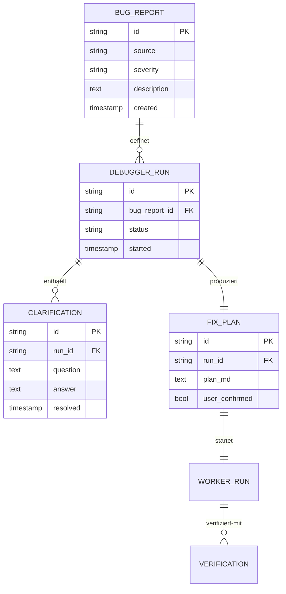

# 06 — Debugger

## Zweck

Der Debugger ist die spezialisierte Phase nach Build-Run. Er bekommt entweder Findings vom Testing Assistant oder direkte Bug-Reports vom User, klaert mit hohem Qualitaetsziel die Auftragsklarheit, plant den Fix, schickt einen tugendhaften Worker ins Debugging und verifiziert das Ergebnis.

Der Debugger ersetzt nicht den heutigen Launcher in seiner Scaffolding-Funktion (das wandert ins Refinement). Er ersetzt die phasenweise Bugfixing-/Polishing-Funktion, die der heutige Launcher in `projectlauncher`-Form mitgemacht hat.

## Abgrenzung

| Was der Debugger tut | Was er nicht tut |
|----------------------|-------------------|
| Findings analysieren | Adversarial Testing (Testing Assistant) |
| Rueckfragen mit User klaeren | Neue Features bauen (Cyber Factory) |
| Fix-Plan schreiben + Bestaetigung | Selbst fixen ohne Plan |
| Worker-Sub-Session steuern | Mehr als 2 Retries |
| Verhaltens-Test fuer Bug schreiben | Test-Suite umstrukturieren |
| Linear Walkthrough auf Wunsch | Adversarial Probing (Testing Assistant) |

## Architektur — Code-Module

```
src/main/debugger/
├── debugger-manager.ts             — Lifecycle, ConfigStore
├── findings-parser.ts               — Testing-Assistant-Reports lesen
├── clarification-router.ts          — User-Rueckfragen verwalten
├── fix-planner.ts                   — Fix-Plan-Generator (mit User-Bestaetigung)
├── worker-launcher.ts               — Worker-Sub-Session fuer Implementierung
├── verification-runner.ts           — Verhaltens-Test pre/post Fix
├── walkthrough-renderer.ts          — Linear Walkthrough Markdown-Generator
├── debugger-template.ts             — Persona+Akzent+Funktional in Entity-CLAUDE.md
└── types.ts                         — TypeScript-Schnittstellen
```

## Architektur — Datenmodell



Persistenz in `~/.config/cipher-mux/cipher-mux.db` als neue Tabellen `debugger_runs`, `clarifications`, `fix_plans`. Bug-Reports nutzen die existierende `bugreports`-Tabelle.

## Lifecycle (8 Phasen)

```
Phase 1: Findings/Bug-Report lesen + Pruefung Klarheit
    ↓
Phase 2: Rueckfragen-Loop mit User (falls noetig)
    ↓
Phase 3: Fix-Plan schreiben + User-Bestaetigung
    ↓
Phase 4: Verhaltens-Test schreiben (rot)
    ↓
Phase 5: Worker-Sub-Session starten + Phasenmodell
    ↓
Phase 6: Verifikation — Test gruen, Suite gruen
    ↓
Phase 7: Risk-Review + Linear Walkthrough auf Wunsch
    ↓
Phase 8: Uebergabe — Re-Test (Testing Assistant) oder Audit
```

### Phase-Details

**Phase 1 — Findings/Bug-Report lesen.**
Strukturierte Felder: Symptom (was passiert), Reproduktion (wie zeigen), Severity (hoch/mittel/niedrig), vermutete Ursache (optional), betroffene Bereiche.

Wenn Findings unstrukturiert (z.B. direktes User-Bug-Posting): Du schreibst die Strukturierung selbst und liest dem User zur Bestaetigung vor ("Ich habe das so verstanden: ... Stimmt das?").

**Phase 2 — Rueckfragen-Loop.**
Hohes Qualitaetsziel — lieber zwei Rueckfragen als ein falscher Fix. Pro Rueckfrage `mux_input_request_create` mit 2-4 Optionen oder Freitext-Empfehlung. Klassische Stellen:

- Ist der gemeldete Bug wirklich der Root-Cause oder ein Symptom?
- Wie soll sich das System idealerweise verhalten?
- Welche Rand-Faelle sind mit drin?
- Gibt es bekannte Stolpersteine in der Region?

**Phase 3 — Fix-Plan.**
Der Plan enthaelt:
- Hypothese ueber Ursache (mit Confidence-Markierung: "vermutlich" vs. "sicher")
- Geplanter Fix (Datei, Zeile, was wird geaendert)
- Test-Erweiterung (welcher Test fuer den Bug)
- Risiko-Einschaetzung (was koennte der Fix sonst noch beruehren)
- Aufwands-Schaetzung (in Form von "trivial / klein / mittel / gross")

User bestaetigt Plan oder fragt nach. Bei trivialem Fix mit klarer Ursache reicht Selbst-Bestaetigung mit Plan-Note.

**Phase 4 — Verhaltens-Test schreiben.**
Bevor der Fix passiert: Test, der das Bug-Verhalten exakt reproduziert (rot). Das ist Reinforcement-Signal fuer den Worker und macht spaeter ueberpruefbar, dass der Fix wirklich greift.

**Phase 5 — Worker-Sub-Session starten.**
`mux_create_session` mit klarem Auftrag:
- Fix-Plan als Anhang
- Verhaltens-Test ist im Repo, soll gruen werden
- Worker-Phasenmodell aus Basisregeln ist Pflicht
- Off-Limits-Liste mitgegeben
- Maximal 2 Retries (Iterative-Degradation-Schutz, Whitepaper 5.2)

Worker-Startup-Protokoll wie in Cyber Factory (Readiness-Check + tmux send-keys, nicht `mux_send` als Auftrag).

**Phase 6 — Verifikation.**
- Verhaltens-Test fuer den Bug: gruen
- Bestehende Test-Suite: gruen
- Lint/Type-Check: gruen
- Falls Phase fehlschlaegt: zurueck zu Phase 5 mit Lerneffekt-Notiz, max 2 Retries.

**Phase 7 — Risk-Review + Linear Walkthrough.**
Risk-Review (was hat der Fix beruehrt, was koennte das brechen) als strukturierte Note (`mux_notes_create`).
Linear Walkthrough als Angebot — wenn der User "ja" sagt: Datei fuer Datei durch den Fix mit Erklaerung.

**Phase 8 — Uebergabe.**
- Bei Welle-Abschluss (mehrere Findings durchgearbeitet): Re-Test durch Testing Assistant. Wenn Re-Test gruen → Audit oder Release.
- Bei einzelnem Bugfix: Uebergabe an User mit Risk-Review-Note und Walkthrough-Angebot.

## ConfigStore-Keys

```typescript
interface DebuggerConfig {
  enabled: boolean;            // Feature-Flag
  maxRetries: number;          // Default 2
  qualityGate: 'strict' | 'permissive'; // Default strict — Test-Pflicht
  walkthroughDefaultOffer: boolean; // Default true
}

const DEBUGGER_DEFAULT: DebuggerConfig = {
  enabled: false,
  maxRetries: 2,
  qualityGate: 'strict',
  walkthroughDefaultOffer: true,
};
```

ConfigStore-Sektion: `debugger`.

## MCP-Tools

| Tool | Status | Aenderung |
|------|--------|-----------|
| `mux_create_session` | Bestehend | Worker-Tag `debugger_run_id` |
| `mux_send`, `mux_read`, `mux_status` | Bestehend | Unveraendert |
| `mux_input_request_create` | Bestehend | Fuer Rueckfragen-Loop |
| `mux_notes_create` | Bestehend | Fix-Plaene und Walkthroughs |
| `mux_bugreport_resolve` | Bestehend | Fix-Abschluss |
| `mux_companion_recall` | Bestehend | Aehnliche frueherer Bugs finden |
| `mux_workspace_memory_recall` | **Neu (Ebene 3)** | Workspace-Kontext |
| `mux_debugger_findings_intake` | **Neu** | Strukturierter Eingang von Testing Assistant |

## IPC-Channels

```typescript
export const IPC_DEBUGGER = {
  RUN_START: 'debugger:run-start',
  RUN_STATUS: 'debugger:run-status',
  RUN_CANCEL: 'debugger:run-cancel',
  CLARIFICATION_NEW: 'debugger:clarification-new',
  CLARIFICATION_RESOLVE: 'debugger:clarification-resolve',
  FIX_PLAN_CONFIRM: 'debugger:fix-plan-confirm',
  WALKTHROUGH_REQUEST: 'debugger:walkthrough-request',
} as const;
```

## Tests (Pflicht)

1. *Findings-Intake:* Strukturierte Findings → Phase 1 mappt korrekt
2. *Rueckfragen-Loop:* Findings ohne klare Reproduktion → Phase 2 erzeugt Input-Request
3. *Fix-Plan:* Plan-Bestaetigung erforderlich, sonst Phase 5 nicht erreichbar
4. *Verhaltens-Test rot vor Worker:* Test ohne Implementation muss rot sein, sonst Phase 5 abbrechen
5. *Max-Retries:* 3. Retry → Eskalation, Worker stop
6. *Verifikation strikt:* Test rot → kein Phase-7-Uebergang
7. *Walkthrough-Output:* Markdown mit Datei + Zeilen-Range + Erklaerung pro Aenderung

## Persona-Sprachstil

Erbt Relay. Debugger-spezifischer Akzent: ruhig, methodisch, "lass uns das systematisch durchgehen" statt "kurz fixen". Bei Findings-Vagheit: aktive Klaerung, nicht raten.

Beispiel-Output:

> "Findings vom Testing Assistant gelesen — drei Severity-mittel, ein Severity-hoch. Ich starte mit dem hohen: Race Condition bei `tmux-capture`. Reproduktion ist im Bericht. Eine Frage vorab: sehen wir den Fehler nur bei mehr als zwei parallelen Sessions oder auch bei einer einzelnen mit hohem Output?"

## Migration aus Launcher

Heutige `launcher`-Builtin-Entity bleibt erstmal bestehen (fuer Scaffolding ueber `kickoff_complete`). Heutige `projectlauncher`-Entity (gescannt unter `~/.config/cipher-mux/entities/projectlauncher/`) wird durch den Debugger inhaltlich ersetzt. Migration:

1. Neuer Code unter `src/main/debugger/` parallel
2. Neue builtin-Entity `debugger`
3. Feature-Flag `experimental.debugger`
4. Cutover: `projectlauncher`-Entity wird `visible=false`, Inhalte werden in Debugger-Konventionen ueberfuehrt
5. v1.0: `projectlauncher`-Entity entfernt

Siehe `12-migration-rebuild.md` Welle 3.

## Offene Punkte

- *Direkte User-Bug-Posts (ohne Testing Assistant)* — soll der Debugger eine eigene UI-Eingabe haben oder ueber Bugreport-Dialog laufen? Empfehlung: bestehender Bugreport-Dialog wird Eingang.
- *Mehrere Findings parallel im Debugger?* — Empfehlung: nein, Debugger arbeitet seriell pro Run. Mehrere Findings → mehrere Runs hintereinander oder parallele Debugger-Sessions.
- *Auto-Walkthrough oder nur on-demand?* — Default offer, User kann ablehnen. Bei strict mode (`qualityGate=strict`) Pflicht.
