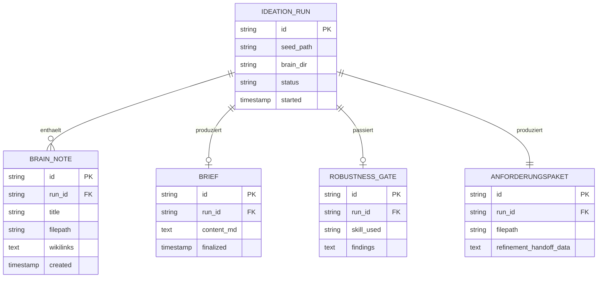

# 07 — Ideation Partner

## Zweck

Der Ideation Partner ist ein neuer Preset, der die Phase **vor** Refinement abdeckt: rohe Idee einfangen, Recherche-Landschaft kartieren, synthetisieren, Skill-gestuetzte Pruefungen anbieten. Output ist ein Anforderungs-Paket, das das Refinement zu Detail-Specs schaerft.

Ohne Ideation Partner war die Eingangsstufe in cipher-mux entweder das Refinement (das aber Detail-Specs schreiben soll, nicht recherchieren) oder ein direkter Cyber-Factory-Auftrag (der aber bereits saubere Anforderungen voraussetzt). Der Ideation Partner schliesst die Luecke.

## Abgrenzung

| Was Ideation Partner tut | Was er nicht tut |
|---------------------------|--------------------|
| Recherche-Landschaft kartieren | Detail-Specs schreiben (Refinement) |
| Brain-Notes anlegen und pflegen | Code schreiben (Cyber Factory) |
| Skills anbieten (Pre-Mortem, Roundtable, etc.) | Tests laufen lassen |
| Anforderungs-Paket fuer Refinement bauen | ADRs schreiben (Refinement) |
| Phasen-Disziplin (Seed → Recherche → Fokussierung → Robustheits-Gate → Anforderungs-Paket) | Implementations-Vorschlaege machen |

## Architektur — Code-Module

Der Ideation Partner ist primaer ein Persona+Akzent-Konstrukt, weniger ein Code-Modul. Er operiert in einer Session mit einem dedizierten Brain-Verzeichnis (`brain/*.md`) im Working Directory. Code-seitig braucht es minimal:

```
src/main/ideation-partner/
├── ideation-template.ts            — Persona+Akzent+Funktional in Entity-CLAUDE.md
├── brain-manager.ts                 — Brain-Verzeichnis-Init, Note-CRUD
├── skill-registry.ts                — Bekannte Skills auffuehren (extern: pre-mortem, roundtable, etc.)
├── anforderungspaket-generator.ts   — Brain → Anforderungs-Paket fuer Refinement
└── types.ts                         — TypeScript-Schnittstellen
```

Die Skills selbst (Pre-Mortem, Persona-Roundtable, etc.) leben **ausserhalb** des Code — sie sind Markdown-Dateien unter `~/.config/cipher-mux/skills/ideation/` (oder, falls bevorzugt, im Repository unter `docs/skills/ideation/`).

## Architektur — Datenmodell



Brain-Notes werden als Markdown-Dateien im Working Directory gespeichert, die Datenmodell-Tabelle dient nur als Index fuer schnelle Suche.

## Lifecycle (5 Phasen, gespiegelt aus Ideation-Template)

```
Phase 0: Seed einfangen
    ↓
Phase 1: Recherche autonom (Sub-Agents, brain/*.md)
    ↓
Phase 2: Fokussierung (Adressat, Scope, Format) → brain/brief.md
    ↓
Phase 3: Robustheits-Gate (Skill-Nutzung)
    ↓
Phase 4: Anforderungs-Paket → Refinement
```

### Phase-Details

**Phase 0 — Seed.**
User-Input einfangen. Felder: Idee, Motivation, Adressat-Hypothese, Zielformat-Hypothese, Was-ich-schon-weiss, Referenzen. Felder duerfen offen sein.

Drei Tragfaehigkeits-Fragen: Grenze nach oben/unten? Motivation und Adressat-Hypothesen benannt? Erkennbare Zielgruppe? Wenn alle drei Ja: zwei oder drei Vor-Phase-1-Klaerungen reichen. Wenn nein: Feld-fuer-Feld-Interview.

**Phase 1 — Recherche autonom.**
Volle Loesungslandschaft kartieren — auch kommerzielle Angebote. Open-Source-first-Filter wird **erst** in Phase 2 angelegt, damit nichts uebersehen wird (Recherche-Breite vor Filter, ideation-lessons.md).

Sub-Agents werden parallel losgeschickt. Jeder Sub-Agent schreibt **nur** seine eigene Note. Keine Sub-Agent-Beruehrung von `_index.md`. Pflicht-Regel: drei Unsicherheits-Markierungen pro Sub-Agent-Note (sonst gilt sie als einseitig).

Index-Pflege macht der Ideation Partner selbst nach Rueckkehr aller Sub-Agents.

**Phase 2 — Fokussierung.**
Dialog mit User. Adressat definieren, Scope schneiden, Zielformat festlegen. Open-Source-first-Filter wird hier angelegt. Output: `brain/brief.md`.

Granularitaets-Regel: Phase 2 entscheidet **Richtung**, nicht **Zahlen**. Keine Preis-Korridore, konkrete Tool-Picks, Paket-Schnitte im Brief — die gehoeren in Phase 4 oder spaeter.

Haerte-Check vor Exit:
- Kann der Brief in 5 Saetzen zusammengefasst werden?
- Sind Entscheidungen klar von Annahmen getrennt?
- Ist der Wirksamkeits-Test benannt?

Scope-Diaet-Moment: bei drei oder mehr Scope-Erweiterungen Zaesur einziehen — *"Ist aus v1 unbemerkt v3 geworden?"*

**Phase 3 — Robustheits-Gate.**
Pre-Mortem oder Persona-Roundtable oder Future-Backwards. Phase darf implizit gemacht werden, aber muss markiert sein ("Phase 3 implizit in Phase 2 — keine Skills noetig").

Skills sind:
- `persona-roundtable` — Stakeholder-Blicke, nach v0.1-Entwurf
- `pre-mortem` — Scheitern in 2 Jahren, Gewichtung, Ableitung
- `future-backwards` — Endzustand 3-5 Jahre, rueckwaerts
- `oss-telescope` — Open-Source-Bausteine kartieren, Lizenzen pruefen
- `external-review` — Frische-Session-Review vor v1.0

**Phase 4 — Anforderungs-Paket.**
Aus dem Brain wird ein strukturiertes Anforderungs-Paket destilliert: `brain/anforderungspaket.md`. Format:

- Projektziel
- Zielgruppe / Adressat
- Funktionale Anforderungen (Liste)
- Meta-Requirements (Stack, Constraints)
- Referenz-Projekte
- Wirksamkeits-Test
- Bekannte Risiken
- Ausgeschlossener Scope (Was bewusst NICHT)

Uebergabe an Refinement: per Note-Verweis oder per Dialog-Cue ("Das geht jetzt zum Refinement; soll ich eine Refinement-Session starten?").

## ConfigStore-Keys

```typescript
interface IdeationPartnerConfig {
  enabled: boolean;
  brainBaseDir: string;       // Default ~/.config/cipher-mux/ideations/
  skillsDir: string;          // Default ~/.config/cipher-mux/skills/ideation/
  subAgentUnsicherheitspflicht: boolean; // Default true
}
```

ConfigStore-Sektion: `ideation_partner`.

## MCP-Tools

| Tool | Status | Zweck |
|------|--------|-------|
| `mux_companion_recall` | Bestehend | User-Praeferenzen aus frueheren Ideations |
| `mux_companion_remember` | Bestehend | substantielle Erkenntnisse |
| `mux_notes_create` | Bestehend | Brain-Notes als persistente Markdowns |
| `mux_create_session` | Bestehend | Sub-Agent-Recherche-Sessions |
| `mux_input_request_create` | Bestehend | User-Klaerungen |
| `mux_ideation_skill_run` | **Neu** | Skill ausfuehren mit aktuellem Brain als Kontext |
| `mux_ideation_handoff_refinement` | **Neu** | Anforderungs-Paket an Refinement uebergeben |

`mux_ideation_skill_run` nimmt einen Skill-Namen, liest die Skill-Markdown-Datei, erzeugt eine Sub-Session mit der Skill-Anweisung und reicht die Brain-Notes als Kontext mit. Output landet als neue Note im Brain-Verzeichnis.

## Tests

1. *Seed-Tragfaehigkeit:* drei Ja → kein Feld-fuer-Feld; ein Nein → Interview
2. *Sub-Agent-Note-Validation:* Note ohne drei Unsicherheits-Markierungen → Note zurueckgewiesen
3. *Brief-Haerte-Check:* Brief mit 6 Saetzen Zusammenfassung → Warning ausloesen
4. *Phase-3-Markierung:* Wechsel Phase 2 → Phase 4 ohne Phase-3-Note → Warnung
5. *Anforderungs-Paket-Format:* alle Pflichtfelder muessen befuellt sein, sonst Refinement-Handoff blockiert

## Persona-Sprachstil

Erbt Relay. Ideation-Partner-Akzent: nuechtern fragend, nicht treibend. Confirmation-Bias-Vermeidung explizit: bei Begeisterungs-Signalen vom User aktiv kritisch werden.

Beispiel-Output:

> "Seed liest sich erstmal klar. Drei Tragfaehigkeits-Fragen pruefen wir kurz: Adressat — wer liest das am Ende? Du selbst, ein konkreter Kunde, ein Stakeholder? Grenze nach oben — was waere zu viel? Grenze nach unten — was waere zu wenig?"

> "Phase 1 ist durch. Brain hat 8 Notes. Was ich noch nicht gesehen habe ist eine kommerzielle Loesungs-Klasse — wir hatten oekonomische Aspekte ausgespart. Soll ich nachschieben oder reicht der jetzige Stand?"

## Initial-Setup beim ersten Lauf

Beim ersten Start eines Ideation-Partner-Runs:

1. Working Directory `<brainBaseDir>/<ideation-name>/` anlegen
2. Template-Dateien kopieren: `00_seed.md`, `README.md`, `START_PROMPT.md`, `_formate/`, `brain/`, `deliverables/`, `skills/`
3. Skills-Symlink oder Kopie aus `<skillsDir>` nach `skills/`
4. Erste Begruessung: "Wir starten eine Ideation. Steht der Seed schon, oder fangen wir mit dem Interview an?"

## Persona-Variabilitaet

Der Ideation Partner profitiert von einer leicht anderen Tonalitaet als der Default-Companion: weniger Helfer-Modus, mehr Sokrates-Modus. Wenn der User das Default-Persona (Relay) durch Wayne ersetzt, sollte der Ideation Partner Wayne nicht uebernehmen — Wayne tendiert zu Begeisterung, was im Ideation-Kontext Confirmation-Bias verstaerkt. Empfehlung: Persona im Ideation-Partner-Preset auf Relay sperren oder explizit warnen.

## Offene Punkte

- *Mehrere parallele Ideations gleichzeitig?* — Ja, jede in eigenem Working Directory.
- *Anforderungs-Paket als strukturiertes JSON oder Markdown mit Frontmatter?* — Empfehlung: Markdown mit Frontmatter, weil Refinement Markdown lesen muss.
- *Skill-Plugins als Marketplace?* — Ausserhalb dieses Packs.
