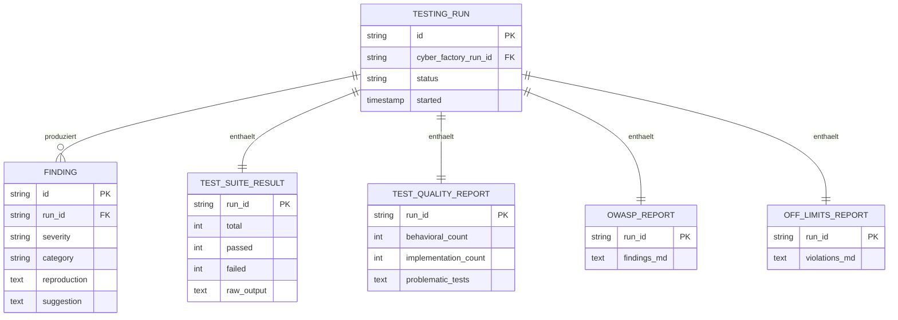

# 09 — Testing Assistant

## Zweck

Der Testing Assistant ist die Test/QA-Phase zwischen Build (Cyber Factory) und Bugfix (Debugger). Er ueberprueft die Implementierungs-Wellen mit zwei Hauptachsen — Spec-Conformance-Checking (Erbe aus Watchdog) **und** Adversarial Probing (neu) — dokumentiert strukturierte Findings und uebergibt entweder an den Debugger (bei Bugs) oder an den Audit (bei sauberer Welle).

## Verhaeltnis zum Watchdog

**Vollstaendiger Cut, keine Erweiterung.** Der Testing Assistant ersetzt den Watchdog (`moreismore/spec-qa-entity.md`) konsequent. Begruendung: "Eleganz ist ein Metaziel" (User-Vorgabe 2026-04-30) — Pre-Alpha-Phase ist die Zeit fuer den scharfen Schnitt.

Inhaltlich passiert dabei:
- *Watchdog-Erbe (uebernommen):* Spec-Conformance-Checking, Reviewer-Checkliste (Plan/Code/Spec), strukturierte Findings, Severity-Klassifikation
- *Pack-Erweiterung (neu):* Adversarial Probing, OWASP-Spotcheck, Off-Limits-Audit, Test-Qualitaets-Audit (Behavioral vs. Implementations-Tests)
- *Watchdog-Reste (entfernt):* checklisten-getriebener Modus als alleiniger Hauptmodus — bleibt als Phase-Inhalt, ist aber nicht mehr Selbstverstaendnis der Rolle

Das Watchdog-Doc `spec-qa-entity.md` wird zu SUPERSEDED markiert (Frontmatter + Hinweis-Block oben), Inhalt bleibt als Historie lesbar, aber wird nicht weiterentwickelt. Operative Quelle ist diese Spec.

## Abgrenzung

| Was Testing Assistant tut | Was er nicht tut |
|----------------------------|--------------------|
| Test-Suite laufen lassen | Tests fixen |
| Test-Qualitaets-Audit | Tests umschreiben |
| Adversarial Probing (Edge Cases, Race Conditions) | Bugs fixen (Debugger) |
| OWASP-Spotcheck (Sicherheits-Audit light) | Vollstaendiges Sicherheits-Audit (Audit) |
| Off-Limits-Audit | Off-Limits-Aenderung autorisieren |
| Strukturierte Findings dokumentieren | Implementations-Aenderungen vornehmen |

## Architektur — Code-Module

```
src/main/testing-assistant/
├── testing-assistant-manager.ts    — Lifecycle, ConfigStore
├── test-runner.ts                   — Test-Suite ausfuehren (Vitest, Playwright, etc.)
├── test-quality-audit.ts            — Verhaltens- vs. Implementations-Tests
├── adversarial-prober.ts            — Edge-Case-Generator
├── owasp-spotcheck.ts               — OWASP-Top-10-Lightcheck
├── off-limits-audit.ts              — Pfad-Check gegen Off-Limits-Liste
├── findings-reporter.ts             — Strukturierter Markdown-Report
├── handoff-debugger.ts              — Routing bei Findings
├── testing-template.ts              — Persona+Akzent+Funktional in Entity-CLAUDE.md
└── types.ts
```

## Architektur — Datenmodell



Persistenz in `~/.config/cipher-mux/cipher-mux.db` als `testing_runs`, `findings`, `*_reports`-Tabellen.

## Reviewer-Checkliste (uebernommen aus Multi-Session-Architektur)

Der Testing Assistant **ist** die RV-Stufe der L0/L1/L2/RV-Architektur. Er folgt der Reviewer-Checkliste aus `multi_session_architecture.md`, ergaenzt um Pack-Spezifika (OWASP-Spotcheck, Off-Limits-Audit, Severity-Routing).

**Code-Review (nach Diff — Hauptaufgabe):**
- [ ] Diff fasst nur erlaubte Pfade an?
- [ ] Pro REQ-ID: konkreter Code-Nachweis vorhanden?
- [ ] Tests fuer jede REQ-ID vorhanden und gruen?
- [ ] Stille Schema-/API-Aenderungen? (kritisch flaggen)
- [ ] Hardcoded Secrets, Default-Werte wie `supersecretkey`? (kritisch)
- [ ] Externe Pakete: existieren in offizieller Registry? (Slopsquatting-Check)
- [ ] **Pack-Erweiterung:** Adversarial Probing (Edge Cases, Race Conditions, Boundary Conditions)
- [ ] **Pack-Erweiterung:** OWASP-Spotcheck (SQL Injection, XSS, fehlende Auth-Checks)
- [ ] **Pack-Erweiterung:** Test-Qualitaets-Audit (Verhaltens- vs. Implementations-Tests)

**Spec-Conformance (Abschluss):**
- [ ] Welche REQ-IDs sind nachweislich erfuellt? Liste mit Code-Pointern.
- [ ] Welche REQ-IDs fehlen oder sind teilweise? Backlog fuer Cyber-Factory-Hauptsession.
- [ ] Drift entdeckt (Code macht etwas anderes als Spec sagt)? Spec-Update oder Code-Anpassung anstossen, niemals still ignorieren.

Diese Checkliste landet im Findings-Report als Pflicht-Sektion.

## Lifecycle (7 Phasen)

```
Phase 1: Test-Suite laufen lassen
    ↓
Phase 2: Test-Qualitaets-Audit
    ↓
Phase 3: Adversarial Probing
    ↓
Phase 4: OWASP-Spotcheck
    ↓
Phase 5: Off-Limits-Audit
    ↓
Phase 6: Findings-Report konsolidieren
    ↓
Phase 7: Uebergabe — Debugger oder Audit
```

### Phase-Details

**Phase 1 — Test-Suite laufen lassen.**
Befehle aus der CLAUDE.md des Projekts. Resultat strukturiert: total/passed/failed, raw output gespeichert. Wenn die Suite nicht laeuft (Setup-Fehler, fehlende Deps): Finding mit Severity Hoch, Phase 7 zur User-Eskalation.

**Phase 2 — Test-Qualitaets-Audit.**
Heuristiken:
- Test-Name enthaelt Implementierungs-Begriff (`renders`, `calls`, `invokes`) → Implementations-Verdacht
- Test prueft Aufrufe von internen Methoden (Mocking-heavy) → Implementations-Verdacht
- Test broeselt bei Renaming, ohne dass Verhalten sich aendert → bestaetigt Implementations-Test

Output: Bericht mit Behavioral-Anteil und Implementations-Verdaechtigen.

**Phase 3 — Adversarial Probing.**
Edge-Case-Set:
- Leere Inputs
- Sehr grosse Inputs (10x typische Groesse)
- Unicode, Emoji, RTL-Text
- Race Conditions (zwei gleichzeitige Anfragen)
- Boundary Conditions (0, -1, MAX_INT)
- Unauthorized Access (kein Token, expired Token)
- Auth-Bypass-Versuche (an oeffentlichen Endpunkten)

Wenn Bugs gefunden: in Findings-Liste mit Reproduktion.

**Phase 4 — OWASP-Spotcheck.**
Checkliste-light (fuer Final-Audit ist Audit-Preset zustaendig):
- SQL Injection (Parametrisierung in Queries?)
- XSS (Output-Escaping?)
- Hardcoded Secrets (Pattern-Match `supersecretkey`, `password123`, `Bearer ey...`)
- Fehlende Auth-Checks an offenen Endpunkten
- Slopsquatting in `package.json` / `requirements.txt` (existieren die Pakete? aktuelle Maintainer? >100 Downloads/Woche?)

Findings mit Severity (Hoch fuer Auth/SQL Inj./Secrets, Mittel fuer XSS/Slopsquatting, Niedrig fuer Logging-Info-Leaks).

**Phase 5 — Off-Limits-Audit.**
Diff der Welle gegen die Off-Limits-Liste (aus Detail-Spec uebernommen, plus globale Off-Limits-Liste). Bei Treffern:
- Wurde es vom User explizit autorisiert? (Pruefe `mux_input_request_history` oder Note mit Autorisierungs-Vermerk)
- Wenn ja: kein Finding
- Wenn nein: Finding mit Severity Hoch (auch wenn der Code funktioniert)

**Phase 6 — Findings-Report konsolidieren.**
Alle Findings in einem Markdown-Report:

```markdown
# Testing-Run-Report — <run-id>

**Welle:** <welle-id>
**Datum:** <iso-timestamp>
**Status:** [Findings vorhanden | sauber]

## Test-Suite
- 142 Tests, 138 passed, 4 failed
- Details: ...

## Test-Qualitaet
- 85% Behavioral, 15% Implementations-Verdacht
- Problematische Tests: ...

## Findings (sortiert nach Severity)

### Hoch
- F-001: SQL Injection in `userController.search`
  - Reproduktion: GET /search?q='; DROP TABLE users; --
  - Vorschlag: Prepared Statement
- F-002: ...

### Mittel
- F-003: ...

### Niedrig
- F-008: ...

## Off-Limits
- Keine Verletzungen
```

**Phase 7 — Uebergabe.**

| Befund | Aktion |
|--------|--------|
| Severity-Hoch oder mehr als 5 Mittel | Uebergabe an Debugger via `mux_handoff_debugger` |
| Severity-Mittel <= 5 und nichts Hohes | Optional Debugger oder direkt Audit |
| Sauber | Uebergabe an Audit |

## ConfigStore-Keys

```typescript
interface TestingAssistantConfig {
  enabled: boolean;
  adversarialDepth: 'shallow' | 'standard' | 'deep'; // Default standard
  owaspChecks: boolean;        // Default true
  offLimitsAudit: boolean;     // Default true
  testQualityAudit: boolean;   // Default true
  autoHandoffOnSeverityHigh: boolean; // Default true
}
```

ConfigStore-Sektion: `testing_assistant`.

## MCP-Tools

| Tool | Status | Zweck |
|------|--------|-------|
| `mux_create_session` | Bestehend | bei Bedarf parallele Adversarial-Sessions |
| `mux_notes_create` | Bestehend | Findings-Reports als Notes |
| `mux_input_request_create` | Bestehend | User-Eskalation bei kritischen Findings |
| `mux_companion_recall` | Bestehend | bekannte Fehler-Muster aus frueheren Runs |
| `mux_testing_run_start` | **Neu** | Run gegen Welle starten |
| `mux_testing_findings_handoff_debugger` | **Neu** | Strukturierter Debugger-Handoff |
| `mux_testing_run_complete` | **Neu** | Run abschliessen, Audit-Empfehlung formulieren |

## Tests

1. *Test-Suite-Aufruf:* CLAUDE.md ohne Test-Befehl → Finding Severity Hoch
2. *Implementations-Test-Erkennung:* Mock-heavy Test mit Renaming-Anfaelligkeit → markiert
3. *Adversarial Edge Cases:* Standard-Depth → mindestens 5 Edge-Case-Klassen geprobed
4. *OWASP-Hardcoded-Secrets:* `supersecretkey` in Code → Finding Severity Hoch
5. *Off-Limits-Audit:* Diff in Migrations-Pfad ohne Autorisierungs-Note → Finding Severity Hoch
6. *Severity-Routing:* 1 Hoch + 0 Mittel → Auto-Handoff Debugger
7. *Findings-Report-Struktur:* alle Pflichtsektionen vorhanden

## Persona-Sprachstil

Erbt Relay. Testing-Assistant-Akzent: skeptisch, gruendlich, "lass uns das mal kaputt machen". Findings sachlich formuliert, keine Schuldzuweisungen.

Beispiel-Output:

> "Test-Run abgeschlossen. 142 Tests, 138 passed. Vier Failures sehen alle ähnlich aus — Mock-Problem in `auth.test.ts`. Test-Qualitaets-Audit hat 22 Implementations-Tests gefunden, davon 6 hochproblematisch. Adversarial Probing hat zwei Hoche gefunden: SQL Injection-Pattern in `userSearch`, und der `/api/admin`-Endpunkt ist ohne Auth-Check. Off-Limits-Audit ist sauber. Empfehlung: ab zum Debugger, Severity Hoch hat klare Routing-Pflicht."

## Migration

Heutige `watchdog`-Builtin-Entity wird umbenannt zu `testing-assistant`. Code-Module werden neu unter `src/main/testing-assistant/` angelegt. Alter Watchdog-Code (falls vorhanden) wird parallel weiterlaufen lassen, dann Cutover.

Cutover-Schritte:
1. Welle 2 (siehe `12-migration-rebuild.md`): testing-assistant parallel zum watchdog
2. Migration-Skript portiert ConfigStore-Sektion `watchdog` → `testing_assistant`
3. ConfigStore-Migration alter Run-Daten (falls vorhanden)
4. Cutover: Default ist testing-assistant
5. v1.0: watchdog-Builtin-Entity entfernt

## Offene Punkte

- *Adversarial Probing — wie wird der Probing-Strategy persistiert?* Empfehlung: Sub-Agents pro Edge-Case-Klasse mit eigenem Prompt-Template. Templates in `src/main/testing-assistant/probes/*.md`.
- *Wann selbst Test-Suite umschreiben vs. Finding?* Empfehlung: nie selbst umschreiben. Implementations-Test-Findings gehen an Debugger oder direkt an User mit Empfehlung.
- *Iterative Re-Tests nach Debugger-Fix.* Wenn Debugger einen Fix abgeschlossen hat, automatisch erneut Testing-Assistant laufen? Empfehlung: ja, aber nur die Findings-Region, nicht volle Suite. Kosten/Geschwindigkeits-Abwaegung.
