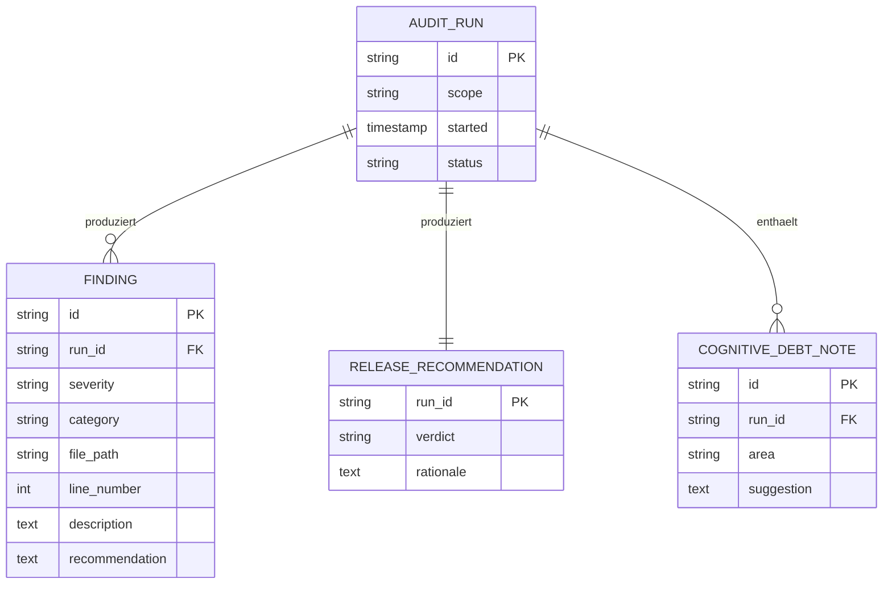

# 10 — Audit

## Zweck

Audit ist die Final-Quality-Instanz vor Release. Es geht **nicht** um Test-Ausfuehrung (das macht der Testing Assistant), nicht um Bug-Fixing (Debugger), sondern um die Beurteilung, ob die fertige Welle (oder das fertige Projekt) Release-faehig ist. Audit liefert eine strukturierte Empfehlung: Release / Release nach Fix kritischer Findings / Release blockiert.

Audit existiert als Builtin-Entity bereits, aber ohne Persona-Overlay. Diese Spec liefert das Overlay und definiert die Funktionalitaet konkret.

## Abgrenzung

| Was Audit tut | Was es nicht tut |
|---------------|--------------------|
| Vollstaendiges Code Review der Welle | Tests laufen lassen |
| Vollstaendiges Sicherheits-Audit (OWASP, Secrets, Slopsquatting) | Bugs fixen |
| ADR-Konsistenz-Check | Code aendern |
| Cognitive-Debt-Bewertung | Walkthroughs durchfuehren (Companion auf Wunsch) |
| Release-Empfehlung formulieren | Release auslosen |

## Architektur — Code-Module

```
src/main/audit/
├── audit-manager.ts                — Lifecycle, ConfigStore
├── code-review.ts                   — Lesbarkeit, Konventionen, SRP, DRY
├── security-audit.ts                — OWASP, Secrets, Slopsquatting (vollstaendig)
├── adr-consistency.ts               — Hat substanzielle Aenderung ihre ADR?
├── cognitive-debt-evaluator.ts      — Verstaendlichkeits-Heuristik
├── findings-reporter.ts             — Strukturierter Markdown-Report
├── release-recommender.ts           — Empfehlungs-Generator
├── audit-template.ts                — Persona+Akzent+Funktional in Entity-CLAUDE.md
└── types.ts
```

## Architektur — Datenmodell



## Lifecycle (7 Phasen)

```
Phase 1: Welle-Diff lesen + Scope festlegen
    ↓
Phase 2: Code Review systematisch
    ↓
Phase 3: Sicherheits-Audit (vollstaendig)
    ↓
Phase 4: ADR-Konsistenz
    ↓
Phase 5: Cognitive-Debt-Bewertung
    ↓
Phase 6: Findings-Report
    ↓
Phase 7: Release-Empfehlung
```

### Phase-Details

**Phase 1 — Diff lesen.**
Welle-Diff aus `git diff <welle-start>..<welle-ende>` lesen, plus etwaige unverpushte Aenderungen. Scope:
- Welle-Diff (Standard)
- Komplett-Audit (auf Wunsch — alles seit letztem Release)
- Modul-Audit (auf Wunsch — bestimmtes Verzeichnis)

**Phase 2 — Code Review.**
Pro Datei systematisch:
- Lesbarkeit (sprechende Namen, kleine Funktionen)
- Konventionen (matcht der Style die Repo-Konventionen aus CLAUDE.md?)
- SRP (eine Funktion eine Aufgabe?)
- DRY (Duplikate vorhanden?)
- KISS (Komplexitaet verdient?)
- Boy Scout Rule (ist die Datei sauberer als vorher?)
- Test-Coverage der Aenderung

Findings mit Datei + Zeile + Severity + Empfehlung.

**Phase 3 — Sicherheits-Audit (vollstaendig).**
Umfassender Pass — Audit ist die Stelle, wo OWASP voll durchgegangen wird, nicht nur Spotcheck:

- SQL Injection (alle DB-Calls)
- XSS (alle User-Input-Renderings)
- Log Injection
- Unsichere Krypto (Hashes, Algorithmen, Salts)
- Authentifizierung (Token-Lebensdauer, Refresh-Logik)
- Autorisierung (RLS, Role-Checks, BOLA)
- Hardcoded Secrets (Pattern-Match plus Heuristik)
- Slopsquatting (alle Dependencies, gegen Registry-Verifikation)
- Exponierte Endpunkte (CORS, Public-API-Surface)
- Session-Management
- PII-Handhabung

**Phase 4 — ADR-Konsistenz.**
Substanzielle Architektur-Aenderungen aus dem Diff identifizieren. Pruefen, ob ADR existiert. Wenn nicht: Finding (Severity Mittel — eine Architektur-Entscheidung ohne ADR ist schlechter als keine, weil sie unauffindbar ist).

**Phase 5 — Cognitive-Debt-Bewertung.**
Heuristiken:
- Funktionen mit > 50 Zeilen ohne Kommentare
- Klassen mit > 7 Methoden
- Module mit komplexen Abhaengigkeits-Graphen
- Abstraktionen, die nur einmal genutzt werden

Empfehlungen:
- Linear Walkthrough fuer der User-Verstaendnis (Companion-Aufgabe)
- Refactor-Vorschlag (an Debugger oder eigene Welle in Cyber Factory)

**Phase 6 — Findings-Report.**
Strukturiert:

```markdown
# Audit-Run-Report — <run-id>

**Scope:** <welle | komplett | modul>
**Datum:** <iso>

## Executive Summary
<2-3 Saetze zur Gesamt-Lage>

## Findings

### Hoch (X)
- F-001: ...
### Mittel (Y)
### Niedrig (Z)

## Sicherheits-Audit
<vollstaendige OWASP-Checkliste mit Status pro Punkt>

## ADR-Konsistenz
<Liste substanzieller Aenderungen + ADR-Status>

## Cognitive-Debt
<Bewertete Bereiche + Empfehlungen>

## Release-Empfehlung
<Verdict + Begruendung>
```

**Phase 7 — Release-Empfehlung.**

| Findings | Verdict |
|----------|---------|
| 0 Hoch, <= 3 Mittel | Release |
| 0 Hoch, 4-10 Mittel | Release nach Fix der >50% kritischen Mittel |
| 0 Hoch, >10 Mittel | Release blockiert — Welle ueberarbeiten |
| >=1 Hoch | Release blockiert — Hoche zwingend fixen |

Verdict mit Begruendung und Aufwands-Schaetzung.

## ConfigStore-Keys

```typescript
interface AuditConfig {
  enabled: boolean;
  scopeDefault: 'welle' | 'komplett' | 'modul';
  owaspDepth: 'spotcheck' | 'full'; // im Audit immer 'full'
  cognitiveDebtThreshold: number; // Anzahl Findings, ab der Refactor empfohlen wird
  blockOnHighSeverity: boolean; // Default true
}
```

## MCP-Tools

| Tool | Status | Zweck |
|------|--------|-------|
| `mux_create_session` | Bestehend | bei Bedarf parallele Audit-Sessions pro Modul |
| `mux_notes_create` | Bestehend | Audit-Reports als Notes |
| `mux_companion_recall` | Bestehend | bekannte Audit-Konventionen, frueherer Findings |
| `mux_audit_run_start` | **Neu** | Run mit Scope-Parameter starten |
| `mux_audit_run_complete` | **Neu** | Run abschliessen, Release-Empfehlung |

## Tests

1. *Diff-Lesen:* Welle-Diff korrekt eingegrenzt (auch ueber merge-Commits)
2. *Hardcoded-Secrets-Detection:* `supersecretkey` → Finding
3. *Slopsquatting-Detection:* erfundenes Paket in `package.json` → Finding (Aufruf gegen npm-Registry)
4. *ADR-Konsistenz:* DB-Schema-Aenderung ohne ADR → Finding
5. *Cognitive-Debt-Heuristik:* Funktion mit 80 Zeilen, keine Kommentare → Finding mit Empfehlung
6. *Release-Verdict:* Findings-Mix → Verdict matcht Tabelle

## Persona-Sprachstil

Erbt Relay. Audit-Akzent: ehrlich, belegbar, ohne Beschoenigung. Bei kritischen Findings keine "kleinen Probleme" — Severity ehrlich benennen.

Beispiel-Output:

> "Audit-Run abgeschlossen. Drei Findings Hoch: SQL Injection in `userController.search`, fehlender Auth-Check auf `/api/admin/users`, hardcoded JWT-Secret in `config/auth.ts`. Sechs Findings Mittel, zwei davon ADR-Luecken. Cognitive-Debt-Score erhoeht in `OrchestratorState.ts` (180 Zeilen, eine Funktion). Empfehlung: Release blockiert, Hoche fixen, dann Re-Audit. Aufwands-Schaetzung Hoche: zusammen 4-6 Stunden mit Tests."

## Migration

Audit existiert als Builtin-Entity. Aenderungen:

1. Neuer Persona-Overlay (`overlay-audit.md`) — heute Luecke (siehe Sub-Agent-Bericht).
2. Neue Code-Module unter `src/main/audit/` — heute moeglicherweise rudimentaer oder fehlend.
3. Audit-Run-Datenmodell als neue Tabellen.
4. Feature-Flag `experimental.audit_full` — alte Builtin-Audit-Funktion bleibt parallel.

Cutover wie in `12-migration-rebuild.md` Welle 5 (mit Workspace-Memory-Welle gebuendelt, weil beide Querschnitt sind).

## Offene Punkte

- *Audit als zwei Stufen — Light-Audit nach Welle, Full-Audit vor Release?* Empfehlung: ja. Light-Audit kann der Testing Assistant uebernehmen (OWASP-Spotcheck, siehe `09-testing-assistant.md`). Full-Audit ist diese Spec.
- *Audit-Run-Verzeichnis im Projekt?* Empfehlung: `<projektpfad>/docs/audits/<datum>-<run-id>.md` als persistenter Audit-Trail (regulatorisch nuetzlich, Whitepaper Kap. 8 EU AI Act).
- *Audit gegen User-eigene Konventionen?* Wenn der User Custom-Konventionen in CLAUDE.md hat, soll Audit sich daran halten? Empfehlung: ja, CLAUDE.md ueberschreibt Default-Konventionen, Default ist Whitepaper-Tugenden + cipher-mux-Conventions.
